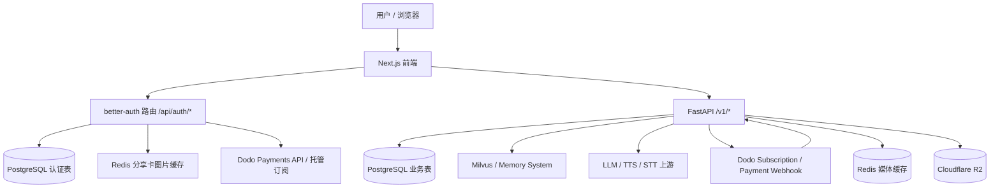
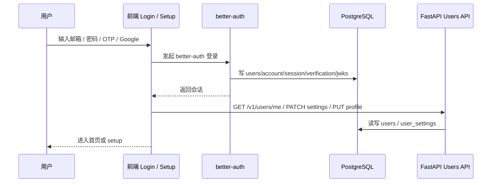
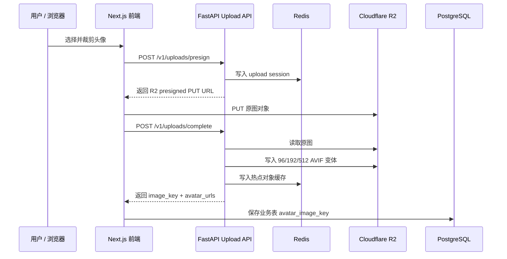
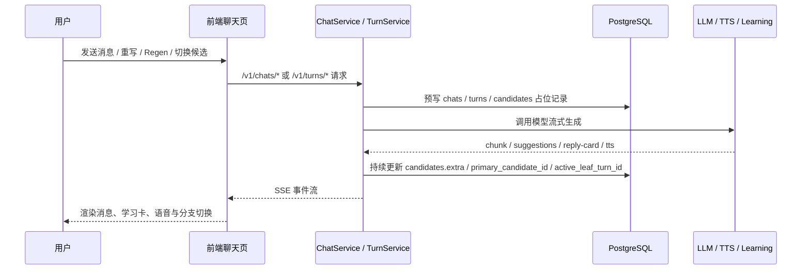

# ParlaSoul 数据库文档

本文档由脚本直接连接 PostgreSQL 实例并基于实时元数据生成。

- 生成时间: `2026-08-14 18:37:37 北京时间`
- 目标数据库: `localhost:5432/role_play_mem`
- Schema: `public`
- 表数量: `30`

## 业务语义总览

### 1. 系统边界与数据职责

ParlaSoul 当前是一个“前端认证层 + 后端业务层 + 共享 PostgreSQL”的系统：

- 前端仓库 `E:\code\parlasoul-frontend`
  - 负责 `better-auth` 登录、定价与账单页、角色发现页、角色分享页、聊天页、收藏页、个人中心、成长统计页。
  - 通过同源 `/api/auth/*` 处理认证，通过 `/v1/*` 调用后端业务 API。
- 后端仓库 `E:\code\parlasoul-backend`
  - 负责角色、聊天树、学习卡、收藏、音色、成长系统、订阅 / 一次性权益同步、Webhook 处理、R2 媒体上传与读取。
- PostgreSQL
  - 同时承载两类表：
    - `better-auth` 维护的认证表
    - FastAPI 维护的业务表
  - realtime 通话测试数据也落在 FastAPI 业务表中，但它们只是内容无关的可观测数据，不是聊天正文的真相源。
  - 评测 harness（phase18）的 `eval_runs` / `eval_results` 也是业务表，但只由进程外 CLI 以 `system` 上下文读写，不属于在线 API 数据面。
- Redis
  - 保存前端分享卡图片代理缓存。
  - 保存后端媒体上传会话、上传互斥锁、AVIF 热点对象缓存和短期 404 缓存，不保存业务主数据。
- Cloudflare R2
  - 保存用户头像、角色头像、音色头像等需要持久化的媒体对象。
  - PostgreSQL 只记录可推导公开 URL 的 `avatar_image_key`，不单独引入媒体资产表。
- Milvus / Zilliz
  - 保存 memory system 的向量与记忆正文，不在 PostgreSQL 里落“记忆业务表”。
- MiniMax / DashScope
  - 系统 TTS 默认走 MiniMax provider，角色表保存实际运行时的 `provider + model + voice_id` 三元组。
  - DashScope 仍承载 STT、音色克隆、克隆音色删除以及历史 TTS provider 配置，便于后续按 provider registry 切换回来。
- Dodo Payments
  - 保存完整订阅与支付流水；本地库保存用户订阅摘要、微信一次性支付订单、一次性权益通行证和 webhook 审计记录。
- 本地文件系统
  - 不再作为头像等持久化媒体资源的运行时存储；系统音色试听文件属于随代码发布的静态预览资产，通过 `/media/voices/preview/*` 暴露。

### 2. 当前主链路与兼容 / 遗留链路

- 当前认证主链路
  - 前端登录页调用 `better-auth`
  - 主表是 [`users`](#table-users)、[`account`](#table-account)、[`session`](#table-session)、[`verification`](#table-verification)、[`jwks`](#table-jwks)
- 当前业务主链路
  - 角色、市场与分享：[`characters`](#table-characters)
  - 聊天树：[`chats`](#table-chats)、[`turns`](#table-turns)、[`candidates`](#table-candidates)
  - 收藏：[`saved_items`](#table-saved_items)
  - 音色：[`voice_profiles`](#table-voice_profiles)
  - 角色系统音色绑定：[`characters`](#table-characters) 保存 MiniMax 系统 TTS 三元组；用户克隆音色资产仍保存在 [`voice_profiles`](#table-voice_profiles)
  - 成长系统：[`growth_user_stats`](#table-growth_user_stats) 等 5 张统计表
  - 订阅与支付权益：[`subscription_webhook_events`](#table-subscription_webhook_events)、[`payment_orders`](#table-payment_orders)、[`payment_webhook_events`](#table-payment_webhook_events)、[`user_access_passes`](#table-user_access_passes)
  - realtime 通话观测：[`realtime_call_sessions`](#table-realtime_call_sessions)、[`realtime_call_events`](#table-realtime_call_events)、[`realtime_turn_metrics`](#table-realtime_turn_metrics)、[`realtime_webrtc_stats_samples`](#table-realtime_webrtc_stats_samples)
  - 媒体资源：Cloudflare R2 存对象，Redis 做短期会话和热点缓存，业务表记录 `avatar_image_key`
- 当前非前端主链路 / 兼容遗留
  - 当前旧验证码登录链路已经从代码库与数据库 schema 中移除，认证统一收敛到 `better-auth`。

### 3. 顶层框架

这个结构的关键点是：

- 认证与账单入口有一部分在前端完成，而不是全部走后端。
- 用户主表 [`users`](#table-users) 是共享表，`better-auth` 和 FastAPI 都会读写它。
- 业务核心状态仍在后端控制，尤其是聊天树、成长统计、角色与音色。

### 4. 核心业务流程

#### 4.1 登录、建号与资料补全

这条链路里：

- `better-auth` 负责“会话建立”和“认证凭据落库”。
- FastAPI 负责“资料补全”和“偏好设置”。
- 前端是否允许进入主应用，最终取决于 `username` 以及 `avatar_image_key` 是否完整。

#### 4.2 媒体上传、压缩与读取

媒体链路的核心约束：

- 浏览器只拿到短期 R2 presigned PUT URL，不持有 R2 Secret。
- 图片格式统一产出 AVIF，当前标准变体为 `96/192/512`。
- 前端展示优先使用后端返回的 `avatar_urls`，否则通过 `avatar_image_key` 推导 `/media/{key}/{size}.avif`。
- `/media/*` 由后端读取 Redis 热点缓存，未命中时回源 R2，并设置长缓存响应头。

#### 4.3 角色发现、聊天树与流式生成

这条链路的核心不是“聊天消息表”，而是“聊天树”：

- [`chats`](#table-chats) 是会话壳和当前活动分支指针。
- [`turns`](#table-turns) 是树节点。
- [`candidates`](#table-candidates) 是同一节点的多个文本版本。

#### 4.4 学习辅助、收藏与成长系统

- 回复卡、输入改写、错误信息主要落在 [`candidates.extra`](#table-candidates)。
- 收藏不是把候选或卡片直接外键化，而是把卡片快照写入 [`saved_items`](#table-saved_items)。
- 成长系统在“聊天完成”后实时更新，而不是离线跑批：
  - [`growth_daily_stats`](#table-growth_daily_stats)：概览页趋势主线与签到状态
  - [`growth_character_daily_stats`](#table-growth_character_daily_stats)：概览页趋势 `character_breakdown` 与角色日级分布
  - [`growth_character_stats`](#table-growth_character_stats)
  - [`growth_user_stats`](#table-growth_user_stats)
  - [`growth_share_triggers`](#table-growth_share_triggers)

#### 4.5 订阅与权益

- 定价页与账单页主要通过前端 `better-auth + Dodo` 直接拿远端数据。
- 微信一次性权益由后端 `/v1/payments/wechat/*` 创建 Dodo checkout session，并通过支付 webhook 完成订单状态与权益发放。
- 本地库保留四层状态：
  - [`users`](#table-users) 上的订阅摘要字段
  - [`subscription_webhook_events`](#table-subscription_webhook_events) 订阅 webhook 审计与幂等记录
  - [`payment_orders`](#table-payment_orders) 微信一次性支付订单镜像
  - [`payment_webhook_events`](#table-payment_webhook_events) 支付 / 退款 webhook 审计与幂等记录
  - [`user_access_passes`](#table-user_access_passes) 已生效的一次性权益通行证
- 真正的“功能是否可用”由后端 `SubscriptionService` 同时计算 recurring subscription 与 active one-time pass，返回 `effective_source`。

#### 4.6 角色分享与可见性

- 应用层只允许写入 `PUBLIC` 和 `PRIVATE` 两种角色 / 会话可见性。
- 迁移 `20260501_0034` 先把历史 `UNLISTED` 行迁移为 `PRIVATE`，业务代码不再产生新的 `UNLISTED` 数据。
- 迁移 `20260525_0039` 随后重建 `visibility_t` 与 `chat_visibility_t` 枚举类型，彻底移除 `UNLISTED`；当前两个枚举仅剩 `PUBLIC` 与 `PRIVATE` 两个取值。
- 前端 `/share/{slug}` 分享页通过 slug 末尾的 character UUID 读取角色详情。当前 active 的 `PUBLIC` 与 `PRIVATE` 角色都允许通过直链读取；`PRIVATE` 不进入市场列表但可被直链访问。进入 get-or-create chat 前，前端会要求登录并保留 `next` 参数。

#### 4.7 Realtime 通话观测

- 浏览器在申请麦克风前先创建 observation，再把 `observation_id` 带入 `/v1/realtime/session` 与实际 `rt_*` 运行时会话绑定。
- [`realtime_call_sessions`](#table-realtime_call_sessions) 保存一次通话尝试的上下文和聚合摘要；其余三张表以 `observation_id + user_id` 复合外键归属到它。
- 客户端事件、服务端事件和 WebRTC stats 使用单调递增的 `seq` 去重；浏览器 stats 默认每 1 秒一个样本。
- 客户端与服务端分别使用自己的 monotonic clock；`occurred_offset_ms` 只能在同一 `source` 泳道内直接相减，不能把两侧 offset 当作同一绝对时间轴。
- 方案 A 的隐私边界是硬约束：四张表只允许 schema 固定白名单中的事件名、原因码、错误码、枚举、计数和数值指标；“格式像 slug”不代表可以写入。系统不保存原始音频、PCM/WAV/base64、完整或部分转写、字幕正文、LLM/TTS 文本、SDP、IP/地址/URL、设备 ID/label、原始 User-Agent 或任意错误消息。
- 正常通话产生的 user/assistant turn 仍按原产品语义进入 [`turns`](#table-turns) 和 [`candidates`](#table-candidates)，观测表不复制正文。
- 测试数据当前不配置自动 TTL，用户通话结束后仍可在 `/realtime-lab` 按 observation 回看。“无 TTL”只适用于内容无关的观测数据，不放宽上述禁入规则。
- 四张表都启用并强制 PostgreSQL RLS：普通请求依赖 `app.current_user_id` 且只能读写自己 `user_id` 的行；只有显式 `system` 上下文可跨用户执行后台操作。

### 5. 数据域分组

- 共享用户核心域
  - [`users`](#table-users)
  - [`user_settings`](#table-user_settings)
- Better Auth 认证域
  - [`account`](#table-account)
  - [`session`](#table-session)
  - [`verification`](#table-verification)
  - [`jwks`](#table-jwks)
- 角色与会话域
  - [`characters`](#table-characters)
  - [`voice_profiles`](#table-voice_profiles)
  - [`chats`](#table-chats)
  - [`proactive_character_preferences`](#table-proactive_character_preferences)
  - [`proactive_message_dispatches`](#table-proactive_message_dispatches)
  - [`turns`](#table-turns)
  - [`candidates`](#table-candidates)
  - [`saved_items`](#table-saved_items)
- Realtime 通话观测域
  - [`realtime_call_sessions`](#table-realtime_call_sessions)
  - [`realtime_call_events`](#table-realtime_call_events)
  - [`realtime_turn_metrics`](#table-realtime_turn_metrics)
  - [`realtime_webrtc_stats_samples`](#table-realtime_webrtc_stats_samples)
- 成长系统域
  - [`growth_user_stats`](#table-growth_user_stats)
  - [`growth_daily_stats`](#table-growth_daily_stats)
  - [`growth_character_daily_stats`](#table-growth_character_daily_stats)
  - [`growth_character_stats`](#table-growth_character_stats)
  - [`growth_share_triggers`](#table-growth_share_triggers)
- 订阅与支付权益域
  - [`subscription_webhook_events`](#table-subscription_webhook_events)
  - [`payment_webhook_events`](#table-payment_webhook_events)
  - [`payment_orders`](#table-payment_orders)
  - [`user_access_passes`](#table-user_access_passes)
- 评测域
  - [`eval_runs`](#table-eval_runs)
  - [`eval_results`](#table-eval_results)
- 基础设施域
  - [`alembic_version`](#table-alembic_version)

## 表业务语义

### 共享用户核心域

#### [users](#table-users)

- 表职责
  - 这是全系统的共享用户主表。
  - `better-auth` 用它承载用户身份主体。
  - FastAPI 用它承载业务资料和订阅摘要。
- 表协作
  - 被认证表、聊天表、角色表、音色表、收藏表、成长表广泛引用。
  - `/setup` 主要补全 `username` 和 `avatar_image_key`。
  - `/billing`、`/v1/users/me/entitlements` 读取订阅摘要字段。
- 当前地位
  - 主链路核心表。

| 字段 | 业务语义 | 典型读写场景 |
| --- | --- | --- |
| `id` | 用户全局主键，认证域和业务域都以它作为统一身份。 | 登录建号、会话、角色创建、聊天、成长统计全部引用。 |
| `email` | 用户登录主标识。 | `better-auth` 登录、Dodo customer 反查、用户展示。 |
| `username` | 面向产品内展示的用户名，也是“资料是否完善”的判定字段之一。 | setup 页写入，前端侧边栏 / 个人主页读取。 |
| `display_name` | `better-auth` 的 name 映射字段，当前产品主展示仍以 `username` 为主。 | `better-auth` 用户创建钩子会填充；业务页很少直接消费。 |
| `avatar_url` | `better-auth` 的用户 `image` 内部映射字段；不作为 ParlaSoul 业务头像来源，也不参与资料补全判定。 | Google/OAuth 用户建号时由认证层维护；业务 API 不暴露该字段。 |
| `avatar_image_key` | R2 中用户头像对象 key 前缀，可推导 `/media/*/*.avif` 变体 URL。 | setup 页新上传后写入，聊天页、分享卡和个人中心读取。 |
| `email_verified` | 邮箱是否已验证。 | 账单页决定是否允许进入 Dodo 订阅管理。 |
| `dodoCustomerId` | Dodo Payments 侧客户 ID 的本地镜像。 | webhook 对账、订阅 reconciliation、账单相关能力。 |
| `subscription_tier` | 本地记住的套餐档位原始值，不等于最终生效权益。 | webhook / reconcile 更新；后端计算 effective tier。 |
| `subscription_status` | 上游订阅状态原始值。 | 后端判断是否过期、冻结、取消。 |
| `subscription_product_id` | 当前关联的 Dodo 商品 ID。 | 用于从 product 映射到 `plus/pro/free`。 |
| `subscription_current_period_end` | 当前订阅周期结束时间。 | 判断付费权益是否仍有效。 |
| `last_login_at` | 最近一次成功登录时间。 | `better-auth` session create hook 回写。 |
| `created_at` | 用户在本系统第一次落库的时间。 | 用户审计与基础展示。 |
| `updated_at` | 用户记录最近更新时间。 | 用户资料或订阅摘要变化时刷新。 |

#### [user_settings](#table-user_settings)

- 表职责
  - 保存每个用户的个性化学习偏好和聊天体验开关。
- 表协作
  - 由 `UserSettingsService` 懒创建。
  - 聊天、学习卡、TTS、成长提示会实时读取这些开关。
- 当前地位
  - 主链路核心表。

| 字段 | 业务语义 | 典型读写场景 |
| --- | --- | --- |
| `user_id` | 与 `users.id` 一一对应的主键兼外键。 | 首次访问设置时 `get_or_create` 建行。 |
| `display_mode` | 学习展示模式，决定 UI 偏简洁还是偏详细。 | 聊天页、学习辅助 UI 读取。 |
| `memory_enabled` | 是否启用 memory feature；开启前会先做订阅权益校验。 | 设置页切换；后端 `SubscriptionService.assert_feature` gating。 |
| `reply_card_enabled` | 是否自动生成回复卡。 | 聊天流结束后决定是否跑 reply card。 |
| `mixed_input_auto_translate_enabled` | 是否对中英混输做自动转写/翻译。 | `ChatService` / `TurnService` 在流式生成前读取。 |
| `auto_read_aloud_enabled` | 是否自动播放实时 TTS。 | 前端聊天页消费 SSE `tts_audio_delta` 时判断。 |
| `preferred_expression_bias_enabled` | 是否使用用户偏好表达做回复建议偏置。 | 学习辅助和回复建议生成时读取。 |
| `proactive_enabled` | 是否允许角色主动联系当前用户。 | scheduler 扫描用户时的全局总开关。 |
| `timezone` | 用户本地时区（IANA 字符串）。 | 主动消息时间槽按此字段换算本地 10:00 / 15:00 / 21:00。 |
| `message_font_size` | 聊天消息字号偏好。 | 前端设置页、聊天 UI。 |
| `created_at` | 设置行创建时间。 | 审计。 |
| `updated_at` | 最近一次设置变更时间。 | 前端显示“已同步/最后更新时间”。 |

### Better Auth 认证域

#### [account](#table-account)

- 表职责
  - `better-auth` 的“账号身份来源表”，一条用户可能对应多个 provider 账号。
- 表协作
  - 通过 `userId` 指向 [`users`](#table-users)。
  - 用于承载邮箱密码账号、社交登录账号或 OAuth 令牌。
- 当前地位
  - 当前认证主链路表，但业务服务基本不直接查询它。

| 字段 | 业务语义 | 典型读写场景 |
| --- | --- | --- |
| `id` | account 记录主键。 | `better-auth` 内部。 |
| `accountId` | provider 侧账号标识。 | 社交登录 / 凭证登录账号绑定。 |
| `providerId` | 身份提供方标识，如 email / google 等。 | `better-auth` 区分登录来源。 |
| `userId` | 关联到共享用户主表。 | 一个用户可挂多个 account。 |
| `accessToken` | OAuth provider 访问令牌。 | 社交登录场景按需保存。 |
| `refreshToken` | OAuth refresh token。 | 社交登录刷新令牌。 |
| `idToken` | OpenID Connect ID Token。 | OIDC / Google 等 provider。 |
| `accessTokenExpiresAt` | access token 到期时间。 | provider token 续期判断。 |
| `refreshTokenExpiresAt` | refresh token 到期时间。 | provider token 续期判断。 |
| `scope` | provider 授权 scope。 | 社交登录权限记录。 |
| `password` | 凭据登录使用的密文/散列载体。 | 邮箱密码登录时由 `better-auth` 维护。 |
| `createdAt` | 账号绑定创建时间。 | 审计。 |
| `updatedAt` | 账号绑定最后更新时间。 | provider 信息更新。 |

#### [session](#table-session)

- 表职责
  - 保存 `better-auth` 的服务端会话。
- 表协作
  - 通过 `userId` 回到 [`users`](#table-users)。
  - 登录态检查、登出、刷新都会影响这里。
- 当前地位
  - 当前认证主链路表。

| 字段 | 业务语义 | 典型读写场景 |
| --- | --- | --- |
| `id` | 会话主键。 | `better-auth` 内部。 |
| `token` | 会话 token 唯一值。 | 浏览器会话校验。 |
| `userId` | 会话所属用户。 | 登录后建立、登出时删除。 |
| `expiresAt` | 会话到期时间。 | 会话失效判断。 |
| `ipAddress` | 登录或会话来源 IP。 | 安全审计。 |
| `userAgent` | 登录或会话来源 UA。 | 安全审计。 |
| `createdAt` | 会话建立时间。 | 审计。 |
| `updatedAt` | 会话最近更新时间。 | 会话刷新。 |

#### [verification](#table-verification)

- 表职责
  - `better-auth` 的验证 / 一次性凭据表。
- 表协作
  - 与登录、邮箱验证、改邮箱、忘记密码等一次性流程相关。
- 当前地位
  - 当前认证主链路表。

| 字段 | 业务语义 | 典型读写场景 |
| --- | --- | --- |
| `id` | 验证记录主键。 | `better-auth` 内部。 |
| `identifier` | 被验证主体，如邮箱或某个 challenge key。 | OTP / 邮箱验证等流程定位记录。 |
| `value` | 一次性验证码、令牌或其持久化值。 | `better-auth` 校验。 |
| `expiresAt` | 失效时间。 | 过期验证。 |
| `createdAt` | 创建时间。 | 审计。 |
| `updatedAt` | 更新时间。 | 验证状态变更。 |

#### [jwks](#table-jwks)

- 表职责
  - 存放 `better-auth` / JWT 所需的密钥材料。
- 表协作
  - 为会话签发与验证提供密钥来源。
- 当前地位
  - 当前认证主链路表，但属于纯基础设施表。

| 字段 | 业务语义 | 典型读写场景 |
| --- | --- | --- |
| `id` | 密钥记录主键。 | 密钥轮换管理。 |
| `publicKey` | 对外验证 JWT 使用的公钥。 | JWK / token 验签。 |
| `privateKey` | 服务端签发 JWT 使用的私钥。 | 仅服务端使用，不应被业务代码直接消费。 |
| `createdAt` | 密钥创建时间。 | 轮换审计。 |
| `expiresAt` | 密钥失效时间。 | 轮换 / 废弃控制。 |

### 角色与会话域

#### [characters](#table-characters)

- 表职责
  - 保存角色的人设、展示信息、语音绑定、LLM 预设和对话风格。
- 表协作
  - 由 `CharacterService` 创建与更新。
  - 与 [`voice_profiles`](#table-voice_profiles) 通过一组绑定键协作，而不是中间绑定表。
  - 与 [`chats`](#table-chats) 构成“角色 -> 多个用户会话”的关系。
- 当前地位
  - 主链路核心表。

| 字段 | 业务语义 | 典型读写场景 |
| --- | --- | --- |
| `id` | 角色主键。 | 市场、个人中心、聊天、成长统计全部引用。 |
| `identifier` | 预留的人类可读标识 / slug 位。 | 当前主链路几乎不依赖，更多是预留扩展位。 |
| `name` | 角色名称。 | 市场卡片、聊天页、个人中心展示。 |
| `description` | 角色简介。 | 市场卡片与资料页展示。 |
| `system_prompt` | 驱动角色行为的核心 system prompt。 | 聊天生成时构造 LLM system prompt。 |
| `greeting_message` | 首次建 chat 时自动插入的开场白。 | `create_chat` 时创建第一条主动消息。 |
| `avatar_image_key` | R2 中角色头像对象 key 前缀，可推导 `/media/*/*.avif` 变体 URL。 | 角色创建 / 编辑新上传后写入，市场、聊天、成长统计和分享卡读取。 |
| `visibility` | 角色可见性，枚举 `visibility_t` 取值 `PUBLIC/PRIVATE`。 | 市场查询、详情页权限、分享页直链读取。 |
| `creator_id` | 角色创建者。 | 个人中心、权限控制、创作者主页。 |
| `voice_provider` | 当前绑定音色的 provider。系统音色当前默认 `minimax`，用户克隆音色仍为 `dashscope`。 | 聊天 TTS、角色详情展示、provider-aware TTS gateway 路由。 |
| `voice_model` | 当前绑定音色的运行时模型。系统默认 `speech-2.8-turbo`，克隆音色保存 DashScope 克隆 TTS 模型。 | TTS 调用时直接使用。 |
| `voice_provider_voice_id` | 当前绑定音色在 provider 侧的 voice id。系统音色保存 MiniMax voice id；克隆音色保存 DashScope clone voice id。 | TTS 调用与角色绑定判断。 |
| `voice_source_type` | 当前绑定音色来源类型。`system` 走系统音色 catalog；`clone` 走用户音色资产校验。 | 区分 system / clone 等来源，并决定 provider registry 路由。 |
| `llm_preset_id` | 产品化 LLM 预设，当前为 `free/flagship`；`flagship` 需要付费权益。 | 角色创建 / 编辑写入，聊天生成时解析实际 provider/model。 |
| `dialogue_style_id` | 对话风格预设，当前为 `true_nature/spring_breeze/free_spirit/clear_inquiry/poetic_reserve/proud_resolve`。 | 角色创建 / 编辑写入，聊天、regen/edit、实时回复构造 system prompt 时注入软风格约束。 |
| `status` | 角色生命周期状态，当前重点是 `ACTIVE/UNPUBLISHED`。 | 下架后市场不可见，但历史聊天保留。 |
| `unpublished_at` | 下架时间。 | 只读历史与运营审计。 |
| `created_at` | 创建时间。 | 排序、审计。 |
| `updated_at` | 最后更新时间。 | 编辑角色后刷新。 |

#### [voice_profiles](#table-voice_profiles)

- 表职责
  - 保存“用户拥有的可复用音色资产”，尤其是克隆音色。
  - 系统音色目录不落本表，由代码 catalog 提供；当前默认系统目录映射到 MiniMax，保留 DashScope legacy catalog 作为可切换配置。
- 表协作
  - 由 `VoiceProfileService` 管理。
  - 并不通过中间绑定表和角色关联，而是由 [`characters`](#table-characters) 把当前选中的 voice binding 扁平化保存。
  - 角色绑定统计通过 `(provider, provider_voice_id, source_type)` 反向推导。
  - 克隆音色的创建、试听、删除仍通过 DashScope 网关；系统音色试听使用静态预览音频 URL，不创建 `voice_profiles` 行。
- 当前地位
  - 主链路核心表。

| 字段 | 业务语义 | 典型读写场景 |
| --- | --- | --- |
| `id` | 音色主键。 | 个人中心、音色详情、编辑页。 |
| `owner_user_id` | 资产所有者。 | “我的音色”分页和权限校验。 |
| `provider` | 音色来源 provider。 | 上游语音服务调用。 |
| `provider_voice_id` | provider 侧 voice id。 | 真正的语音资产识别键。 |
| `provider_model` | provider 侧使用的语音模型。 | TTS / preview 调用。 |
| `source_type` | system / clone / designed / imported。 | 区分系统音色与用户自定义音色。 |
| `status` | 本地归一化后的生命周期状态。 | UI 判断是否可试听、可选择、可删除。 |
| `provider_status` | 上游返回的原始状态。 | 调试和细粒度状态判断。 |
| `display_name` | 音色展示名。 | 选择器和音色卡片。 |
| `description` | 音色描述。 | 个人中心与编辑页。 |
| `avatar_image_key` | R2 中音色头像对象 key 前缀，可推导 `/media/*/*.avif` 变体 URL。 | 音色创建 / 编辑新上传后写入，音色卡片和选择器读取。 |
| `preview_text` | 用于试听的文本。 | 预览音频生成。 |
| `preview_audio_url` | 上游直接提供的试听 URL。 | 可直接播放的 preview。 |
| `language_tags` | 音色语言标签。 | 选择器信息展示。 |
| `metadata` | provider 扩展元数据。当前会存 `usage_hint`、`audio_format`、`language_hint`、`idempotency_key` 等。 | 克隆创建结果、选择器使用建议。 |
| `created_at` | 创建时间。 | 我的音色排序。 |
| `updated_at` | 最后更新时间。 | 音色编辑后刷新。 |

#### [chats](#table-chats)

- 表职责
  - 保存某个用户与某个角色的一次会话实例，以及当前活动分支的入口指针。
- 表协作
  - 一条 chat 下面有多条 [`turns`](#table-turns)。
  - 前端聊天历史分页、最近会话、侧边栏角色列表都依赖这里的缓存字段。
- 当前地位
  - 主链路核心表。

| 字段 | 业务语义 | 典型读写场景 |
| --- | --- | --- |
| `id` | 会话主键。 | 聊天页路由参数。 |
| `user_id` | 会话归属用户。 | 权限隔离，聊天只对本人可见。 |
| `character_id` | 会话对应角色。 | 角色切换和历史归档。 |
| `type` | 会话类型，当前主链路是一对一聊天。 | 预留 ROOM 能力。 |
| `state` | 会话状态，当前主要是 `ACTIVE`。 | 历史查询和后续归档扩展。 |
| `visibility` | 会话可见性，枚举 `chat_visibility_t` 取值当前主链路写 `PRIVATE`。 | 当前主链路只做本人聊天隔离，未来共享能力预留。 |
| `origin` | 会话来源。`user` 表示用户主动发起，`proactive` 表示角色主动外联创建。 | recent chat、draft 清理、sidebar 暴露逻辑都依赖该字段区分普通 greeting chat 与主动消息 chat。 |
| `title` | 会话标题。默认是占位标题，首条用户消息后可能被自动改写。 | 聊天历史列表与 header。 |
| `last_turn_at` | 当前会话最新 turn 的时间。 | 最近会话排序。 |
| `last_turn_id` | 当前记录的最新 turn。 | 历史列表和刷新定位。 |
| `last_turn_no` | 当前会话已占用的最大 turn_no。 | 生成新 turn 时分配序号。 |
| `active_leaf_turn_id` | 当前被选中的分支叶子节点。 | snapshot 加载当前活动分支。 |
| `last_read_turn_no` | 预留的已读游标。 | 当前主链路几乎未消费。 |
| `meta` | 会话级扩展上下文。 | create chat 时可携带附加信息。 |
| `archived_at` | 归档时间。 | 为未来 archive 场景预留。 |
| `created_at` | 建会话时间。 | 历史和最近会话回退排序。 |
| `updated_at` | 会话最近更新时间。 | 重命名、状态变化时刷新。 |

#### [proactive_character_preferences](#table-proactive_character_preferences)

- 表职责
  - 保存“某个用户是否允许某个已互动角色主动联系自己”的角色级开关。
- 表协作
  - 只有“至少出现过 1 条用户 turn 的角色”才应该出现在这张表里。
  - 与 [`user_settings`](#table-user_settings) 的 `proactive_enabled` 一起构成两级门控：
    - 全局开关
    - 角色级开关
- 当前地位
  - 主动消息系统主链路表。

| 字段 | 业务语义 | 典型读写场景 |
| --- | --- | --- |
| `user_id` | 偏好所属用户。 | 设置页加载与保存。 |
| `character_id` | 被配置的角色。 | selector 筛选候选角色。 |
| `enabled` | 是否允许这个角色主动联系当前用户。 | 设置页勾选、scheduler 选角。 |
| `created_at` | 创建时间。 | 审计。 |
| `updated_at` | 最近一次改动时间。 | 设置页保存后刷新。 |

#### [proactive_message_dispatches](#table-proactive_message_dispatches)

- 表职责
  - 作为主动消息调度的持久化队列表与执行审计表。
- 表协作
  - scheduler 写入唯一 `(user_id, slot_at)` dispatch。
  - worker claim 之后执行选角、拉记忆、LLM 生成、chat/turn 落库，并回写状态。
- 当前地位
  - 主动消息系统主链路表。

| 字段 | 业务语义 | 典型读写场景 |
| --- | --- | --- |
| `id` | dispatch 主键。 | 调试、脚本、日志关联。 |
| `user_id` | 本次时间槽对应的目标用户。 | scheduler 入队、worker claim。 |
| `slot_at` | 该用户本地时间槽换算成 UTC 后的唯一触发时间。 | 唯一约束去重。 |
| `slot_label` | 时间槽标签，例如 `10:00`。 | 调试和报表。 |
| `timezone` | 当次调度时使用的用户时区。 | 排查时区计算问题。 |
| `status` | 当前状态：queued / processing / retry_waiting / succeeded / skipped / failed。 | scheduler/worker 生命周期流转。 |
| `selected_character_id` | 本次被选中的角色。 | 选角成功后回写。 |
| `attempt_count` | 已经尝试处理的次数。 | 退避重试。 |
| `next_attempt_at` | 下一次允许被 worker claim 的时间。 | retry_waiting 调度。 |
| `lease_expires_at` | 当前 processing lease 的过期时间。 | worker 崩溃后的重领。 |
| `error_code` | 最后一次失败或跳过的错误码。 | 诊断。 |
| `error_message` | 最后一次失败或跳过的文字描述。 | 诊断。 |
| `payload_json` | 执行附带信息，例如 chat_id、candidate_id、选角权重等。 | 调试与脚本输出。 |
| `created_at` | dispatch 创建时间。 | 审计。 |
| `updated_at` | 最近更新时间。 | worker 状态变更。 |
| `completed_at` | 成功/失败/跳过的结束时间。 | 报表与排障。 |

#### [turns](#table-turns)

- 表职责
  - 表示聊天树中的一个“轮次节点”，不是最终文本本身。
- 表协作
  - `turn.parent_turn_id` 决定节点挂在谁后面。
  - `turn.parent_candidate_id` 决定这条分支是从哪个候选版本延伸出来的。
  - `turn.primary_candidate_id` 决定当前这个 turn 选中的文本版本。
- 当前地位
  - 主链路核心表，是 turn tree 的骨架。

| 字段 | 业务语义 | 典型读写场景 |
| --- | --- | --- |
| `id` | turn 节点主键。 | 前端消息 id、反馈卡、regen、edit。 |
| `chat_id` | 所属会话。 | turn tree 归属。 |
| `turn_no` | 在 chat 内的单调序号。 | 消息排序、分页、诊断。 |
| `parent_turn_id` | 父节点 turn。 | 恢复当前分支路径。 |
| `parent_candidate_id` | 这条分支是从父 turn 的哪个 candidate 继续出来的。 | 候选切换与分支重建。 |
| `author_type` | 谁说的：用户、角色或系统。 | 前端消息角色映射。 |
| `author_user_id` | 用户消息的作者用户。 | `author_type=USER` 时有效。 |
| `author_character_id` | 角色消息的作者角色。 | `author_type=CHARACTER` 时有效。 |
| `state` | turn 级状态，如 `OK/ERROR`。 | 流式失败时标记错误。 |
| `is_proactive` | 是否是“assistant 主动起头”的根 turn。当前既覆盖 greeting，也覆盖角色主动外联消息。 | 前端消息渲染、selector cooldown、draft 清理都会参考，但必须结合 `candidates.extra.source` 进一步区分 greeting 与 proactive_outreach。 |
| `primary_candidate_id` | 当前被选中的候选文本版本。 | 切换候选后更新。 |
| `meta` | turn 级扩展上下文。 | 当前主链路很少直接消费，更多是保留位。 |
| `created_at` | 创建时间。 | 排序、审计。 |
| `updated_at` | 更新时间。 | 切换 candidate / 状态变更。 |

#### [candidates](#table-candidates)

- 表职责
  - 保存某个 turn 的具体文本版本。
  - 同一个 turn 可以有多个 candidate，因此 turn tree 的“内容分叉”实际落在这里。
- 表协作
  - 与 [`turns`](#table-turns) 一对多。
  - 通过 `turn.primary_candidate_id` 选中当前展示版本。
  - `candidate.extra` 承载学习卡和流式附加数据。
- 当前地位
  - 主链路核心表。

| 字段 | 业务语义 | 典型读写场景 |
| --- | --- | --- |
| `id` | candidate 主键。 | 前端助手消息 candidate id、TTS、reply card。 |
| `turn_id` | 所属 turn。 | 一个 turn 的多个版本归组。 |
| `candidate_no` | 版本号，按 turn 内单调递增。 | regen、候选切换 UI 的 `k/n`。 |
| `content` | 具体消息文本。 | 聊天页直接展示。 |
| `model_type` | 生成这段文本时使用的模型标签。 | 调试、模型展示。 |
| `is_final` | 是否已经结束生成。 | 流式占位 candidate 初始为 false，完成后置 true。 |
| `rank` | 候选排序预留位。 | 当前主链路基本未使用。 |
| `extra` | 扩展 JSON。当前会存 `input_transform`、`reply_card`、`error_code/error_message`、`source=stream_placeholder/greeting` 等。 | 流式生成、学习辅助、错误回显。 |
| `created_at` | 创建时间。 | 排序、审计。 |
| `updated_at` | 更新时间。 | 流式写入、补写 reply card。 |

#### [saved_items](#table-saved_items)

- 表职责
  - 保存用户收藏的学习卡快照。
  - 这张表不是“消息引用表”，而是“可长期保留的卡片快照表”。
- 表协作
  - 来源可能是 reply card、word card、feedback card。
  - 保存来源上下文，但不强依赖原始 chat / turn / candidate 必须仍存在。
- 当前地位
  - 主链路核心表。

| 字段 | 业务语义 | 典型读写场景 |
| --- | --- | --- |
| `id` | 收藏主键。 | 收藏夹列表与删除操作。 |
| `user_id` | 收藏归属用户。 | 收藏隔离。 |
| `kind` | 收藏类型：`reply_card / word_card / feedback_card`。 | 收藏页过滤。 |
| `display_surface` | 收藏卡片的主英文展示文案。 | 列表标题、去重键。 |
| `display_zh` | 收藏卡片的主中文展示文案。 | 收藏列表副标题。 |
| `card` | 卡片完整 JSON 快照。 | 收藏页直接渲染，不必重新回源生成。 |
| `source_role_id` | 来源角色 ID。命名里的 `role` 延续了早期 role-playing 口径，本质上就是 `character_id`。 | 过滤某个角色的收藏。 |
| `source_chat_id` | 来源 chat。 | 过滤某段会话产生的收藏。 |
| `source_message_id` | 来源消息的前端/业务消息 ID 字符串。 | UI 回溯来源时使用；故意不用外键。 |
| `source_turn_id` | 来源 turn，如果有。 | 聊天树回链。 |
| `source_candidate_id` | 来源 candidate，如果有。 | 回复卡等精确回链。 |
| `source_meta` | 附加来源上下文。 | 额外补充生成来源信息。 |
| `created_at` | 收藏时间。 | 收藏页分页排序。 |

### Realtime 通话观测域

该数据域的共同约束：

- 四张表均开启 `ENABLE ROW LEVEL SECURITY` 与 `FORCE ROW LEVEL SECURITY`，RLS policy 以 `user_id = app.current_user_id` 隔离用户，显式 `system` 上下文例外。
- 子表都通过 `(observation_id, user_id)` 复合外键指向会话表，避免跨用户挂接观测数据；删除 observation 时级联删除子表。
- 不配置自动 TTL，数据用于用户回看和后续性能优化。
- 严禁原始音频、完整或部分转写、字幕正文、prompt/LLM/TTS 文本、SDP、IP/地址/URL、设备标识和原始 User-Agent 进入任何字段或 JSON。

#### [realtime_call_sessions](#table-realtime_call_sessions)

- 表职责
  - 保存一次 realtime 通话尝试的观测信封、运行时绑定、终态和内容无关的汇总指标。
- 表协作
  - 浏览器先通过 telemetry API 创建 observation，然后把 `observation_id` 传给 `/v1/realtime/session`；后端校验 user/chat/character 上下文后绑定唯一 `rtc_session_id`。
  - `/realtime-lab` 从这张表分页读取测试记录，再按 `observation_id` 拉取三张子表。
  - `(user_id, started_at, observation_id)` 与 `(user_id, mode, started_at, observation_id)` 支撑列表/cursor 分页；`chat_id`、`character_id`、`ended_at` 各有定位索引；`status='failed'` 另有 `(user_id, started_at)` 部分索引。
- 当前地位
  - Realtime 可观测根表；不是 chat/turn 内容真相源。

| 字段 | 业务语义 | 典型读写场景 |
| --- | --- | --- |
| `observation_id` | 一次通话观测的 UUID 主键，也是 Lab 诊断编号。 | 创建观测、绑定 WebRTC session、查询详情。 |
| `user_id` | 观测归属用户，也是 RLS 隔离键。 | 列表/详情查询、子表复合外键。 |
| `chat_id` | chat 模式下关联的会话；chat 删除时置空以保留观测记录。 | 创建 chat 观测、按会话定位。 |
| `character_id` | chat 模式下关联的角色；角色删除时置空。 | 校验 session 上下文、按角色定位。 |
| `rtc_session_id` | 实际 aiortc 运行时会话 ID，格式为 `rt_*`，全局唯一；negotiation 前可为空。 | 将 HTTP observation 与进程内 runtime 关联。 |
| `mode` | 观测模式：`chat` 或 `lab`。 | 列表筛选、区分正式聊天与隔离实验。 |
| `scenario` | 固定测试场景：`normal/slow_speaker/barge_in/network_switch/mic_toggle/background_tab`。 | Lab 场景选择与同类测试比较。 |
| `experiment_tag` | 可选安全 slug 实验标签，不允许自由文本。 | 对比特定配置批次。 |
| `client_build` / `server_build` | 受格式约束的前后端构建标识。 | 回归定位和版本对比。 |
| `browser_name` / `browser_version` | 归一化浏览器枚举和受控版本；不保存原始 User-Agent。 | 实机兼容性分组。 |
| `os_name` / `os_version` | 归一化操作系统枚举和受控版本。 | Windows/macOS/iOS/Android 等环境比较。 |
| `status` | 会话观测生命周期：`starting/connected/completed/failed/cancelled`。首个 `completed/failed/cancelled` 终态获胜，晚到的不同终态不会覆盖它。 | 建连成功、挂断、失败定类。 |
| `failure_stage` | 失败所在受控阶段：signaling、ICE、media、STT、LLM、TTS、playout、persistence、client 或 unknown。 | `status=failed` 时快速分类。 |
| `error_code` | 固定安全错误码 slug，不保存任意错误消息。 | Lab 展示和失败聚合。 |
| `started_at` / `connected_at` / `ended_at` | 服务端墙钟上的开始、建连和结束时间。 | 列表排序、会话生命周期展示。 |
| `duration_ms` | 客户端在本地 monotonic clock 域内计算的会话总时长。 | 终态 PATCH 和 Lab 摘要。 |
| `turn_count` / `interruption_count` | 已观测 turn 数与已确认打断数。 | 单会话统计。 |
| `safe_config` | 白名单配置 JSON，仅含 stats 间隔、ICE policy、VAD/endpoint/interruption/playout 毫秒阈值和音频帧长。 | 对比配置与结果，禁止 secret/自由文本。 |
| `summary` | 白名单会话聚合 JSON，如 TTFA、打断停止、RTT、丢包、jitter buffer、concealed ratio 和丢弃事件数。 | Lab 列表与指标卡片。 |
| `created_at` / `updated_at` | observation 创建和最后更新时间。 | 分页、并发更新审计。 |

#### [realtime_call_events](#table-realtime_call_events)

- 表职责
  - 保存客户端或服务端的低频、内容无关时间线事件。
- 表协作
  - `(observation_id, source, seq)` 唯一，允许同一批次安全重试并返回 duplicate count。
  - Lab 将 client/server 分成独立泳道，因为两侧 `occurred_offset_ms` 不共享时钟原点。
  - `(observation_id, occurred_offset_ms, id)` 支撑单 observation 时间线；`received_at` 索引用于接收时间排序和跨泳道粗略对齐。
- 当前地位
  - 诊断阶段顺序的时间线，不是通用日志表。

| 字段 | 业务语义 | 典型读写场景 |
| --- | --- | --- |
| `id` | 服务端自增事件主键。 | 稳定排序和详情响应。 |
| `observation_id` / `user_id` | 事件所属 observation 和 RLS 用户。 | 复合外键、会话时间线查询。 |
| `source` | 时钟与事件来源：`client` 或 `server`。 | Lab 分泳道展示。 |
| `seq` | 在同一 observation/source 内单调递增的幂等序号。 | 批量上报去重。 |
| `event_type` | schema 固定白名单中的事件名，不接受白名单外的任意 slug。 | `session.connected`、`speech_start`、`state_transition` 等节点。 |
| `stage` | 受控阶段，覆盖 session/signaling/ICE/media/VAD/endpointing/STT/LLM/TTS/persistence/playout/server RTP source/server playout queue/interruption/state machine/client/unknown。 | 按管线阶段定位。 |
| `reason_code` | 可选的 schema 固定原因码，不接受白名单外的任意 slug，也不保存错误消息。 | 状态转移、失败与取消原因。 |
| `occurred_offset_ms` | 事件在该 `source` 本地 monotonic clock 域内相对会话开始的偏移。 | 同一泳道内延迟差分。 |
| `received_at` | 数据库接收事件的墙钟时间，只用于跨泳道粗略对齐。 | Lab 显示、接收排序。 |
| `payload` | 严格白名单的标量 JSON，只允许数值、布尔和受控枚举。 | 保存 latency、queue depth、generation ID、state 等内容无关指标。 |

#### [realtime_turn_metrics](#table-realtime_turn_metrics)

- 表职责
  - 以 turn/generation 为单位保存阶段延迟、打断结果、播放队列和 pacer 计数。
- 表协作
  - `(observation_id, turn_seq)` 和 `(observation_id, generation_id)` 各自唯一；客户端首个非静音/打断估计与服务端 pipeline/pacer 指标可幂等 upsert 到同一行。
  - `(user_id, created_at)` 索引支持按用户回溯 turn 指标。
- 当前地位
  - 语音交互优化的 turn 级核心指标表，只保存字符/单词数而不保存输入输出文本。

| 字段 | 业务语义 | 典型读写场景 |
| --- | --- | --- |
| `id` | 服务端自增主键。 | 详情响应和稳定排序。 |
| `observation_id` / `user_id` | turn 指标所属 observation 和 RLS 用户。 | 复合外键与详情查询。 |
| `turn_seq` | observation 内的 turn 序号。 | 一次通话的 turn 顺序。 |
| `generation_id` | 后端 generation fencing 的非负整数 ID。 | 关联服务端事件、防止旧 generation 回写。 |
| `outcome` | `completed/interrupted/failed/cancelled` 之一。 | 区分正常播放、打断和失败 turn。 |
| `failure_stage` / `error_code` | 失败阶段和固定安全错误码，不保存错误正文。 | turn 失败定类。 |
| `speech_duration_ms` | 已确认用户 utterance 的语音时长。 | 区分短噪声、普通语句和慢速说话。 |
| `endpointing_latency_ms` | 同一服务端时钟域中，VAD speech stop 到 end-of-turn 确认的延迟。 | 调整慢语者 endpointing。 |
| `stt_first_partial_latency_ms` / `stt_final_latency_ms` | STT 首个 partial 与 final 的阶段延迟。 | 分解 STT 响应成本。 |
| `llm_ttft_ms` | LLM request 到首 token 的同时钟域延迟。 | 模型首 token 性能。 |
| `first_speakable_chunk_latency_ms` | end-of-turn 确认到首个可安全送 TTS 语句块的延迟。 | 量化 sentence/clause aggregation 等待。 |
| `tts_ttfb_ms` | 同一服务端 monotonic 时钟域内，`tts_request_start` 到 `tts_first_audio` 的延迟。 | 语音网关首包性能。 |
| `first_audio_enqueued_latency_ms` | generation 开始到首个音频写入 pacer 的服务端延迟。 | 区分 TTS 产出与队列写入。 |
| `server_first_audio_read_latency_ms` | generation 开始到 WebRTC RTP source 首次读出该 generation 音频的服务端延迟。 | 定位服务端 playout source 等待。 |
| `client_first_audio_played_latency_ms` | 浏览器在远端 MediaStream 检测到首个非静音能量的 playout 估计；不证明操作系统扬声器已实际出声。 | 客户端首个可闻音频近似值。 |
| `ttfa_ms` | 客户端同一 monotonic 时钟域内，收到服务端 `input_audio_buffer.speech_stopped` 到远端首个非静音能量的时间。 | 用户体感首音频延迟。 |
| `barge_in_stop_latency_ms` | 客户端同一时钟域内，打断 candidate 到服务端确认旧音频停止且远端能量降下的延迟估计。 | 打断体感优化。 |
| `playout_queue_peak_ms` / `playout_queue_final_ms` | 该 generation 的 pacer 队列峰值和最终深度。 | 监测音频积压和排空。 |
| `server_playout_drained_latency_ms` | generation 开始到服务端 RTP source 完成排空的延迟。 | 判断 response 何时在服务端真正播完。 |
| `pacer_underrun_count` | 读音频时队列无可用音频的次数。 | 诊断 TTS 断供或节奏不稳。 |
| `pacer_partial_pad_count` | 不足整帧时使用静音 pad 的次数。 | 诊断 chunk 对齐。 |
| `pacer_frames_read` / `pacer_silence_frames` | RTP source 读取的总帧数与其中静音帧数。 | 分析输出节奏与空转。 |
| `pacer_rejected_write_count` | generation fencing 拒绝旧 generation 音频写入的次数。 | 验证打断后不会重放旧音频。 |
| `pacer_fadeout_count` | 对该 generation 执行 fadeout 的次数。 | 打断尾音与重复 fade 诊断。 |
| `input_char_count` / `input_word_count` | 用户输入的字符/单词数，不包含转写正文。 | 按 utterance 规模分组。 |
| `output_char_count` / `output_word_count` | assistant 输出的字符/单词数，不包含 LLM/TTS 正文。 | 按回复长度分析延迟。 |
| `created_at` / `updated_at` | turn 指标首次写入和最后 upsert 时间。 | 客户端/服务端分阶段补齐指标。 |

#### [realtime_webrtc_stats_samples](#table-realtime_webrtc_stats_samples)

- 表职责
  - 保存经过归一化、去地址化的浏览器 `RTCPeerConnection.getStats()` 样本。
- 表协作
  - 客户端默认 1Hz 采样，`(observation_id, sample_seq)` 唯一以支持批量重试。
  - 只保存 candidate type/protocol/address family，不保存 candidate IP、hostname、port 或 URL。
  - `(observation_id, sampled_offset_ms, id)` 支撑单 observation 样本时间线；`received_at` 索引用于按服务端接收时间回溯。
- 当前地位
  - 网络、jitter buffer、丢包、concealment 和 DataChannel 排队的生产级诊断数据。

| 字段 | 业务语义 | 典型读写场景 |
| --- | --- | --- |
| `id` | 服务端自增样本主键。 | 详情响应和稳定排序。 |
| `observation_id` / `user_id` | 样本所属 observation 和 RLS 用户。 | 复合外键与会话样本查询。 |
| `sample_seq` | observation 内单调递增的幂等样本序号。 | 批量上报去重。 |
| `sampled_offset_ms` | 浏览器 monotonic clock 域内的采样偏移。 | 客户端时间线排序。 |
| `connection_state` / `ice_connection_state` / `data_channel_state` | 归一化的 PeerConnection、ICE 和 DataChannel 状态。 | 区分 signaling 成功与媒体/控制面实际就绪。 |
| `local_candidate_type` / `remote_candidate_type` | `host/srflx/prflx/relay/unknown` 之一，不包含地址。 | TURN 覆盖和 candidate pair 类型分析。 |
| `candidate_protocol` / `address_family` | 受控的 UDP/TCP/TLS 与 IPv4/IPv6 枚举，不包含具体网络地址。 | 传输路径分组。 |
| `rtt_ms` | selected candidate pair 优先的当前 RTT 毫秒值。 | 网络往返延迟趋势。 |
| `inbound_jitter_ms` / `packet_loss_ratio` | 服务端到浏览器下行音频的 jitter 和区间丢包比。 | 下行媒体质量诊断。 |
| `remote_inbound_fraction_lost` / `remote_inbound_jitter_ms` / `remote_inbound_rtt_ms` | 来自 `remote-inbound-rtp` 的上行麦克风流丢包、jitter 和 RTT 报告。 | 浏览器到服务端的上行质量诊断。 |
| `remote_inbound_packets_lost_delta` | 上行远端报告的区间丢包数。 | 上行丢包趋势与 counter reset 判断。 |
| `inbound_packets_received_delta` / `inbound_packets_lost_delta` / `inbound_bytes_received_delta` | 下行 RTP 自上个样本以来的收包、丢包和字节增量。 | 区间丢包比、流量与断流诊断。 |
| `outbound_packets_sent_delta` / `outbound_bytes_sent_delta` | 上行 RTP 自上个样本以来的发包和字节增量。 | 麦克风上行是否持续。 |
| `jitter_buffer_delay_ms` | 用 `delta(jitterBufferDelay) / delta(jitterBufferEmittedCount)` 计算的区间平均 jitter buffer 延迟。 | 诊断“包到了但播放仍延迟”。 |
| `concealed_ratio` / `concealed_samples_delta` / `silent_concealed_samples_delta` | 当前区间解码器隐藏的样本比例、总隐藏样本增量和静音隐藏样本增量。 | 诊断丢包补偿和听感断裂风险。 |
| `audio_level` | 归一化入站音频能量 `0..1`，不包含音频样本。 | 首个非静音和远端是否有声的诊断。 |
| `codec_mime_type` / `codec_clock_rate` | 受控音频 codec 类型与时钟频率。 | 确认 Opus/PCMU/PCMA 协商结果。 |
| `control_queue_size` / `data_channel_buffered_amount` | 前端控制事件 FIFO 长度与 DataChannel 待发字节数。 | 控制面积压诊断。 |
| `counter_reset` | 是否检测到 WebRTC 累计计数器回退；为 true 的样本不用旧 baseline 计算 delta。 | track/transport 变化后重置基线。 |
| `available_outgoing_bitrate_bps` | selected candidate pair 报告的可用上行码率。 | 网络容量趋势。 |
| `received_at` | 数据库接收样本的墙钟时间。 | 详情展示和粗略对齐。 |

### 成长系统域

#### [growth_user_stats](#table-growth_user_stats)

- 表职责
  - 保存用户维度的成长累计状态。
- 表协作
  - 由 `GrowthService.record_canonical_chat_completed` 和 `apply_makeup` 更新。
  - 配合 [`growth_daily_stats`](#table-growth_daily_stats) 计算签到和补签。
- 当前地位
  - 主链路核心表。

| 字段 | 业务语义 | 典型读写场景 |
| --- | --- | --- |
| `user_id` | 统计归属用户。 | 与 `users` 一一对应。 |
| `current_natural_streak` | 当前自然签到连续天数。 | 签到弹窗、统计页 KPI。 |
| `longest_natural_streak` | 历史最长自然签到连续天数。 | 统计页 KPI。 |
| `makeup_card_balance` | 当前补签卡余额。 | 补签接口、签到弹窗。 |
| `last_natural_signin_date` | 最近一次自然签到日期。 | 连续签到推进逻辑。 |
| `last_rewarded_natural_streak` | 上次已发奖励的连续签到阈值。 | 防止重复发补签卡。 |
| `created_at` | 创建时间。 | 审计。 |
| `updated_at` | 最近更新时间。 | 成长状态变化。 |

#### [growth_daily_stats](#table-growth_daily_stats)

- 表职责
  - 保存用户在北京时间某一天的签到与总量统计。
- 表协作
  - 和 [`growth_user_stats`](#table-growth_user_stats) 一起完成签到推进。
  - 和前端 `GrowthProvider` / 签到日历弹窗直接对应。
  - 也是 `/v1/growth/overview` 中 `trends.last_7_days` / `trends.last_30_days` 总量趋势的日级来源。
- 当前地位
  - 主链路核心表。

| 字段 | 业务语义 | 典型读写场景 |
| --- | --- | --- |
| `id` | 每日统计行主键。 | 后端内部。 |
| `user_id` | 统计所属用户。 | 日历、概览。 |
| `stat_date` | 北京时间自然日。 | 签到与月历主键维度。 |
| `user_signin_message_count` | 仅统计用户自己发送的消息数，用于达到 15 条签到阈值。 | 自然签到判定。 |
| `total_message_count` | 当日全部消息数，包含用户与助手，也会计入 greeting。 | 概览页趋势。 |
| `total_word_count` | 当日累计英文词数。 | 阅读等价计算。 |
| `is_natural_signed` | 是否自然签到成功。 | 日历视觉状态。 |
| `natural_signed_at` | 自然签到完成时间。 | 审计与 UI 提示。 |
| `is_makeup_signed` | 是否通过补签卡完成签到。 | 日历视觉状态。 |
| `makeup_signed_at` | 补签完成时间。 | 审计。 |
| `popup_consumed_at` | 当日签到弹窗是否已经展示 / 消费。 | `consume_entry` 决定是否自动弹窗。 |
| `created_at` | 创建时间。 | 审计。 |
| `updated_at` | 最近更新时间。 | 每次聊天完成或补签。 |

#### [growth_character_daily_stats](#table-growth_character_daily_stats)

- 表职责
  - 保存“某用户在某天和某角色”的日粒度互动统计。
- 表协作
  - 是阅读环、角色日历、角色分布数据的日级基础。
  - 也是 `/v1/growth/overview` 中 `trends.last_7_days[].character_breakdown` / `trends.last_30_days[].character_breakdown` 的直接数据来源。
- 当前地位
  - 主链路核心表。

| 字段 | 业务语义 | 典型读写场景 |
| --- | --- | --- |
| `id` | 行主键。 | 后端内部。 |
| `user_id` | 统计所属用户。 | 用户隔离。 |
| `character_id` | 统计所属角色。 | 角色日级统计。 |
| `stat_date` | 北京时间自然日。 | 日级聚合键。 |
| `total_message_count` | 该用户与该角色当日总消息量。 | 统计页和角色画像。 |
| `total_word_count` | 该用户与该角色当日总词数。 | 阅读等价。 |
| `total_exchange_count` | 该用户与该角色当日完成的用户-角色轮数。 | 角色互动密度分析。 |
| `last_chat_at` | 当日最后一次与该角色聊天的时间。 | 排序与 UI 提示。 |
| `created_at` | 创建时间。 | 审计。 |
| `updated_at` | 最近更新时间。 | 当日互动完成后刷新。 |

#### [growth_character_stats](#table-growth_character_stats)

- 表职责
  - 保存“某用户与某角色”的全局累计统计，是角色台账和排行榜的基础表。
- 表协作
  - 由聊天完成与 greeting 插入实时更新。
  - 统计页 `/stats` 和聊天 header 的阅读环都依赖这里。
- 当前地位
  - 主链路核心表。

| 字段 | 业务语义 | 典型读写场景 |
| --- | --- | --- |
| `id` | 行主键。 | 后端内部。 |
| `user_id` | 统计所属用户。 | 个人统计隔离。 |
| `character_id` | 统计所属角色。 | 角色台账。 |
| `total_message_count` | 历史累计消息量。包含 greeting 和后续对话。 | 排行榜、角色画像。 |
| `total_word_count` | 历史累计英文词数。 | 阅读等价、趋势总结。 |
| `total_exchange_count` | 历史累计完成轮数。 | 互动深度指标。 |
| `chatted_days_count` | 历史发生过有效交流的天数。 | 排行榜和成长画像。 |
| `last_chat_at` | 最近一次与该角色聊天时间。 | 排序与展示。 |
| `created_at` | 创建时间。 | 审计。 |
| `updated_at` | 最近更新时间。 | 每次聊天完成刷新。 |

#### [growth_share_triggers](#table-growth_share_triggers)

- 表职责
  - 保存“待展示 / 待消费”的成长分享卡触发器。
  - 这张表不是分享卡静态模板表，而是运行时待处理队列。
- 表协作
  - 由 `GrowthService` 在签到完成或里程碑跨越时写入。
  - 由前端 `GrowthProvider` 拉取待处理卡片并在消费后标记 `consumed_at`。
- 当前地位
  - 主链路核心表。

| 字段 | 业务语义 | 典型读写场景 |
| --- | --- | --- |
| `id` | 触发器主键。 | 前端 share card consume。 |
| `user_id` | 触发归属用户。 | 仅本人可见。 |
| `chat_id` | 触发所在 chat，上下文可选。 | 从聊天流弹出的分享卡可以回到具体会话。 |
| `character_id` | 触发关联角色，可选。 | 角色里程碑分享卡。 |
| `trigger_kind` | 触发类型，如 `daily_signin_completed`、`character_message_milestone`。 | 前端决定卡片种类。 |
| `trigger_key` | 幂等键，同一事件不会重复写卡。 | 后端 `create_share_trigger_if_absent` 去重。 |
| `payload` | 已经物化好的卡片数据来源。 | 前端直接渲染 share card，不用重新计算。 |
| `triggered_at` | 触发时间。 | 排序和展示。 |
| `consumed_at` | 前端已消费时间。 | 待办队列过滤。 |
| `created_at` | 创建时间。 | 审计。 |

### 订阅与支付权益域

#### [subscription_webhook_events](#table-subscription_webhook_events)

- 表职责
  - 记录 Dodo 订阅 webhook 的原始事件、处理状态和幂等主键。
  - 这是“审计 + 幂等 + 本地同步中间态”表，不是账单查询表。
- 表协作
  - webhook 路由先验签，再写这里。
  - 处理成功后会把结果同步到 [`users`](#table-users) 的订阅摘要字段。
- 当前地位
  - 主链路支撑表。

| 字段 | 业务语义 | 典型读写场景 |
| --- | --- | --- |
| `id` | 本地事件记录主键。 | 审计。 |
| `webhook_id` | Dodo webhook 唯一事件 ID。 | 幂等去重主键。 |
| `event_type` | webhook 类型。 | 决定是否要更新用户订阅状态。 |
| `webhook_timestamp` | 上游 webhook 时间。 | 审计与时序诊断。 |
| `customer_id` | Dodo customer id。 | 反查本地用户。 |
| `subscription_id` | 上游 subscription id。 | 审计与关联支付事件。 |
| `product_id` | 上游 product id。 | 映射 plus / pro 套餐。 |
| `payload_json` | 原始 webhook 负载快照。 | 追查问题时复盘。 |
| `processing_status` | 本地处理状态，如 `received/processed/ignored/ignored_unknown_customer`。 | 运维与补偿判断。 |
| `processed_at` | 本地完成处理时间。 | 审计。 |
| `created_at` | 本地接收时间。 | 审计。 |

#### [payment_webhook_events](#table-payment_webhook_events)

- 表职责
  - 记录 Dodo 一次性支付 / 退款 webhook 的原始事件、处理状态和幂等主键。
  - 这是支付链路的“审计 + 幂等 + 补偿判断”表，不直接作为用户权益表。
- 表协作
  - webhook 路由验签后先写这里。
  - `WechatPaymentService` 根据 `payment_id/refund_id/dodo_product_id` 更新 [`payment_orders`](#table-payment_orders)，并在成功支付后创建或更新 [`user_access_passes`](#table-user_access_passes)。
- 当前地位
  - 主链路支撑表。

| 字段 | 业务语义 | 典型读写场景 |
| --- | --- | --- |
| `id` | 本地事件记录主键。 | 审计。 |
| `webhook_id` | Dodo webhook 唯一事件 ID。 | 幂等去重。 |
| `event_type` | webhook 类型。 | 区分 payment、refund 等处理路径。 |
| `webhook_timestamp` | 上游 webhook 时间。 | 审计与时序诊断。 |
| `customer_id` | Dodo customer id。 | 反查本地用户和订单。 |
| `payment_id` | 上游 payment id。 | 与订单支付结果关联。 |
| `refund_id` | 上游 refund id。 | 退款审计与权益回收判断。 |
| `dodo_product_id` | 上游商品 ID。 | 映射 plus / pro 与有效期。 |
| `payload_json` | 原始 webhook 负载快照。 | 追查支付问题时复盘。 |
| `processing_status` | 本地处理状态，如 `received/processed/ignored`。 | 运维与补偿判断。 |
| `processed_at` | 本地完成处理时间。 | 审计。 |
| `created_at` | 本地接收时间。 | 审计。 |

#### [payment_orders](#table-payment_orders)

- 表职责
  - 保存微信一次性权益购买订单在本地的状态镜像。
  - 这是用户账单页的一次性支付订单来源，也是支付 webhook 更新和 access pass 发放的核心锚点。
- 表协作
  - 由 `/v1/payments/wechat/checkout-session` 创建。
  - 支付 / 退款 webhook 会回写 `status`、支付金额、结算金额和原始 payload。
  - 支付成功后与 [`user_access_passes`](#table-user_access_passes) 形成一对一权益来源关系。
- 当前地位
  - 主链路核心表。

| 字段 | 业务语义 | 典型读写场景 |
| --- | --- | --- |
| `id` | 本地订单主键，也是前端查询订单详情的 ID。 | 创建 checkout、账单页详情。 |
| `user_id` | 订单归属用户。 | 账单列表、权限隔离。 |
| `provider` | 支付 provider，当前固定为 `dodo`。 | 多 provider 预留。 |
| `channel` | 支付渠道，当前固定为 `wechat_pay`。 | 定价页和账单页区分支付方式。 |
| `order_kind` | 订单种类，当前固定为 `one_time_pass`。 | 区分订阅和一次性权益。 |
| `dodo_product_id` | Dodo 商品 ID。 | 映射 tier、有效期和上游对账。 |
| `tier` | 本次购买获得的权益档位。 | `plus/pro` access pass 发放。 |
| `duration_days` | 一次性权益有效天数。 | 计算 `ends_at`。 |
| `base_price_minor` | 商品目录中的基础价格最小货币单位。 | 价格展示和审计。 |
| `base_price_currency` | 基础价格币种。 | 价格展示和审计。 |
| `billing_currency` | checkout 使用的计费币种，当前主要是 `CNY`。 | 前端账单展示。 |
| `dodo_customer_id` | Dodo customer id。 | webhook 反查与对账。 |
| `dodo_checkout_session_id` | Dodo checkout session id。 | 创建 checkout 后保存，唯一去重。 |
| `dodo_payment_id` | Dodo payment id。 | 支付成功后回写，唯一去重。 |
| `dodo_refund_id` | Dodo refund id。 | 退款后回写。 |
| `checkout_url` | 前端跳转到的托管支付地址。 | 定价页跳转。 |
| `charged_total_minor` | 实际扣款金额最小货币单位。 | 账单和对账。 |
| `charged_currency` | 实际扣款币种。 | 账单和对账。 |
| `settlement_total_minor` | 上游结算金额最小货币单位。 | 财务审计。 |
| `settlement_currency` | 上游结算币种。 | 财务审计。 |
| `status` | 本地订单状态：`created/checkout_created/pending/succeeded/failed/cancelled/refunded/expired`。 | 账单页展示、权益发放判断。 |
| `paid_at` | 支付成功时间。 | 权益生效与账单展示。 |
| `refunded_at` | 退款时间。 | 权益回收与账单展示。 |
| `checkout_payload_json` | 创建 checkout session 的上游响应快照。 | 排障和对账。 |
| `last_event_payload_json` | 最近一次支付 webhook payload 快照。 | 排障和对账。 |
| `created_at` | 本地订单创建时间。 | 账单排序。 |
| `updated_at` | 本地订单最后更新时间。 | 状态变化审计。 |

#### [user_access_passes](#table-user_access_passes)

- 表职责
  - 保存由一次性支付授予的限时权益通行证。
  - 它是 `SubscriptionService` 计算 `effective_source=one_time_pass` 的直接数据来源。
- 表协作
  - 每条记录通过 `source_order_id` 唯一关联一笔 [`payment_orders`](#table-payment_orders)。
  - 用户权益接口 `/v1/users/me/entitlements` 会读取当前 active pass，与 recurring subscription 一起计算最终档位。
- 当前地位
  - 主链路核心表。

| 字段 | 业务语义 | 典型读写场景 |
| --- | --- | --- |
| `id` | access pass 主键。 | 权益响应中的 `active_pass.id`。 |
| `user_id` | 权益归属用户。 | 权限隔离和权益查询。 |
| `source_order_id` | 来源订单，唯一。 | 一笔成功订单最多生成一张 pass。 |
| `source_type` | 来源类型，当前固定为 `one_time_payment`。 | 未来扩展来源预留。 |
| `channel` | 支付渠道，当前固定为 `wechat_pay`。 | 账单展示和审计。 |
| `dodo_product_id` | Dodo 商品 ID。 | 上游对账和权益映射。 |
| `tier` | 权益档位：`plus/pro`。 | 功能 gating。 |
| `starts_at` | 权益开始时间。 | 生效判断。 |
| `ends_at` | 权益结束时间。 | 过期判断。 |
| `status` | 权益状态：`active/expired/refunded/revoked`。 | 权益计算和退款回收。 |
| `created_at` | 创建时间。 | 审计。 |
| `updated_at` | 最后更新时间。 | 状态变化审计。 |

### 评测域

该数据域的共同约束：

- 两张表均开启 `ENABLE ROW LEVEL SECURITY` 与 `FORCE ROW LEVEL SECURITY`，policy 为 system-only：只有 `app.current_user_id = 'system'` 的会话可读写；普通用户上下文读写均为空/被拒绝。
- 仅供进程外评测 CLI（phase18）使用：离线 chat replay、Judge 评分、聚合指标与结果持久化；在线 API 与 FastAPI lifespan 不读不写。
- `content_mode=none` 时数据库不落任何 case 原文（`input_text`/`actual_output_text` 必须为 NULL）；`redacted` 只允许已批准脱敏 sidecar 文本；`full` 仅限 synthetic/人工批准的非生产样本，生产环境拒绝。
- 评测只引用业务事实（`source_candidate_id`/`character_id`），外键均为 `ON DELETE SET NULL`，不阻塞业务数据清理；删除 run 时结果行级联删除。

#### [eval_runs](#table-eval_runs)

- 表职责
  - 保存一次评测运行的完整契约快照：数据集身份/指纹、锁定的 Judge route、rubric/prompt 版本与 hash、内容模式、运行状态与计数。
- 表协作
  - CLI 启动前解析并锁定唯一 Judge route（fail-closed），随后以 `status=running` 建 run；结束时写入 `summary_json` 与终态。
  - `run_kind='case'` 处理数据集 case 并关联 `eval_results`；`run_kind='aggregate'` 只写 `summary_json`/报告，case 计数恒为 0，反之 case run 的 metric 计数恒为 0。
  - `(status, created_at DESC)` 支撑状态巡检与保留期清理；`(dataset_fingerprint, effective_judge_provider, effective_judge_model, rubric_version, created_at DESC)` 支撑同数据集跨 run 比较。
- 当前地位
  - 评测可复现性的根记录；相同配置允许重复建 run 以观察模型随机性，`--resume` 才复用同一 run。

| 字段 | 业务语义 | 典型读写场景 |
| --- | --- | --- |
| `id` | run 全局主键。 | CLI 创建/恢复/清理。 |
| `name` | 人类可读运行名。 | CLI 报告与列表。 |
| `dataset_id` / `dataset_version` / `dataset_fingerprint` | 数据集身份与规范字节指纹；aggregate run 使用规范化 metric/scenario/window/scope identity。 | 复现校验、跨 run 对齐。 |
| `dataset_path` | 本机路径审计提示，不参与相等比较。 | 排障。 |
| `runner_version` / `git_revision` | harness 版本与代码版本。 | 版本漂移归因。 |
| `owner_user_id` | 预留未来受控 UI 属主；CLI 阶段为 NULL。 | 未来 owner policy。 |
| `run_kind` | `case` 或 `aggregate`，决定计数语义与状态判定。 | 状态机分支。 |
| `judge_route` | `locked`（case run 必填有效 Judge route）或 `none`（aggregate 不调用 Judge）。 | route 审计。 |
| `requested_judge_provider` / `requested_judge_model` | CLI 请求的 Judge route。 | 与 effective 对比审计。 |
| `effective_judge_provider` / `effective_judge_model` | 实际锁定的 Judge route；`judge_route='none'` 时为 NULL。 | 结果归因、比较索引。 |
| `rubric_version` / `prompt_template_version` / `prompt_hash` | 评分 rubric 与 prompt 模板版本及 SHA-256。 | rubric 漂移检测。 |
| `content_mode` | `none/redacted/full`，只描述结果持久化策略，不代表 Judge 是否见到文本。 | 隐私边界审计。 |
| `artifact_dir` | 本地报告目录提示。 | 排障。 |
| `status` | `running/completed/partial/failed/cancelled/no_data`。 | 状态机与退出码映射。 |
| `case_count` / `completed_case_count` / `failed_case_count` / `cancelled_case_count` | case run 的分母与各终态计数；aggregate run 恒 0。 | 状态判定与报告。 |
| `metric_count` / `metric_error_count` / `cancelled_metric_count` | aggregate run 的 metric 计数；case run 恒 0。 | aggregate 状态判定。 |
| `retention_until` | 保留期限，供清理命令使用。 | prune。 |
| `seed` / `generation_params` | 生成参数快照；不支持确定性 seed 时必须在 `generation_params` 标记 `determinism=best_effort`。 | 复现审计。 |
| `selection_json` | 只读生产抽样的 query/window/filter 摘要（不含用户文本/secret）。 | approved source mode 审计。 |
| `config_json` | 白名单脱敏运行配置。 | 复现审计。 |
| `summary_json` | 运行级聚合结果（wins/ties/valid 分母、metric 状态、no_data 计数等）。 | 报告与比较。 |
| `started_at` / `finished_at` / `created_at` | 运行生命周期时间。 | 列表、保留期计算。 |

#### [eval_results](#table-eval_results)

- 表职责
  - 保存 case run 中每个 case 的一条最新评测结果：结构化分数、规则指标、Judge/生成 route 元数据与安全错误摘要。
- 表协作
  - `UNIQUE(run_id, case_id, runner)` + 幂等 upsert：重试只递增 `attempt` 并覆盖最新状态；取消写入不得覆盖 `completed` 行。
  - `status` 描述 runner 是否完成该 case，`response_status` 描述生成/Judge 响应是否构成有效分数（`judge_inconsistency` 属于后者，不是前者）。
  - pairwise 结果额外保存 `pairwise_winner`/`swap_consistent` 与两侧生成 route/`variant_ref`；其余 runner 这些列必须为 NULL。
- 当前地位
  - 评测结果事实表；aggregate run 不写本表。

| 字段 | 业务语义 | 典型读写场景 |
| --- | --- | --- |
| `id` | 结果行主键。 | upsert 定位。 |
| `run_id` | 所属 run，`ON DELETE CASCADE`。 | run 级联清理。 |
| `case_id` / `runner` | 数据集 case 身份与 runner 类型；与 `run_id` 组成唯一键。 | 幂等 upsert、resume 校验。 |
| `source_candidate_id` / `character_id` | 评测引用的业务事实；删除业务行时置 NULL。 | candidate_replay 归因。 |
| `owner_user_id` | 与 run 一致的属主预留。 | 未来 owner policy。 |
| `status` | `completed/failed/skipped/no_data/cancelled`。 | run 计数汇总。 |
| `response_status` | `valid/runner_error/judge_timeout/judge_error/judge_parse_failed/judge_inconsistency/skipped/no_data/cancelled`。 | 有效分母判定。 |
| `attempt` | 该 case 的累计尝试次数。 | resume 审计。 |
| `started_at` / `finished_at` / `duration_ms` | case 执行耗时。 | 性能观察。 |
| `content_mode` | 与所属 run 一致的内容模式。 | 隐私边界审计。 |
| `input_ref` / `output_ref` | opaque case/source ID 或指纹，不是路径/URL；`none` 模式下仍必填以便审计。 | 溯源。 |
| `input_text` / `actual_output_text` | 仅 `redacted/full` 写入；`none` 时必须为 NULL（数据库 check 强制）。 | 脱敏回看。 |
| `dimension_scores_json` / `rule_metrics_json` | 五维/OOC 分数与规则指标（repetition、memory trace、swap 摘要等）。 | 聚合与报告。 |
| `judge_rationale` | 经 allowlist sanitizer 的评分理由（≤4000 字符）；`none` 模式为 NULL 或不可逆 hash。 | 人工复核。 |
| `judge_provider` / `judge_model` / `rubric_version` / `prompt_hash` | 该 result 实际使用的 Judge 与 rubric 身份。 | 漂移审计。 |
| `generation_provider` / `generation_model` / `generation_model_type` | replay 生成的实际 route（chat_replay/pairwise_replay 必填）。 | 质量归因。 |
| `pairwise_winner` / `swap_consistent` | 规范化 winner（`a/b/tie`）与两次 order-swap 是否一致。 | Pairwise Win Rate 聚合。 |
| `variant_a_ref` / `variant_b_ref` / `variant_a_generation_provider` / `variant_a_generation_model` / `variant_a_generation_model_type` / `variant_b_generation_provider` / `variant_b_generation_model` / `variant_b_generation_model_type` | pairwise 两侧匿名 ref 与生成 route 元数据（仅 pairwise_replay）。 | 分桶比较。 |
| `error_code` / `error_detail_safe` | 复用现有错误码与固定模板安全摘要（≤1000 字符），不保存异常原文。 | 失败分类。 |
| `created_at` | 行创建时间。 | 索引排序。 |

### 基础设施域

#### [alembic_version](#table-alembic_version)

- 表职责
  - 保存 Alembic 当前 migration head。
- 表协作
  - 只和迁移系统交互，不参与任何业务流程。
- 当前地位
  - 纯基础设施表。

| 字段 | 业务语义 | 典型读写场景 |
| --- | --- | --- |
| `version_num` | 当前数据库 schema 版本号。 | `alembic upgrade head`、启动前 schema guard。 |

## 读文档的建议方式

- 如果你想先理解系统怎么跑：
  - 先看“业务语义总览”的系统边界与核心流程。
- 如果你想理解某条链路：
  - 聊天看 [`chats`](#table-chats) / [`turns`](#table-turns) / [`candidates`](#table-candidates)
  - 成长看 [`growth_daily_stats`](#table-growth_daily_stats) 与 [`growth_character_stats`](#table-growth_character_stats)
  - 订阅与一次性权益看 [`users`](#table-users)、[`subscription_webhook_events`](#table-subscription_webhook_events)、[`payment_orders`](#table-payment_orders) 与 [`user_access_passes`](#table-user_access_passes)
  - 音色看 [`voice_profiles`](#table-voice_profiles) 与 [`characters`](#table-characters)
  - realtime 通话诊断看 [`realtime_call_sessions`](#table-realtime_call_sessions)、[`realtime_call_events`](#table-realtime_call_events)、[`realtime_turn_metrics`](#table-realtime_turn_metrics) 与 [`realtime_webrtc_stats_samples`](#table-realtime_webrtc_stats_samples)
- 如果你想核对真实结构：
  - 直接往下看“实时结构快照”部分，它来自当前真实数据库。

## 实时结构快照

## 表目录

| 表名 | 类型 |
| --- | --- |
| [`account`](#table-account) | BASE TABLE |
| [`alembic_version`](#table-alembic_version) | BASE TABLE |
| [`candidates`](#table-candidates) | BASE TABLE |
| [`characters`](#table-characters) | BASE TABLE |
| [`chats`](#table-chats) | BASE TABLE |
| [`eval_results`](#table-eval_results) | BASE TABLE |
| [`eval_runs`](#table-eval_runs) | BASE TABLE |
| [`growth_character_daily_stats`](#table-growth_character_daily_stats) | BASE TABLE |
| [`growth_character_stats`](#table-growth_character_stats) | BASE TABLE |
| [`growth_daily_stats`](#table-growth_daily_stats) | BASE TABLE |
| [`growth_share_triggers`](#table-growth_share_triggers) | BASE TABLE |
| [`growth_user_stats`](#table-growth_user_stats) | BASE TABLE |
| [`jwks`](#table-jwks) | BASE TABLE |
| [`payment_orders`](#table-payment_orders) | BASE TABLE |
| [`payment_webhook_events`](#table-payment_webhook_events) | BASE TABLE |
| [`proactive_character_preferences`](#table-proactive_character_preferences) | BASE TABLE |
| [`proactive_message_dispatches`](#table-proactive_message_dispatches) | BASE TABLE |
| [`realtime_call_events`](#table-realtime_call_events) | BASE TABLE |
| [`realtime_call_sessions`](#table-realtime_call_sessions) | BASE TABLE |
| [`realtime_turn_metrics`](#table-realtime_turn_metrics) | BASE TABLE |
| [`realtime_webrtc_stats_samples`](#table-realtime_webrtc_stats_samples) | BASE TABLE |
| [`saved_items`](#table-saved_items) | BASE TABLE |
| [`session`](#table-session) | BASE TABLE |
| [`subscription_webhook_events`](#table-subscription_webhook_events) | BASE TABLE |
| [`turns`](#table-turns) | BASE TABLE |
| [`user_access_passes`](#table-user_access_passes) | BASE TABLE |
| [`user_settings`](#table-user_settings) | BASE TABLE |
| [`users`](#table-users) | BASE TABLE |
| [`verification`](#table-verification) | BASE TABLE |
| [`voice_profiles`](#table-voice_profiles) | BASE TABLE |

## Table `account`

- 类型: `BASE TABLE`
- 行级安全: `未启用`

### 列

| 字段 | 类型 | 可空 | 默认值 | 额外属性 | 注释 |
| --- | --- | --- | --- | --- | --- |
| `id` | `uuid` | NOT NULL | gen_random_uuid() | - | - |
| `accountId` | `text` | NOT NULL | - | - | - |
| `providerId` | `text` | NOT NULL | - | - | - |
| `userId` | `uuid` | NOT NULL | - | - | - |
| `accessToken` | `text` | NULL | - | - | - |
| `refreshToken` | `text` | NULL | - | - | - |
| `idToken` | `text` | NULL | - | - | - |
| `accessTokenExpiresAt` | `timestamp with time zone` | NULL | - | - | - |
| `refreshTokenExpiresAt` | `timestamp with time zone` | NULL | - | - | - |
| `scope` | `text` | NULL | - | - | - |
| `password` | `text` | NULL | - | - | - |
| `createdAt` | `timestamp with time zone` | NOT NULL | CURRENT_TIMESTAMP | - | - |
| `updatedAt` | `timestamp with time zone` | NOT NULL | - | - | - |

### 约束

- `account_pkey` [PRIMARY KEY]
  定义: `PRIMARY KEY (id)`
- `account_userId_fkey` [FOREIGN KEY]
  定义: `FOREIGN KEY ("userId") REFERENCES users(id) ON DELETE CASCADE`

### 外键出站引用

- `account_userId_fkey` -> `public.users`
  定义: `FOREIGN KEY ("userId") REFERENCES users(id) ON DELETE CASCADE`

### 被其他表引用

- 无

### 索引

- `account_pkey` [PRIMARY / UNIQUE]
  大小: `16 kB`
  定义: `CREATE UNIQUE INDEX account_pkey ON public.account USING btree (id)`
- `account_userId_idx`
  大小: `16 kB`
  定义: `CREATE INDEX "account_userId_idx" ON public.account USING btree ("userId")`

## Table `alembic_version`

- 类型: `BASE TABLE`
- 行级安全: `未启用`

### 列

| 字段 | 类型 | 可空 | 默认值 | 额外属性 | 注释 |
| --- | --- | --- | --- | --- | --- |
| `version_num` | `character varying(32)` | NOT NULL | - | - | - |

### 约束

- `alembic_version_pkc` [PRIMARY KEY]
  定义: `PRIMARY KEY (version_num)`

### 外键出站引用

- 无

### 被其他表引用

- 无

### 索引

- `alembic_version_pkc` [PRIMARY / UNIQUE]
  大小: `16 kB`
  定义: `CREATE UNIQUE INDEX alembic_version_pkc ON public.alembic_version USING btree (version_num)`

## Table `candidates`

- 类型: `BASE TABLE`
- 行级安全: `已启用`（强制执行）

### 列

| 字段 | 类型 | 可空 | 默认值 | 额外属性 | 注释 |
| --- | --- | --- | --- | --- | --- |
| `id` | `uuid` | NOT NULL | gen_random_uuid() | - | - |
| `turn_id` | `uuid` | NOT NULL | - | - | - |
| `candidate_no` | `bigint` | NOT NULL | - | - | - |
| `content` | `text` | NOT NULL | - | - | - |
| `model_type` | `character varying(80)` | NULL | - | - | - |
| `is_final` | `boolean` | NOT NULL | true | - | - |
| `rank` | `integer` | NULL | - | - | - |
| `created_at` | `timestamp with time zone` | NOT NULL | now() | - | - |
| `updated_at` | `timestamp with time zone` | NOT NULL | now() | - | - |
| `extra` | `jsonb` | NOT NULL | '{}'::jsonb | - | - |

### 约束

- `candidates_pkey` [PRIMARY KEY]
  定义: `PRIMARY KEY (id)`
- `candidates_turn_candidate_no_uniq` [UNIQUE]
  定义: `UNIQUE (turn_id, candidate_no)`
- `uq_candidates_turn_id_id` [UNIQUE]
  定义: `UNIQUE (turn_id, id)`
- `candidates_turn_id_fkey` [FOREIGN KEY]
  定义: `FOREIGN KEY (turn_id) REFERENCES turns(id) ON DELETE CASCADE`

### 外键出站引用

- `candidates_turn_id_fkey` -> `public.turns`
  定义: `FOREIGN KEY (turn_id) REFERENCES turns(id) ON DELETE CASCADE`

### 被其他表引用

- `public.eval_results` 通过 `eval_results_source_candidate_fkey` 引用本表
  定义: `FOREIGN KEY (source_candidate_id) REFERENCES candidates(id) ON DELETE SET NULL`
- `public.turns` 通过 `fk_turns_primary_candidate_belongs` 引用本表
  定义: `FOREIGN KEY (id, primary_candidate_id) REFERENCES candidates(turn_id, id)`

### 索引

- `candidates_pkey` [PRIMARY / UNIQUE]
  大小: `88 kB`
  定义: `CREATE UNIQUE INDEX candidates_pkey ON public.candidates USING btree (id)`
- `candidates_turn_candidate_no_uniq` [UNIQUE]
  大小: `88 kB`
  定义: `CREATE UNIQUE INDEX candidates_turn_candidate_no_uniq ON public.candidates USING btree (turn_id, candidate_no)`
- `candidates_turn_id_idx`
  大小: `80 kB`
  定义: `CREATE INDEX candidates_turn_id_idx ON public.candidates USING btree (turn_id)`
- `idx_candidates_turn_created`
  大小: `88 kB`
  定义: `CREATE INDEX idx_candidates_turn_created ON public.candidates USING btree (turn_id, created_at DESC)`
- `uq_candidates_turn_id_id` [UNIQUE]
  大小: `120 kB`
  定义: `CREATE UNIQUE INDEX uq_candidates_turn_id_id ON public.candidates USING btree (turn_id, id)`

## Table `characters`

- 类型: `BASE TABLE`
- 行级安全: `已启用`（强制执行）

### 列

| 字段 | 类型 | 可空 | 默认值 | 额外属性 | 注释 |
| --- | --- | --- | --- | --- | --- |
| `id` | `uuid` | NOT NULL | gen_random_uuid() | - | - |
| `identifier` | `text` | NULL | - | - | - |
| `name` | `character varying(100)` | NOT NULL | - | - | - |
| `description` | `text` | NOT NULL | - | - | - |
| `greeting_message` | `text` | NULL | - | - | - |
| `visibility` | `visibility_t` | NOT NULL | 'PRIVATE'::visibility_t | - | - |
| `creator_id` | `uuid` | NOT NULL | - | - | - |
| `created_at` | `timestamp with time zone` | NOT NULL | now() | - | - |
| `updated_at` | `timestamp with time zone` | NOT NULL | now() | - | - |
| `system_prompt` | `text` | NOT NULL | - | - | - |
| `voice_provider` | `character varying(40)` | NOT NULL | 'minimax'::character varying | - | - |
| `voice_model` | `character varying(120)` | NOT NULL | 'speech-2.8-turbo'::character varying | - | - |
| `voice_provider_voice_id` | `character varying(191)` | NOT NULL | 'Chinese (Mandarin)_Wise_Women'::character varying | - | - |
| `voice_source_type` | `character varying(20)` | NOT NULL | 'system'::character varying | - | - |
| `status` | `character varying(20)` | NOT NULL | 'ACTIVE'::character varying | - | - |
| `unpublished_at` | `timestamp with time zone` | NULL | - | - | - |
| `avatar_image_key` | `text` | NULL | - | - | - |
| `llm_preset_id` | `character varying(40)` | NOT NULL | 'free'::character varying | - | - |
| `dialogue_style_id` | `character varying(40)` | NOT NULL | 'true_nature'::character varying | - | - |

### 约束

- `characters_pkey` [PRIMARY KEY]
  定义: `PRIMARY KEY (id)`
- `characters_creator_id_fkey` [FOREIGN KEY]
  定义: `FOREIGN KEY (creator_id) REFERENCES users(id)`
- `characters_dialogue_style_id_check` [CHECK]
  定义: `CHECK (dialogue_style_id::text = ANY (ARRAY['clear_inquiry'::character varying, 'free_spirit'::character varying, 'poetic_reserve'::character varying, 'proud_resolve'::character varying, 'spring_breeze'::character varying, 'true_nature'::character varying]::text[]))`
- `characters_llm_preset_id_check` [CHECK]
  定义: `CHECK (llm_preset_id::text = ANY (ARRAY['free'::character varying, 'flagship'::character varying]::text[]))`
- `characters_status_check` [CHECK]
  定义: `CHECK (status::text = ANY (ARRAY['ACTIVE'::character varying, 'UNPUBLISHED'::character varying]::text[]))`
- `characters_voice_source_type_check` [CHECK]
  定义: `CHECK (voice_source_type::text = ANY (ARRAY['system'::character varying, 'clone'::character varying, 'designed'::character varying, 'imported'::character varying]::text[]))`

### 外键出站引用

- `characters_creator_id_fkey` -> `public.users`
  定义: `FOREIGN KEY (creator_id) REFERENCES users(id)`

### 被其他表引用

- `public.chats` 通过 `chats_character_id_fkey` 引用本表
  定义: `FOREIGN KEY (character_id) REFERENCES characters(id)`
- `public.eval_results` 通过 `eval_results_character_fkey` 引用本表
  定义: `FOREIGN KEY (character_id) REFERENCES characters(id) ON DELETE SET NULL`
- `public.growth_character_daily_stats` 通过 `growth_character_daily_stats_character_id_fkey` 引用本表
  定义: `FOREIGN KEY (character_id) REFERENCES characters(id) ON DELETE CASCADE`
- `public.growth_character_stats` 通过 `growth_character_stats_character_id_fkey` 引用本表
  定义: `FOREIGN KEY (character_id) REFERENCES characters(id) ON DELETE CASCADE`
- `public.proactive_character_preferences` 通过 `proactive_character_preferences_character_id_fkey` 引用本表
  定义: `FOREIGN KEY (character_id) REFERENCES characters(id) ON DELETE CASCADE`
- `public.proactive_message_dispatches` 通过 `proactive_message_dispatches_selected_character_id_fkey` 引用本表
  定义: `FOREIGN KEY (selected_character_id) REFERENCES characters(id) ON DELETE SET NULL`
- `public.realtime_call_sessions` 通过 `realtime_call_sessions_character_id_fkey` 引用本表
  定义: `FOREIGN KEY (character_id) REFERENCES characters(id) ON DELETE SET NULL`
- `public.turns` 通过 `turns_author_character_id_fkey` 引用本表
  定义: `FOREIGN KEY (author_character_id) REFERENCES characters(id)`

### 索引

- `characters_avatar_image_key_idx`
  大小: `16 kB`
  定义: `CREATE INDEX characters_avatar_image_key_idx ON public.characters USING btree (avatar_image_key)`
- `characters_creator_visibility_idx`
  大小: `16 kB`
  定义: `CREATE INDEX characters_creator_visibility_idx ON public.characters USING btree (creator_id, visibility)`
- `characters_pkey` [PRIMARY / UNIQUE]
  大小: `16 kB`
  定义: `CREATE UNIQUE INDEX characters_pkey ON public.characters USING btree (id)`
- `characters_voice_binding_idx`
  大小: `16 kB`
  定义: `CREATE INDEX characters_voice_binding_idx ON public.characters USING btree (voice_provider, voice_model, voice_provider_voice_id)`
- `idx_characters_creator`
  大小: `16 kB`
  定义: `CREATE INDEX idx_characters_creator ON public.characters USING btree (creator_id)`

## Table `chats`

- 类型: `BASE TABLE`
- 行级安全: `已启用`（强制执行）

### 列

| 字段 | 类型 | 可空 | 默认值 | 额外属性 | 注释 |
| --- | --- | --- | --- | --- | --- |
| `id` | `uuid` | NOT NULL | gen_random_uuid() | - | - |
| `user_id` | `uuid` | NOT NULL | - | - | - |
| `character_id` | `uuid` | NOT NULL | - | - | - |
| `type` | `chat_type_t` | NOT NULL | 'ONE_ON_ONE'::chat_type_t | - | - |
| `state` | `chat_state_t` | NOT NULL | 'ACTIVE'::chat_state_t | - | - |
| `visibility` | `chat_visibility_t` | NOT NULL | 'PRIVATE'::chat_visibility_t | - | - |
| `last_turn_at` | `timestamp with time zone` | NULL | - | - | - |
| `last_turn_id` | `uuid` | NULL | - | - | - |
| `last_read_turn_no` | `bigint` | NULL | - | - | - |
| `created_at` | `timestamp with time zone` | NOT NULL | now() | - | - |
| `updated_at` | `timestamp with time zone` | NOT NULL | now() | - | - |
| `archived_at` | `timestamp with time zone` | NULL | - | - | - |
| `meta` | `jsonb` | NOT NULL | '{}'::jsonb | - | - |
| `last_turn_no` | `bigint` | NULL | - | - | - |
| `active_leaf_turn_id` | `uuid` | NULL | - | - | - |
| `title` | `character varying(120)` | NOT NULL | '新聊天'::character varying | - | - |
| `origin` | `character varying(20)` | NOT NULL | 'user'::character varying | - | - |

### 约束

- `chats_pkey` [PRIMARY KEY]
  定义: `PRIMARY KEY (id)`
- `chats_character_id_fkey` [FOREIGN KEY]
  定义: `FOREIGN KEY (character_id) REFERENCES characters(id)`
- `chats_user_id_fkey` [FOREIGN KEY]
  定义: `FOREIGN KEY (user_id) REFERENCES users(id)`
- `chats_origin_check` [CHECK]
  定义: `CHECK (origin::text = ANY (ARRAY['user'::character varying, 'proactive'::character varying]::text[]))`

### 外键出站引用

- `chats_character_id_fkey` -> `public.characters`
  定义: `FOREIGN KEY (character_id) REFERENCES characters(id)`
- `chats_user_id_fkey` -> `public.users`
  定义: `FOREIGN KEY (user_id) REFERENCES users(id)`

### 被其他表引用

- `public.realtime_call_sessions` 通过 `realtime_call_sessions_chat_id_fkey` 引用本表
  定义: `FOREIGN KEY (chat_id) REFERENCES chats(id) ON DELETE SET NULL`
- `public.turns` 通过 `turns_chat_id_fkey` 引用本表
  定义: `FOREIGN KEY (chat_id) REFERENCES chats(id) ON DELETE CASCADE`

### 索引

- `chats_pkey` [PRIMARY / UNIQUE]
  大小: `16 kB`
  定义: `CREATE UNIQUE INDEX chats_pkey ON public.chats USING btree (id)`
- `chats_user_character_state_sort_idx`
  大小: `16 kB`
  定义: `CREATE INDEX chats_user_character_state_sort_idx ON public.chats USING btree (user_id, character_id, state, COALESCE(last_turn_at, created_at) DESC, id DESC)`
- `chats_user_id_idx`
  大小: `16 kB`
  定义: `CREATE INDEX chats_user_id_idx ON public.chats USING btree (user_id)`
- `chats_user_state_sort_idx`
  大小: `16 kB`
  定义: `CREATE INDEX chats_user_state_sort_idx ON public.chats USING btree (user_id, state, COALESCE(last_turn_at, created_at) DESC, id DESC)`
- `idx_chats_character`
  大小: `16 kB`
  定义: `CREATE INDEX idx_chats_character ON public.chats USING btree (character_id)`
- `idx_chats_user_state_last`
  大小: `16 kB`
  定义: `CREATE INDEX idx_chats_user_state_last ON public.chats USING btree (user_id, state, last_turn_at DESC NULLS LAST)`

## Table `eval_results`

- 类型: `BASE TABLE`
- 行级安全: `已启用`（强制执行）

### 列

| 字段 | 类型 | 可空 | 默认值 | 额外属性 | 注释 |
| --- | --- | --- | --- | --- | --- |
| `id` | `uuid` | NOT NULL | - | - | - |
| `run_id` | `uuid` | NOT NULL | - | - | - |
| `case_id` | `character varying(120)` | NOT NULL | - | - | - |
| `runner` | `character varying(40)` | NOT NULL | - | - | - |
| `source_candidate_id` | `uuid` | NULL | - | - | - |
| `character_id` | `uuid` | NULL | - | - | - |
| `owner_user_id` | `uuid` | NULL | - | - | - |
| `status` | `character varying(16)` | NOT NULL | - | - | - |
| `response_status` | `character varying(24)` | NOT NULL | - | - | - |
| `attempt` | `integer` | NOT NULL | 1 | - | - |
| `started_at` | `timestamp with time zone` | NULL | - | - | - |
| `finished_at` | `timestamp with time zone` | NULL | - | - | - |
| `duration_ms` | `integer` | NULL | - | - | - |
| `content_mode` | `character varying(12)` | NOT NULL | - | - | - |
| `input_ref` | `character varying(200)` | NOT NULL | - | - | - |
| `output_ref` | `character varying(200)` | NOT NULL | - | - | - |
| `input_text` | `text` | NULL | - | - | - |
| `actual_output_text` | `text` | NULL | - | - | - |
| `dimension_scores_json` | `jsonb` | NOT NULL | '{}'::jsonb | - | - |
| `rule_metrics_json` | `jsonb` | NOT NULL | '{}'::jsonb | - | - |
| `judge_rationale` | `text` | NULL | - | - | - |
| `judge_provider` | `character varying(40)` | NULL | - | - | - |
| `judge_model` | `character varying(120)` | NULL | - | - | - |
| `rubric_version` | `character varying(80)` | NULL | - | - | - |
| `prompt_hash` | `character varying(64)` | NULL | - | - | - |
| `generation_provider` | `character varying(40)` | NULL | - | - | - |
| `generation_model` | `character varying(120)` | NULL | - | - | - |
| `generation_model_type` | `character varying(120)` | NULL | - | - | - |
| `pairwise_winner` | `character varying(4)` | NULL | - | - | - |
| `swap_consistent` | `boolean` | NULL | - | - | - |
| `variant_a_ref` | `character varying(200)` | NULL | - | - | - |
| `variant_b_ref` | `character varying(200)` | NULL | - | - | - |
| `variant_a_generation_provider` | `character varying(40)` | NULL | - | - | - |
| `variant_a_generation_model` | `character varying(120)` | NULL | - | - | - |
| `variant_a_generation_model_type` | `character varying(120)` | NULL | - | - | - |
| `variant_b_generation_provider` | `character varying(40)` | NULL | - | - | - |
| `variant_b_generation_model` | `character varying(120)` | NULL | - | - | - |
| `variant_b_generation_model_type` | `character varying(120)` | NULL | - | - | - |
| `error_code` | `character varying(64)` | NULL | - | - | - |
| `error_detail_safe` | `character varying(1000)` | NULL | - | - | - |
| `created_at` | `timestamp with time zone` | NOT NULL | now() | - | - |

### 约束

- `eval_results_pkey` [PRIMARY KEY]
  定义: `PRIMARY KEY (id)`
- `eval_results_run_case_runner_uniq` [UNIQUE]
  定义: `UNIQUE (run_id, case_id, runner)`
- `eval_results_character_fkey` [FOREIGN KEY]
  定义: `FOREIGN KEY (character_id) REFERENCES characters(id) ON DELETE SET NULL`
- `eval_results_run_fkey` [FOREIGN KEY]
  定义: `FOREIGN KEY (run_id) REFERENCES eval_runs(id) ON DELETE CASCADE`
- `eval_results_source_candidate_fkey` [FOREIGN KEY]
  定义: `FOREIGN KEY (source_candidate_id) REFERENCES candidates(id) ON DELETE SET NULL`
- `eval_results_attempt_check` [CHECK]
  定义: `CHECK (attempt >= 1)`
- `eval_results_content_mode_check` [CHECK]
  定义: `CHECK (content_mode::text = ANY (ARRAY['none'::character varying, 'redacted'::character varying, 'full'::character varying]::text[]))`
- `eval_results_duration_check` [CHECK]
  定义: `CHECK (duration_ms IS NULL OR duration_ms >= 0)`
- `eval_results_error_detail_len_check` [CHECK]
  定义: `CHECK (char_length(error_detail_safe::text) <= 1000)`
- `eval_results_json_object_check` [CHECK]
  定义: `CHECK (jsonb_typeof(dimension_scores_json) = 'object'::text AND jsonb_typeof(rule_metrics_json) = 'object'::text)`
- `eval_results_none_mode_no_text_check` [CHECK]
  定义: `CHECK (content_mode::text <> 'none'::text OR input_text IS NULL AND actual_output_text IS NULL)`
- `eval_results_pairwise_fields_runner_check` [CHECK]
  定义: `CHECK (runner::text = 'pairwise_replay'::text OR pairwise_winner IS NULL AND swap_consistent IS NULL AND variant_a_ref IS NULL AND variant_b_ref IS NULL AND variant_a_generation_provider IS NULL AND variant_b_generation_provider IS NULL)`
- `eval_results_pairwise_winner_check` [CHECK]
  定义: `CHECK (pairwise_winner IS NULL OR (pairwise_winner::text = ANY (ARRAY['a'::character varying, 'b'::character varying, 'tie'::character varying]::text[])))`
- `eval_results_rationale_len_check` [CHECK]
  定义: `CHECK (char_length(judge_rationale) <= 4000)`
- `eval_results_response_status_check` [CHECK]
  定义: `CHECK (response_status::text = ANY (ARRAY['valid'::character varying, 'runner_error'::character varying, 'judge_timeout'::character varying, 'judge_error'::character varying, 'judge_parse_failed'::character varying, 'judge_inconsistency'::character varying, 'skipped'::character varying, 'no_data'::character varying, 'cancelled'::character varying]::text[]))`
- `eval_results_runner_check` [CHECK]
  定义: `CHECK (runner::text = ANY (ARRAY['chat_replay'::character varying, 'candidate_replay'::character varying, 'pairwise_replay'::character varying, 'realtime_functional'::character varying]::text[]))`
- `eval_results_status_check` [CHECK]
  定义: `CHECK (status::text = ANY (ARRAY['completed'::character varying, 'failed'::character varying, 'skipped'::character varying, 'no_data'::character varying, 'cancelled'::character varying]::text[]))`

### 外键出站引用

- `eval_results_character_fkey` -> `public.characters`
  定义: `FOREIGN KEY (character_id) REFERENCES characters(id) ON DELETE SET NULL`
- `eval_results_run_fkey` -> `public.eval_runs`
  定义: `FOREIGN KEY (run_id) REFERENCES eval_runs(id) ON DELETE CASCADE`
- `eval_results_source_candidate_fkey` -> `public.candidates`
  定义: `FOREIGN KEY (source_candidate_id) REFERENCES candidates(id) ON DELETE SET NULL`

### 被其他表引用

- 无

### 索引

- `eval_results_character_created_idx`
  大小: `8192 bytes`
  定义: `CREATE INDEX eval_results_character_created_idx ON public.eval_results USING btree (character_id, created_at DESC)`
- `eval_results_pkey` [PRIMARY / UNIQUE]
  大小: `8192 bytes`
  定义: `CREATE UNIQUE INDEX eval_results_pkey ON public.eval_results USING btree (id)`
- `eval_results_run_case_idx`
  大小: `8192 bytes`
  定义: `CREATE INDEX eval_results_run_case_idx ON public.eval_results USING btree (run_id, case_id)`
- `eval_results_run_case_runner_uniq` [UNIQUE]
  大小: `8192 bytes`
  定义: `CREATE UNIQUE INDEX eval_results_run_case_runner_uniq ON public.eval_results USING btree (run_id, case_id, runner)`
- `eval_results_status_created_idx`
  大小: `8192 bytes`
  定义: `CREATE INDEX eval_results_status_created_idx ON public.eval_results USING btree (status, created_at DESC)`

## Table `eval_runs`

- 类型: `BASE TABLE`
- 行级安全: `已启用`（强制执行）

### 列

| 字段 | 类型 | 可空 | 默认值 | 额外属性 | 注释 |
| --- | --- | --- | --- | --- | --- |
| `id` | `uuid` | NOT NULL | - | - | - |
| `name` | `character varying(200)` | NOT NULL | - | - | - |
| `dataset_id` | `character varying(120)` | NOT NULL | - | - | - |
| `dataset_version` | `character varying(40)` | NOT NULL | - | - | - |
| `dataset_fingerprint` | `character varying(64)` | NOT NULL | - | - | - |
| `dataset_path` | `text` | NULL | - | - | - |
| `runner_version` | `character varying(80)` | NOT NULL | - | - | - |
| `git_revision` | `character varying(64)` | NULL | - | - | - |
| `owner_user_id` | `uuid` | NULL | - | - | - |
| `run_kind` | `character varying(10)` | NOT NULL | - | - | - |
| `judge_route` | `character varying(8)` | NOT NULL | - | - | - |
| `requested_judge_provider` | `character varying(40)` | NULL | - | - | - |
| `requested_judge_model` | `character varying(120)` | NULL | - | - | - |
| `effective_judge_provider` | `character varying(40)` | NULL | - | - | - |
| `effective_judge_model` | `character varying(120)` | NULL | - | - | - |
| `rubric_version` | `character varying(80)` | NULL | - | - | - |
| `prompt_template_version` | `character varying(80)` | NULL | - | - | - |
| `prompt_hash` | `character varying(64)` | NULL | - | - | - |
| `content_mode` | `character varying(12)` | NOT NULL | - | - | - |
| `artifact_dir` | `text` | NULL | - | - | - |
| `status` | `character varying(16)` | NOT NULL | - | - | - |
| `case_count` | `integer` | NOT NULL | 0 | - | - |
| `completed_case_count` | `integer` | NOT NULL | 0 | - | - |
| `failed_case_count` | `integer` | NOT NULL | 0 | - | - |
| `cancelled_case_count` | `integer` | NOT NULL | 0 | - | - |
| `metric_count` | `integer` | NOT NULL | 0 | - | - |
| `metric_error_count` | `integer` | NOT NULL | 0 | - | - |
| `cancelled_metric_count` | `integer` | NOT NULL | 0 | - | - |
| `retention_until` | `timestamp with time zone` | NULL | - | - | - |
| `seed` | `bigint` | NULL | - | - | - |
| `generation_params` | `jsonb` | NOT NULL | '{}'::jsonb | - | - |
| `selection_json` | `jsonb` | NOT NULL | '{}'::jsonb | - | - |
| `config_json` | `jsonb` | NOT NULL | '{}'::jsonb | - | - |
| `summary_json` | `jsonb` | NOT NULL | '{}'::jsonb | - | - |
| `started_at` | `timestamp with time zone` | NULL | - | - | - |
| `finished_at` | `timestamp with time zone` | NULL | - | - | - |
| `created_at` | `timestamp with time zone` | NOT NULL | now() | - | - |

### 约束

- `eval_runs_pkey` [PRIMARY KEY]
  定义: `PRIMARY KEY (id)`
- `eval_runs_aggregate_no_case_counts_check` [CHECK]
  定义: `CHECK (run_kind::text <> 'aggregate'::text OR case_count = 0 AND completed_case_count = 0 AND failed_case_count = 0 AND cancelled_case_count = 0)`
- `eval_runs_cancelled_case_count_check` [CHECK]
  定义: `CHECK (cancelled_case_count >= 0)`
- `eval_runs_cancelled_metric_count_check` [CHECK]
  定义: `CHECK (cancelled_metric_count >= 0)`
- `eval_runs_case_count_check` [CHECK]
  定义: `CHECK (case_count >= 0)`
- `eval_runs_case_no_metric_counts_check` [CHECK]
  定义: `CHECK (run_kind::text <> 'case'::text OR metric_count = 0 AND metric_error_count = 0 AND cancelled_metric_count = 0)`
- `eval_runs_completed_case_count_check` [CHECK]
  定义: `CHECK (completed_case_count >= 0)`
- `eval_runs_content_mode_check` [CHECK]
  定义: `CHECK (content_mode::text = ANY (ARRAY['none'::character varying, 'redacted'::character varying, 'full'::character varying]::text[]))`
- `eval_runs_dataset_fingerprint_check` [CHECK]
  定义: `CHECK (dataset_fingerprint::text ~ '^[0-9a-f]{64}$'::text)`
- `eval_runs_failed_case_count_check` [CHECK]
  定义: `CHECK (failed_case_count >= 0)`
- `eval_runs_json_object_check` [CHECK]
  定义: `CHECK (jsonb_typeof(selection_json) = 'object'::text AND jsonb_typeof(config_json) = 'object'::text AND jsonb_typeof(summary_json) = 'object'::text AND jsonb_typeof(generation_params) = 'object'::text)`
- `eval_runs_judge_route_check` [CHECK]
  定义: `CHECK (judge_route::text = ANY (ARRAY['locked'::character varying, 'none'::character varying]::text[]))`
- `eval_runs_locked_route_fields_check` [CHECK]
  定义: `CHECK (judge_route::text <> 'locked'::text OR effective_judge_provider IS NOT NULL AND effective_judge_model IS NOT NULL AND rubric_version IS NOT NULL AND prompt_hash IS NOT NULL)`
- `eval_runs_metric_count_check` [CHECK]
  定义: `CHECK (metric_count >= 0)`
- `eval_runs_metric_error_count_check` [CHECK]
  定义: `CHECK (metric_error_count >= 0)`
- `eval_runs_no_route_fields_check` [CHECK]
  定义: `CHECK (judge_route::text <> 'none'::text OR effective_judge_provider IS NULL AND effective_judge_model IS NULL)`
- `eval_runs_prompt_hash_check` [CHECK]
  定义: `CHECK (prompt_hash IS NULL OR prompt_hash::text ~ '^[0-9a-f]{64}$'::text)`
- `eval_runs_run_kind_check` [CHECK]
  定义: `CHECK (run_kind::text = ANY (ARRAY['case'::character varying, 'aggregate'::character varying]::text[]))`
- `eval_runs_status_check` [CHECK]
  定义: `CHECK (status::text = ANY (ARRAY['running'::character varying, 'completed'::character varying, 'partial'::character varying, 'failed'::character varying, 'cancelled'::character varying, 'no_data'::character varying]::text[]))`

### 外键出站引用

- 无

### 被其他表引用

- `public.eval_results` 通过 `eval_results_run_fkey` 引用本表
  定义: `FOREIGN KEY (run_id) REFERENCES eval_runs(id) ON DELETE CASCADE`

### 索引

- `eval_runs_compare_idx`
  大小: `8192 bytes`
  定义: `CREATE INDEX eval_runs_compare_idx ON public.eval_runs USING btree (dataset_fingerprint, effective_judge_provider, effective_judge_model, rubric_version, created_at DESC)`
- `eval_runs_pkey` [PRIMARY / UNIQUE]
  大小: `8192 bytes`
  定义: `CREATE UNIQUE INDEX eval_runs_pkey ON public.eval_runs USING btree (id)`
- `eval_runs_status_created_idx`
  大小: `8192 bytes`
  定义: `CREATE INDEX eval_runs_status_created_idx ON public.eval_runs USING btree (status, created_at DESC)`

## Table `growth_character_daily_stats`

- 类型: `BASE TABLE`
- 行级安全: `未启用`

### 列

| 字段 | 类型 | 可空 | 默认值 | 额外属性 | 注释 |
| --- | --- | --- | --- | --- | --- |
| `id` | `uuid` | NOT NULL | - | - | - |
| `user_id` | `uuid` | NOT NULL | - | - | - |
| `character_id` | `uuid` | NOT NULL | - | - | - |
| `stat_date` | `date` | NOT NULL | - | - | - |
| `total_message_count` | `bigint` | NOT NULL | 0 | - | - |
| `total_word_count` | `bigint` | NOT NULL | 0 | - | - |
| `total_exchange_count` | `bigint` | NOT NULL | 0 | - | - |
| `last_chat_at` | `timestamp with time zone` | NULL | - | - | - |
| `created_at` | `timestamp with time zone` | NOT NULL | now() | - | - |
| `updated_at` | `timestamp with time zone` | NOT NULL | now() | - | - |

### 约束

- `growth_character_daily_stats_pkey` [PRIMARY KEY]
  定义: `PRIMARY KEY (id)`
- `growth_character_daily_stats_user_character_date_uniq` [UNIQUE]
  定义: `UNIQUE (user_id, character_id, stat_date)`
- `growth_character_daily_stats_character_id_fkey` [FOREIGN KEY]
  定义: `FOREIGN KEY (character_id) REFERENCES characters(id) ON DELETE CASCADE`
- `growth_character_daily_stats_user_id_fkey` [FOREIGN KEY]
  定义: `FOREIGN KEY (user_id) REFERENCES users(id) ON DELETE CASCADE`

### 外键出站引用

- `growth_character_daily_stats_character_id_fkey` -> `public.characters`
  定义: `FOREIGN KEY (character_id) REFERENCES characters(id) ON DELETE CASCADE`
- `growth_character_daily_stats_user_id_fkey` -> `public.users`
  定义: `FOREIGN KEY (user_id) REFERENCES users(id) ON DELETE CASCADE`

### 被其他表引用

- 无

### 索引

- `growth_character_daily_stats_pkey` [PRIMARY / UNIQUE]
  大小: `16 kB`
  定义: `CREATE UNIQUE INDEX growth_character_daily_stats_pkey ON public.growth_character_daily_stats USING btree (id)`
- `growth_character_daily_stats_user_character_date_idx`
  大小: `16 kB`
  定义: `CREATE INDEX growth_character_daily_stats_user_character_date_idx ON public.growth_character_daily_stats USING btree (user_id, character_id, stat_date DESC)`
- `growth_character_daily_stats_user_character_date_uniq` [UNIQUE]
  大小: `16 kB`
  定义: `CREATE UNIQUE INDEX growth_character_daily_stats_user_character_date_uniq ON public.growth_character_daily_stats USING btree (user_id, character_id, stat_date)`
- `growth_character_daily_stats_user_date_idx`
  大小: `16 kB`
  定义: `CREATE INDEX growth_character_daily_stats_user_date_idx ON public.growth_character_daily_stats USING btree (user_id, stat_date DESC)`

## Table `growth_character_stats`

- 类型: `BASE TABLE`
- 行级安全: `未启用`

### 列

| 字段 | 类型 | 可空 | 默认值 | 额外属性 | 注释 |
| --- | --- | --- | --- | --- | --- |
| `id` | `uuid` | NOT NULL | - | - | - |
| `user_id` | `uuid` | NOT NULL | - | - | - |
| `character_id` | `uuid` | NOT NULL | - | - | - |
| `total_message_count` | `bigint` | NOT NULL | 0 | - | - |
| `total_word_count` | `bigint` | NOT NULL | 0 | - | - |
| `total_exchange_count` | `bigint` | NOT NULL | 0 | - | - |
| `chatted_days_count` | `bigint` | NOT NULL | 0 | - | - |
| `last_chat_at` | `timestamp with time zone` | NULL | - | - | - |
| `created_at` | `timestamp with time zone` | NOT NULL | now() | - | - |
| `updated_at` | `timestamp with time zone` | NOT NULL | now() | - | - |

### 约束

- `growth_character_stats_pkey` [PRIMARY KEY]
  定义: `PRIMARY KEY (id)`
- `growth_character_stats_user_character_uniq` [UNIQUE]
  定义: `UNIQUE (user_id, character_id)`
- `growth_character_stats_character_id_fkey` [FOREIGN KEY]
  定义: `FOREIGN KEY (character_id) REFERENCES characters(id) ON DELETE CASCADE`
- `growth_character_stats_user_id_fkey` [FOREIGN KEY]
  定义: `FOREIGN KEY (user_id) REFERENCES users(id) ON DELETE CASCADE`

### 外键出站引用

- `growth_character_stats_character_id_fkey` -> `public.characters`
  定义: `FOREIGN KEY (character_id) REFERENCES characters(id) ON DELETE CASCADE`
- `growth_character_stats_user_id_fkey` -> `public.users`
  定义: `FOREIGN KEY (user_id) REFERENCES users(id) ON DELETE CASCADE`

### 被其他表引用

- 无

### 索引

- `growth_character_stats_pkey` [PRIMARY / UNIQUE]
  大小: `16 kB`
  定义: `CREATE UNIQUE INDEX growth_character_stats_pkey ON public.growth_character_stats USING btree (id)`
- `growth_character_stats_user_character_uniq` [UNIQUE]
  大小: `16 kB`
  定义: `CREATE UNIQUE INDEX growth_character_stats_user_character_uniq ON public.growth_character_stats USING btree (user_id, character_id)`
- `growth_character_stats_user_sort_days_idx`
  大小: `16 kB`
  定义: `CREATE INDEX growth_character_stats_user_sort_days_idx ON public.growth_character_stats USING btree (user_id, chatted_days_count DESC, total_message_count DESC, total_exchange_count DESC, character_id DESC)`
- `growth_character_stats_user_sort_messages_idx`
  大小: `16 kB`
  定义: `CREATE INDEX growth_character_stats_user_sort_messages_idx ON public.growth_character_stats USING btree (user_id, total_message_count DESC, chatted_days_count DESC, total_exchange_count DESC, character_id DESC)`
- `growth_character_stats_user_sort_words_idx`
  大小: `16 kB`
  定义: `CREATE INDEX growth_character_stats_user_sort_words_idx ON public.growth_character_stats USING btree (user_id, total_word_count DESC, chatted_days_count DESC, total_exchange_count DESC, character_id DESC)`

## Table `growth_daily_stats`

- 类型: `BASE TABLE`
- 行级安全: `未启用`

### 列

| 字段 | 类型 | 可空 | 默认值 | 额外属性 | 注释 |
| --- | --- | --- | --- | --- | --- |
| `id` | `uuid` | NOT NULL | - | - | - |
| `user_id` | `uuid` | NOT NULL | - | - | - |
| `stat_date` | `date` | NOT NULL | - | - | - |
| `user_signin_message_count` | `bigint` | NOT NULL | 0 | - | - |
| `total_message_count` | `bigint` | NOT NULL | 0 | - | - |
| `total_word_count` | `bigint` | NOT NULL | 0 | - | - |
| `is_natural_signed` | `boolean` | NOT NULL | false | - | - |
| `natural_signed_at` | `timestamp with time zone` | NULL | - | - | - |
| `is_makeup_signed` | `boolean` | NOT NULL | false | - | - |
| `makeup_signed_at` | `timestamp with time zone` | NULL | - | - | - |
| `popup_consumed_at` | `timestamp with time zone` | NULL | - | - | - |
| `created_at` | `timestamp with time zone` | NOT NULL | now() | - | - |
| `updated_at` | `timestamp with time zone` | NOT NULL | now() | - | - |

### 约束

- `growth_daily_stats_pkey` [PRIMARY KEY]
  定义: `PRIMARY KEY (id)`
- `growth_daily_stats_user_date_uniq` [UNIQUE]
  定义: `UNIQUE (user_id, stat_date)`
- `growth_daily_stats_user_id_fkey` [FOREIGN KEY]
  定义: `FOREIGN KEY (user_id) REFERENCES users(id) ON DELETE CASCADE`

### 外键出站引用

- `growth_daily_stats_user_id_fkey` -> `public.users`
  定义: `FOREIGN KEY (user_id) REFERENCES users(id) ON DELETE CASCADE`

### 被其他表引用

- 无

### 索引

- `growth_daily_stats_pkey` [PRIMARY / UNIQUE]
  大小: `16 kB`
  定义: `CREATE UNIQUE INDEX growth_daily_stats_pkey ON public.growth_daily_stats USING btree (id)`
- `growth_daily_stats_user_date_idx`
  大小: `16 kB`
  定义: `CREATE INDEX growth_daily_stats_user_date_idx ON public.growth_daily_stats USING btree (user_id, stat_date DESC)`
- `growth_daily_stats_user_date_uniq` [UNIQUE]
  大小: `16 kB`
  定义: `CREATE UNIQUE INDEX growth_daily_stats_user_date_uniq ON public.growth_daily_stats USING btree (user_id, stat_date)`

## Table `growth_share_triggers`

- 类型: `BASE TABLE`
- 行级安全: `未启用`

### 列

| 字段 | 类型 | 可空 | 默认值 | 额外属性 | 注释 |
| --- | --- | --- | --- | --- | --- |
| `id` | `uuid` | NOT NULL | - | - | - |
| `user_id` | `uuid` | NOT NULL | - | - | - |
| `chat_id` | `uuid` | NULL | - | - | - |
| `character_id` | `uuid` | NULL | - | - | - |
| `trigger_kind` | `character varying(50)` | NOT NULL | - | - | - |
| `trigger_key` | `character varying(255)` | NOT NULL | - | - | - |
| `payload` | `jsonb` | NOT NULL | '{}'::jsonb | - | - |
| `triggered_at` | `timestamp with time zone` | NOT NULL | now() | - | - |
| `consumed_at` | `timestamp with time zone` | NULL | - | - | - |
| `created_at` | `timestamp with time zone` | NOT NULL | now() | - | - |

### 约束

- `growth_share_triggers_pkey` [PRIMARY KEY]
  定义: `PRIMARY KEY (id)`
- `growth_share_triggers_trigger_key_uniq` [UNIQUE]
  定义: `UNIQUE (trigger_key)`
- `growth_share_triggers_user_id_fkey` [FOREIGN KEY]
  定义: `FOREIGN KEY (user_id) REFERENCES users(id) ON DELETE CASCADE`
- `growth_share_triggers_kind_check` [CHECK]
  定义: `CHECK (trigger_kind::text = ANY (ARRAY['daily_signin_completed'::character varying, 'character_message_milestone'::character varying]::text[]))`

### 外键出站引用

- `growth_share_triggers_user_id_fkey` -> `public.users`
  定义: `FOREIGN KEY (user_id) REFERENCES users(id) ON DELETE CASCADE`

### 被其他表引用

- 无

### 索引

- `growth_share_triggers_pkey` [PRIMARY / UNIQUE]
  大小: `16 kB`
  定义: `CREATE UNIQUE INDEX growth_share_triggers_pkey ON public.growth_share_triggers USING btree (id)`
- `growth_share_triggers_trigger_key_uniq` [UNIQUE]
  大小: `16 kB`
  定义: `CREATE UNIQUE INDEX growth_share_triggers_trigger_key_uniq ON public.growth_share_triggers USING btree (trigger_key)`
- `growth_share_triggers_user_pending_idx`
  大小: `16 kB`
  定义: `CREATE INDEX growth_share_triggers_user_pending_idx ON public.growth_share_triggers USING btree (user_id, consumed_at, triggered_at, id)`

## Table `growth_user_stats`

- 类型: `BASE TABLE`
- 行级安全: `未启用`

### 列

| 字段 | 类型 | 可空 | 默认值 | 额外属性 | 注释 |
| --- | --- | --- | --- | --- | --- |
| `user_id` | `uuid` | NOT NULL | - | - | - |
| `current_natural_streak` | `bigint` | NOT NULL | 0 | - | - |
| `longest_natural_streak` | `bigint` | NOT NULL | 0 | - | - |
| `makeup_card_balance` | `bigint` | NOT NULL | 0 | - | - |
| `last_natural_signin_date` | `date` | NULL | - | - | - |
| `last_rewarded_natural_streak` | `bigint` | NOT NULL | 0 | - | - |
| `created_at` | `timestamp with time zone` | NOT NULL | now() | - | - |
| `updated_at` | `timestamp with time zone` | NOT NULL | now() | - | - |

### 约束

- `growth_user_stats_pkey` [PRIMARY KEY]
  定义: `PRIMARY KEY (user_id)`
- `growth_user_stats_user_id_fkey` [FOREIGN KEY]
  定义: `FOREIGN KEY (user_id) REFERENCES users(id) ON DELETE CASCADE`

### 外键出站引用

- `growth_user_stats_user_id_fkey` -> `public.users`
  定义: `FOREIGN KEY (user_id) REFERENCES users(id) ON DELETE CASCADE`

### 被其他表引用

- 无

### 索引

- `growth_user_stats_pkey` [PRIMARY / UNIQUE]
  大小: `16 kB`
  定义: `CREATE UNIQUE INDEX growth_user_stats_pkey ON public.growth_user_stats USING btree (user_id)`

## Table `jwks`

- 类型: `BASE TABLE`
- 行级安全: `未启用`

### 列

| 字段 | 类型 | 可空 | 默认值 | 额外属性 | 注释 |
| --- | --- | --- | --- | --- | --- |
| `id` | `uuid` | NOT NULL | gen_random_uuid() | - | - |
| `publicKey` | `text` | NOT NULL | - | - | - |
| `privateKey` | `text` | NOT NULL | - | - | - |
| `createdAt` | `timestamp with time zone` | NOT NULL | - | - | - |
| `expiresAt` | `timestamp with time zone` | NULL | - | - | - |

### 约束

- `jwks_pkey` [PRIMARY KEY]
  定义: `PRIMARY KEY (id)`

### 外键出站引用

- 无

### 被其他表引用

- 无

### 索引

- `jwks_pkey` [PRIMARY / UNIQUE]
  大小: `16 kB`
  定义: `CREATE UNIQUE INDEX jwks_pkey ON public.jwks USING btree (id)`

## Table `payment_orders`

- 类型: `BASE TABLE`
- 行级安全: `未启用`

### 列

| 字段 | 类型 | 可空 | 默认值 | 额外属性 | 注释 |
| --- | --- | --- | --- | --- | --- |
| `id` | `uuid` | NOT NULL | - | - | - |
| `user_id` | `uuid` | NOT NULL | - | - | - |
| `provider` | `character varying(32)` | NOT NULL | 'dodo'::character varying | - | - |
| `channel` | `character varying(32)` | NOT NULL | 'wechat_pay'::character varying | - | - |
| `order_kind` | `character varying(32)` | NOT NULL | 'one_time_pass'::character varying | - | - |
| `dodo_product_id` | `text` | NOT NULL | - | - | - |
| `tier` | `character varying(20)` | NOT NULL | - | - | - |
| `duration_days` | `bigint` | NOT NULL | - | - | - |
| `base_price_minor` | `bigint` | NULL | - | - | - |
| `base_price_currency` | `character varying(8)` | NULL | - | - | - |
| `billing_currency` | `character varying(8)` | NOT NULL | 'CNY'::character varying | - | - |
| `dodo_customer_id` | `text` | NULL | - | - | - |
| `dodo_checkout_session_id` | `text` | NULL | - | - | - |
| `dodo_payment_id` | `text` | NULL | - | - | - |
| `dodo_refund_id` | `text` | NULL | - | - | - |
| `checkout_url` | `text` | NULL | - | - | - |
| `charged_total_minor` | `bigint` | NULL | - | - | - |
| `charged_currency` | `character varying(8)` | NULL | - | - | - |
| `settlement_total_minor` | `bigint` | NULL | - | - | - |
| `settlement_currency` | `character varying(8)` | NULL | - | - | - |
| `status` | `character varying(32)` | NOT NULL | 'created'::character varying | - | - |
| `paid_at` | `timestamp with time zone` | NULL | - | - | - |
| `refunded_at` | `timestamp with time zone` | NULL | - | - | - |
| `checkout_payload_json` | `jsonb` | NULL | - | - | - |
| `last_event_payload_json` | `jsonb` | NULL | - | - | - |
| `created_at` | `timestamp with time zone` | NOT NULL | now() | - | - |
| `updated_at` | `timestamp with time zone` | NOT NULL | now() | - | - |

### 约束

- `payment_orders_pkey` [PRIMARY KEY]
  定义: `PRIMARY KEY (id)`
- `payment_orders_dodo_payment_uniq` [UNIQUE]
  定义: `UNIQUE (dodo_payment_id)`
- `payment_orders_dodo_session_uniq` [UNIQUE]
  定义: `UNIQUE (dodo_checkout_session_id)`
- `payment_orders_user_id_fkey` [FOREIGN KEY]
  定义: `FOREIGN KEY (user_id) REFERENCES users(id) ON DELETE CASCADE`
- `payment_orders_channel_check` [CHECK]
  定义: `CHECK (channel::text = 'wechat_pay'::text)`
- `payment_orders_kind_check` [CHECK]
  定义: `CHECK (order_kind::text = 'one_time_pass'::text)`
- `payment_orders_provider_check` [CHECK]
  定义: `CHECK (provider::text = 'dodo'::text)`
- `payment_orders_status_check` [CHECK]
  定义: `CHECK (status::text = ANY (ARRAY['created'::character varying, 'checkout_created'::character varying, 'pending'::character varying, 'succeeded'::character varying, 'failed'::character varying, 'cancelled'::character varying, 'refunded'::character varying, 'expired'::character varying]::text[]))`
- `payment_orders_tier_check` [CHECK]
  定义: `CHECK (tier::text = ANY (ARRAY['plus'::character varying, 'pro'::character varying]::text[]))`

### 外键出站引用

- `payment_orders_user_id_fkey` -> `public.users`
  定义: `FOREIGN KEY (user_id) REFERENCES users(id) ON DELETE CASCADE`

### 被其他表引用

- `public.user_access_passes` 通过 `user_access_passes_source_order_id_fkey` 引用本表
  定义: `FOREIGN KEY (source_order_id) REFERENCES payment_orders(id) ON DELETE CASCADE`

### 索引

- `payment_orders_dodo_payment_uniq` [UNIQUE]
  大小: `16 kB`
  定义: `CREATE UNIQUE INDEX payment_orders_dodo_payment_uniq ON public.payment_orders USING btree (dodo_payment_id)`
- `payment_orders_dodo_session_uniq` [UNIQUE]
  大小: `16 kB`
  定义: `CREATE UNIQUE INDEX payment_orders_dodo_session_uniq ON public.payment_orders USING btree (dodo_checkout_session_id)`
- `payment_orders_pkey` [PRIMARY / UNIQUE]
  大小: `16 kB`
  定义: `CREATE UNIQUE INDEX payment_orders_pkey ON public.payment_orders USING btree (id)`
- `payment_orders_user_created_at_idx`
  大小: `16 kB`
  定义: `CREATE INDEX payment_orders_user_created_at_idx ON public.payment_orders USING btree (user_id, created_at)`
- `payment_orders_user_status_idx`
  大小: `16 kB`
  定义: `CREATE INDEX payment_orders_user_status_idx ON public.payment_orders USING btree (user_id, status)`

## Table `payment_webhook_events`

- 类型: `BASE TABLE`
- 行级安全: `未启用`

### 列

| 字段 | 类型 | 可空 | 默认值 | 额外属性 | 注释 |
| --- | --- | --- | --- | --- | --- |
| `id` | `uuid` | NOT NULL | - | - | - |
| `webhook_id` | `text` | NOT NULL | - | - | - |
| `event_type` | `character varying(80)` | NOT NULL | - | - | - |
| `webhook_timestamp` | `timestamp with time zone` | NULL | - | - | - |
| `customer_id` | `text` | NULL | - | - | - |
| `payment_id` | `text` | NULL | - | - | - |
| `refund_id` | `text` | NULL | - | - | - |
| `dodo_product_id` | `text` | NULL | - | - | - |
| `payload_json` | `jsonb` | NOT NULL | '{}'::jsonb | - | - |
| `processing_status` | `character varying(32)` | NOT NULL | 'received'::character varying | - | - |
| `processed_at` | `timestamp with time zone` | NULL | - | - | - |
| `created_at` | `timestamp with time zone` | NOT NULL | now() | - | - |

### 约束

- `payment_webhook_events_pkey` [PRIMARY KEY]
  定义: `PRIMARY KEY (id)`
- `payment_webhook_events_webhook_id_uniq` [UNIQUE]
  定义: `UNIQUE (webhook_id)`

### 外键出站引用

- 无

### 被其他表引用

- 无

### 索引

- `payment_webhook_events_pkey` [PRIMARY / UNIQUE]
  大小: `16 kB`
  定义: `CREATE UNIQUE INDEX payment_webhook_events_pkey ON public.payment_webhook_events USING btree (id)`
- `payment_webhook_events_processing_status_created_at_idx`
  大小: `16 kB`
  定义: `CREATE INDEX payment_webhook_events_processing_status_created_at_idx ON public.payment_webhook_events USING btree (processing_status, created_at)`
- `payment_webhook_events_webhook_id_uniq` [UNIQUE]
  大小: `16 kB`
  定义: `CREATE UNIQUE INDEX payment_webhook_events_webhook_id_uniq ON public.payment_webhook_events USING btree (webhook_id)`

## Table `proactive_character_preferences`

- 类型: `BASE TABLE`
- 行级安全: `未启用`

### 列

| 字段 | 类型 | 可空 | 默认值 | 额外属性 | 注释 |
| --- | --- | --- | --- | --- | --- |
| `user_id` | `uuid` | NOT NULL | - | - | - |
| `character_id` | `uuid` | NOT NULL | - | - | - |
| `enabled` | `boolean` | NOT NULL | true | - | - |
| `created_at` | `timestamp with time zone` | NOT NULL | now() | - | - |
| `updated_at` | `timestamp with time zone` | NOT NULL | now() | - | - |

### 约束

- `proactive_character_preferences_pkey` [PRIMARY KEY]
  定义: `PRIMARY KEY (user_id, character_id)`
- `proactive_character_preferences_character_id_fkey` [FOREIGN KEY]
  定义: `FOREIGN KEY (character_id) REFERENCES characters(id) ON DELETE CASCADE`
- `proactive_character_preferences_user_id_fkey` [FOREIGN KEY]
  定义: `FOREIGN KEY (user_id) REFERENCES users(id) ON DELETE CASCADE`

### 外键出站引用

- `proactive_character_preferences_character_id_fkey` -> `public.characters`
  定义: `FOREIGN KEY (character_id) REFERENCES characters(id) ON DELETE CASCADE`
- `proactive_character_preferences_user_id_fkey` -> `public.users`
  定义: `FOREIGN KEY (user_id) REFERENCES users(id) ON DELETE CASCADE`

### 被其他表引用

- 无

### 索引

- `proactive_character_preferences_pkey` [PRIMARY / UNIQUE]
  大小: `16 kB`
  定义: `CREATE UNIQUE INDEX proactive_character_preferences_pkey ON public.proactive_character_preferences USING btree (user_id, character_id)`

## Table `proactive_message_dispatches`

- 类型: `BASE TABLE`
- 行级安全: `未启用`

### 列

| 字段 | 类型 | 可空 | 默认值 | 额外属性 | 注释 |
| --- | --- | --- | --- | --- | --- |
| `id` | `uuid` | NOT NULL | - | - | - |
| `user_id` | `uuid` | NOT NULL | - | - | - |
| `slot_at` | `timestamp with time zone` | NOT NULL | - | - | - |
| `slot_label` | `character varying(20)` | NOT NULL | - | - | - |
| `timezone` | `character varying(64)` | NOT NULL | - | - | - |
| `status` | `character varying(20)` | NOT NULL | 'queued'::character varying | - | - |
| `selected_character_id` | `uuid` | NULL | - | - | - |
| `attempt_count` | `integer` | NOT NULL | 0 | - | - |
| `next_attempt_at` | `timestamp with time zone` | NOT NULL | now() | - | - |
| `lease_expires_at` | `timestamp with time zone` | NULL | - | - | - |
| `error_code` | `character varying(64)` | NULL | - | - | - |
| `error_message` | `text` | NULL | - | - | - |
| `payload_json` | `jsonb` | NOT NULL | '{}'::jsonb | - | - |
| `created_at` | `timestamp with time zone` | NOT NULL | now() | - | - |
| `updated_at` | `timestamp with time zone` | NOT NULL | now() | - | - |
| `completed_at` | `timestamp with time zone` | NULL | - | - | - |

### 约束

- `proactive_message_dispatches_pkey` [PRIMARY KEY]
  定义: `PRIMARY KEY (id)`
- `proactive_message_dispatches_user_slot_uniq` [UNIQUE]
  定义: `UNIQUE (user_id, slot_at)`
- `proactive_message_dispatches_selected_character_id_fkey` [FOREIGN KEY]
  定义: `FOREIGN KEY (selected_character_id) REFERENCES characters(id) ON DELETE SET NULL`
- `proactive_message_dispatches_user_id_fkey` [FOREIGN KEY]
  定义: `FOREIGN KEY (user_id) REFERENCES users(id) ON DELETE CASCADE`
- `proactive_message_dispatches_status_check` [CHECK]
  定义: `CHECK (status::text = ANY (ARRAY['queued'::character varying, 'processing'::character varying, 'retry_waiting'::character varying, 'succeeded'::character varying, 'skipped'::character varying, 'failed'::character varying]::text[]))`

### 外键出站引用

- `proactive_message_dispatches_selected_character_id_fkey` -> `public.characters`
  定义: `FOREIGN KEY (selected_character_id) REFERENCES characters(id) ON DELETE SET NULL`
- `proactive_message_dispatches_user_id_fkey` -> `public.users`
  定义: `FOREIGN KEY (user_id) REFERENCES users(id) ON DELETE CASCADE`

### 被其他表引用

- 无

### 索引

- `proactive_message_dispatches_pkey` [PRIMARY / UNIQUE]
  大小: `16 kB`
  定义: `CREATE UNIQUE INDEX proactive_message_dispatches_pkey ON public.proactive_message_dispatches USING btree (id)`
- `proactive_message_dispatches_status_next_attempt_idx`
  大小: `16 kB`
  定义: `CREATE INDEX proactive_message_dispatches_status_next_attempt_idx ON public.proactive_message_dispatches USING btree (status, next_attempt_at)`
- `proactive_message_dispatches_user_created_at_idx`
  大小: `16 kB`
  定义: `CREATE INDEX proactive_message_dispatches_user_created_at_idx ON public.proactive_message_dispatches USING btree (user_id, created_at)`
- `proactive_message_dispatches_user_slot_uniq` [UNIQUE]
  大小: `16 kB`
  定义: `CREATE UNIQUE INDEX proactive_message_dispatches_user_slot_uniq ON public.proactive_message_dispatches USING btree (user_id, slot_at)`

## Table `realtime_call_events`

- 类型: `BASE TABLE`
- 行级安全: `已启用`（强制执行）

### 列

| 字段 | 类型 | 可空 | 默认值 | 额外属性 | 注释 |
| --- | --- | --- | --- | --- | --- |
| `id` | `bigint` | NOT NULL | - | IDENTITY BY DEFAULT | - |
| `observation_id` | `uuid` | NOT NULL | - | - | - |
| `user_id` | `uuid` | NOT NULL | - | - | - |
| `source` | `character varying(12)` | NOT NULL | - | - | - |
| `seq` | `bigint` | NOT NULL | - | - | - |
| `event_type` | `character varying(80)` | NOT NULL | - | - | - |
| `stage` | `character varying(24)` | NULL | - | - | - |
| `reason_code` | `character varying(64)` | NULL | - | - | - |
| `occurred_offset_ms` | `bigint` | NOT NULL | - | - | - |
| `received_at` | `timestamp with time zone` | NOT NULL | now() | - | - |
| `payload` | `jsonb` | NOT NULL | '{}'::jsonb | - | - |

### 约束

- `realtime_call_events_pkey` [PRIMARY KEY]
  定义: `PRIMARY KEY (id)`
- `realtime_call_events_session_source_seq_uniq` [UNIQUE]
  定义: `UNIQUE (observation_id, source, seq)`
- `realtime_call_events_session_user_fkey` [FOREIGN KEY]
  定义: `FOREIGN KEY (observation_id, user_id) REFERENCES realtime_call_sessions(observation_id, user_id) ON DELETE CASCADE`
- `realtime_call_events_event_type_check` [CHECK]
  定义: `CHECK (event_type::text ~ '^[a-z0-9][a-z0-9._-]{0,63}$'::text)`
- `realtime_call_events_offset_check` [CHECK]
  定义: `CHECK (occurred_offset_ms >= 0)`
- `realtime_call_events_payload_object_check` [CHECK]
  定义: `CHECK (jsonb_typeof(payload) = 'object'::text)`
- `realtime_call_events_reason_code_check` [CHECK]
  定义: `CHECK (reason_code IS NULL OR reason_code::text ~ '^[a-z0-9][a-z0-9._-]{0,63}$'::text)`
- `realtime_call_events_seq_check` [CHECK]
  定义: `CHECK (seq >= 0)`
- `realtime_call_events_source_check` [CHECK]
  定义: `CHECK (source::text = ANY (ARRAY['client'::character varying, 'server'::character varying]::text[]))`
- `realtime_call_events_stage_check` [CHECK]
  定义: `CHECK (stage IS NULL OR (stage::text = ANY (ARRAY['session'::character varying, 'signaling'::character varying, 'ice'::character varying, 'media'::character varying, 'vad'::character varying, 'endpointing'::character varying, 'stt'::character varying, 'llm'::character varying, 'tts'::character varying, 'persistence'::character varying, 'playout'::character varying, 'server_rtp_source'::character varying, 'server_playout_queue'::character varying, 'interruption'::character varying, 'state_machine'::character varying, 'client'::character varying, 'unknown'::character varying]::text[])))`

### 外键出站引用

- `realtime_call_events_session_user_fkey` -> `public.realtime_call_sessions`
  定义: `FOREIGN KEY (observation_id, user_id) REFERENCES realtime_call_sessions(observation_id, user_id) ON DELETE CASCADE`

### 被其他表引用

- 无

### 索引

- `realtime_call_events_pkey` [PRIMARY / UNIQUE]
  大小: `8192 bytes`
  定义: `CREATE UNIQUE INDEX realtime_call_events_pkey ON public.realtime_call_events USING btree (id)`
- `realtime_call_events_received_at_idx`
  大小: `8192 bytes`
  定义: `CREATE INDEX realtime_call_events_received_at_idx ON public.realtime_call_events USING btree (received_at)`
- `realtime_call_events_session_source_seq_uniq` [UNIQUE]
  大小: `8192 bytes`
  定义: `CREATE UNIQUE INDEX realtime_call_events_session_source_seq_uniq ON public.realtime_call_events USING btree (observation_id, source, seq)`
- `realtime_call_events_session_timeline_idx`
  大小: `8192 bytes`
  定义: `CREATE INDEX realtime_call_events_session_timeline_idx ON public.realtime_call_events USING btree (observation_id, occurred_offset_ms, id)`

## Table `realtime_call_sessions`

- 类型: `BASE TABLE`
- 行级安全: `已启用`（强制执行）

### 列

| 字段 | 类型 | 可空 | 默认值 | 额外属性 | 注释 |
| --- | --- | --- | --- | --- | --- |
| `observation_id` | `uuid` | NOT NULL | - | - | - |
| `user_id` | `uuid` | NOT NULL | - | - | - |
| `chat_id` | `uuid` | NULL | - | - | - |
| `character_id` | `uuid` | NULL | - | - | - |
| `rtc_session_id` | `character varying(64)` | NULL | - | - | - |
| `mode` | `character varying(16)` | NOT NULL | 'chat'::character varying | - | - |
| `scenario` | `character varying(32)` | NOT NULL | 'normal'::character varying | - | - |
| `experiment_tag` | `character varying(64)` | NULL | - | - | - |
| `client_build` | `character varying(80)` | NULL | - | - | - |
| `server_build` | `character varying(80)` | NULL | - | - | - |
| `browser_name` | `character varying(16)` | NOT NULL | 'unknown'::character varying | - | - |
| `browser_version` | `character varying(32)` | NULL | - | - | - |
| `os_name` | `character varying(16)` | NOT NULL | 'unknown'::character varying | - | - |
| `os_version` | `character varying(32)` | NULL | - | - | - |
| `status` | `character varying(20)` | NOT NULL | 'starting'::character varying | - | - |
| `failure_stage` | `character varying(24)` | NULL | - | - | - |
| `error_code` | `character varying(64)` | NULL | - | - | - |
| `started_at` | `timestamp with time zone` | NOT NULL | now() | - | - |
| `connected_at` | `timestamp with time zone` | NULL | - | - | - |
| `ended_at` | `timestamp with time zone` | NULL | - | - | - |
| `duration_ms` | `bigint` | NULL | - | - | - |
| `turn_count` | `integer` | NOT NULL | 0 | - | - |
| `interruption_count` | `integer` | NOT NULL | 0 | - | - |
| `safe_config` | `jsonb` | NOT NULL | '{}'::jsonb | - | - |
| `summary` | `jsonb` | NOT NULL | '{}'::jsonb | - | - |
| `created_at` | `timestamp with time zone` | NOT NULL | now() | - | - |
| `updated_at` | `timestamp with time zone` | NOT NULL | now() | - | - |

### 约束

- `realtime_call_sessions_pkey` [PRIMARY KEY]
  定义: `PRIMARY KEY (observation_id)`
- `realtime_call_sessions_observation_user_uniq` [UNIQUE]
  定义: `UNIQUE (observation_id, user_id)`
- `realtime_call_sessions_rtc_session_uniq` [UNIQUE]
  定义: `UNIQUE (rtc_session_id)`
- `realtime_call_sessions_character_id_fkey` [FOREIGN KEY]
  定义: `FOREIGN KEY (character_id) REFERENCES characters(id) ON DELETE SET NULL`
- `realtime_call_sessions_chat_id_fkey` [FOREIGN KEY]
  定义: `FOREIGN KEY (chat_id) REFERENCES chats(id) ON DELETE SET NULL`
- `realtime_call_sessions_user_id_fkey` [FOREIGN KEY]
  定义: `FOREIGN KEY (user_id) REFERENCES users(id) ON DELETE CASCADE`
- `realtime_call_sessions_browser_name_check` [CHECK]
  定义: `CHECK (browser_name::text = ANY (ARRAY['chrome'::character varying, 'edge'::character varying, 'firefox'::character varying, 'safari'::character varying, 'other'::character varying, 'unknown'::character varying]::text[]))`
- `realtime_call_sessions_duration_check` [CHECK]
  定义: `CHECK (duration_ms IS NULL OR duration_ms >= 0)`
- `realtime_call_sessions_error_code_check` [CHECK]
  定义: `CHECK (error_code IS NULL OR error_code::text ~ '^[a-z0-9][a-z0-9._-]{0,63}$'::text)`
- `realtime_call_sessions_failure_stage_check` [CHECK]
  定义: `CHECK (failure_stage IS NULL OR (failure_stage::text = ANY (ARRAY['signaling'::character varying, 'ice'::character varying, 'media'::character varying, 'stt'::character varying, 'llm'::character varying, 'tts'::character varying, 'playout'::character varying, 'persistence'::character varying, 'client'::character varying, 'unknown'::character varying]::text[])))`
- `realtime_call_sessions_interruption_count_check` [CHECK]
  定义: `CHECK (interruption_count >= 0)`
- `realtime_call_sessions_mode_check` [CHECK]
  定义: `CHECK (mode::text = ANY (ARRAY['chat'::character varying, 'lab'::character varying]::text[]))`
- `realtime_call_sessions_os_name_check` [CHECK]
  定义: `CHECK (os_name::text = ANY (ARRAY['windows'::character varying, 'macos'::character varying, 'ios'::character varying, 'android'::character varying, 'linux'::character varying, 'chromeos'::character varying, 'other'::character varying, 'unknown'::character varying]::text[]))`
- `realtime_call_sessions_rtc_session_id_check` [CHECK]
  定义: `CHECK (rtc_session_id IS NULL OR rtc_session_id::text ~ '^rt_[a-z0-9]+$'::text)`
- `realtime_call_sessions_safe_config_object_check` [CHECK]
  定义: `CHECK (jsonb_typeof(safe_config) = 'object'::text)`
- `realtime_call_sessions_scenario_check` [CHECK]
  定义: `CHECK (scenario::text = ANY (ARRAY['normal'::character varying, 'slow_speaker'::character varying, 'barge_in'::character varying, 'network_switch'::character varying, 'mic_toggle'::character varying, 'background_tab'::character varying]::text[]))`
- `realtime_call_sessions_status_check` [CHECK]
  定义: `CHECK (status::text = ANY (ARRAY['starting'::character varying, 'connected'::character varying, 'completed'::character varying, 'failed'::character varying, 'cancelled'::character varying]::text[]))`
- `realtime_call_sessions_summary_object_check` [CHECK]
  定义: `CHECK (jsonb_typeof(summary) = 'object'::text)`
- `realtime_call_sessions_turn_count_check` [CHECK]
  定义: `CHECK (turn_count >= 0)`

### 外键出站引用

- `realtime_call_sessions_character_id_fkey` -> `public.characters`
  定义: `FOREIGN KEY (character_id) REFERENCES characters(id) ON DELETE SET NULL`
- `realtime_call_sessions_chat_id_fkey` -> `public.chats`
  定义: `FOREIGN KEY (chat_id) REFERENCES chats(id) ON DELETE SET NULL`
- `realtime_call_sessions_user_id_fkey` -> `public.users`
  定义: `FOREIGN KEY (user_id) REFERENCES users(id) ON DELETE CASCADE`

### 被其他表引用

- `public.realtime_call_events` 通过 `realtime_call_events_session_user_fkey` 引用本表
  定义: `FOREIGN KEY (observation_id, user_id) REFERENCES realtime_call_sessions(observation_id, user_id) ON DELETE CASCADE`
- `public.realtime_turn_metrics` 通过 `realtime_turn_metrics_session_user_fkey` 引用本表
  定义: `FOREIGN KEY (observation_id, user_id) REFERENCES realtime_call_sessions(observation_id, user_id) ON DELETE CASCADE`
- `public.realtime_webrtc_stats_samples` 通过 `realtime_webrtc_stats_session_user_fkey` 引用本表
  定义: `FOREIGN KEY (observation_id, user_id) REFERENCES realtime_call_sessions(observation_id, user_id) ON DELETE CASCADE`

### 索引

- `realtime_call_sessions_character_id_idx`
  大小: `8192 bytes`
  定义: `CREATE INDEX realtime_call_sessions_character_id_idx ON public.realtime_call_sessions USING btree (character_id)`
- `realtime_call_sessions_chat_id_idx`
  大小: `8192 bytes`
  定义: `CREATE INDEX realtime_call_sessions_chat_id_idx ON public.realtime_call_sessions USING btree (chat_id)`
- `realtime_call_sessions_ended_at_idx`
  大小: `8192 bytes`
  定义: `CREATE INDEX realtime_call_sessions_ended_at_idx ON public.realtime_call_sessions USING btree (ended_at)`
- `realtime_call_sessions_observation_user_uniq` [UNIQUE]
  大小: `8192 bytes`
  定义: `CREATE UNIQUE INDEX realtime_call_sessions_observation_user_uniq ON public.realtime_call_sessions USING btree (observation_id, user_id)`
- `realtime_call_sessions_pkey` [PRIMARY / UNIQUE]
  大小: `8192 bytes`
  定义: `CREATE UNIQUE INDEX realtime_call_sessions_pkey ON public.realtime_call_sessions USING btree (observation_id)`
- `realtime_call_sessions_rtc_session_uniq` [UNIQUE]
  大小: `8192 bytes`
  定义: `CREATE UNIQUE INDEX realtime_call_sessions_rtc_session_uniq ON public.realtime_call_sessions USING btree (rtc_session_id)`
- `realtime_call_sessions_user_failed_idx`
  大小: `8192 bytes`
  定义: `CREATE INDEX realtime_call_sessions_user_failed_idx ON public.realtime_call_sessions USING btree (user_id, started_at) WHERE ((status)::text = 'failed'::text)`
  谓词: `status::text = 'failed'::text`
- `realtime_call_sessions_user_mode_started_idx`
  大小: `8192 bytes`
  定义: `CREATE INDEX realtime_call_sessions_user_mode_started_idx ON public.realtime_call_sessions USING btree (user_id, mode, started_at, observation_id)`
- `realtime_call_sessions_user_started_idx`
  大小: `8192 bytes`
  定义: `CREATE INDEX realtime_call_sessions_user_started_idx ON public.realtime_call_sessions USING btree (user_id, started_at, observation_id)`

## Table `realtime_turn_metrics`

- 类型: `BASE TABLE`
- 行级安全: `已启用`（强制执行）

### 列

| 字段 | 类型 | 可空 | 默认值 | 额外属性 | 注释 |
| --- | --- | --- | --- | --- | --- |
| `id` | `bigint` | NOT NULL | - | IDENTITY BY DEFAULT | - |
| `observation_id` | `uuid` | NOT NULL | - | - | - |
| `user_id` | `uuid` | NOT NULL | - | - | - |
| `turn_seq` | `integer` | NOT NULL | - | - | - |
| `generation_id` | `bigint` | NOT NULL | - | - | - |
| `outcome` | `character varying(20)` | NOT NULL | 'completed'::character varying | - | - |
| `failure_stage` | `character varying(24)` | NULL | - | - | - |
| `error_code` | `character varying(64)` | NULL | - | - | - |
| `speech_duration_ms` | `integer` | NULL | - | - | - |
| `endpointing_latency_ms` | `integer` | NULL | - | - | - |
| `stt_first_partial_latency_ms` | `integer` | NULL | - | - | - |
| `stt_final_latency_ms` | `integer` | NULL | - | - | - |
| `llm_ttft_ms` | `integer` | NULL | - | - | - |
| `first_speakable_chunk_latency_ms` | `integer` | NULL | - | - | - |
| `tts_ttfb_ms` | `integer` | NULL | - | - | - |
| `first_audio_enqueued_latency_ms` | `integer` | NULL | - | - | - |
| `server_first_audio_read_latency_ms` | `integer` | NULL | - | - | - |
| `client_first_audio_played_latency_ms` | `integer` | NULL | - | - | - |
| `ttfa_ms` | `integer` | NULL | - | - | - |
| `barge_in_stop_latency_ms` | `integer` | NULL | - | - | - |
| `playout_queue_peak_ms` | `integer` | NULL | - | - | - |
| `pacer_underrun_count` | `integer` | NOT NULL | 0 | - | - |
| `input_char_count` | `integer` | NOT NULL | 0 | - | - |
| `input_word_count` | `integer` | NOT NULL | 0 | - | - |
| `output_char_count` | `integer` | NOT NULL | 0 | - | - |
| `output_word_count` | `integer` | NOT NULL | 0 | - | - |
| `created_at` | `timestamp with time zone` | NOT NULL | now() | - | - |
| `updated_at` | `timestamp with time zone` | NOT NULL | now() | - | - |
| `playout_queue_final_ms` | `integer` | NULL | - | - | - |
| `server_playout_drained_latency_ms` | `integer` | NULL | - | - | - |
| `pacer_partial_pad_count` | `integer` | NOT NULL | 0 | - | - |
| `pacer_frames_read` | `integer` | NOT NULL | 0 | - | - |
| `pacer_silence_frames` | `integer` | NOT NULL | 0 | - | - |
| `pacer_rejected_write_count` | `integer` | NOT NULL | 0 | - | - |
| `pacer_fadeout_count` | `integer` | NOT NULL | 0 | - | - |

### 约束

- `realtime_turn_metrics_pkey` [PRIMARY KEY]
  定义: `PRIMARY KEY (id)`
- `realtime_turn_metrics_session_generation_uniq` [UNIQUE]
  定义: `UNIQUE (observation_id, generation_id)`
- `realtime_turn_metrics_session_turn_seq_uniq` [UNIQUE]
  定义: `UNIQUE (observation_id, turn_seq)`
- `realtime_turn_metrics_session_user_fkey` [FOREIGN KEY]
  定义: `FOREIGN KEY (observation_id, user_id) REFERENCES realtime_call_sessions(observation_id, user_id) ON DELETE CASCADE`
- `realtime_turn_metrics_counts_check` [CHECK]
  定义: `CHECK (pacer_underrun_count >= 0 AND input_char_count >= 0 AND input_word_count >= 0 AND output_char_count >= 0 AND output_word_count >= 0 AND pacer_partial_pad_count >= 0 AND pacer_frames_read >= 0 AND pacer_silence_frames >= 0 AND pacer_rejected_write_count >= 0 AND pacer_fadeout_count >= 0)`
- `realtime_turn_metrics_error_code_check` [CHECK]
  定义: `CHECK (error_code IS NULL OR error_code::text ~ '^[a-z0-9][a-z0-9._-]{0,63}$'::text)`
- `realtime_turn_metrics_failure_stage_check` [CHECK]
  定义: `CHECK (failure_stage IS NULL OR (failure_stage::text = ANY (ARRAY['signaling'::character varying, 'ice'::character varying, 'media'::character varying, 'stt'::character varying, 'llm'::character varying, 'tts'::character varying, 'playout'::character varying, 'persistence'::character varying, 'client'::character varying, 'unknown'::character varying]::text[])))`
- `realtime_turn_metrics_generation_id_check` [CHECK]
  定义: `CHECK (generation_id >= 0)`
- `realtime_turn_metrics_outcome_check` [CHECK]
  定义: `CHECK (outcome::text = ANY (ARRAY['completed'::character varying, 'interrupted'::character varying, 'failed'::character varying, 'cancelled'::character varying]::text[]))`
- `realtime_turn_metrics_turn_seq_check` [CHECK]
  定义: `CHECK (turn_seq >= 0)`

### 外键出站引用

- `realtime_turn_metrics_session_user_fkey` -> `public.realtime_call_sessions`
  定义: `FOREIGN KEY (observation_id, user_id) REFERENCES realtime_call_sessions(observation_id, user_id) ON DELETE CASCADE`

### 被其他表引用

- 无

### 索引

- `realtime_turn_metrics_pkey` [PRIMARY / UNIQUE]
  大小: `8192 bytes`
  定义: `CREATE UNIQUE INDEX realtime_turn_metrics_pkey ON public.realtime_turn_metrics USING btree (id)`
- `realtime_turn_metrics_session_generation_uniq` [UNIQUE]
  大小: `8192 bytes`
  定义: `CREATE UNIQUE INDEX realtime_turn_metrics_session_generation_uniq ON public.realtime_turn_metrics USING btree (observation_id, generation_id)`
- `realtime_turn_metrics_session_turn_seq_uniq` [UNIQUE]
  大小: `8192 bytes`
  定义: `CREATE UNIQUE INDEX realtime_turn_metrics_session_turn_seq_uniq ON public.realtime_turn_metrics USING btree (observation_id, turn_seq)`
- `realtime_turn_metrics_user_created_idx`
  大小: `8192 bytes`
  定义: `CREATE INDEX realtime_turn_metrics_user_created_idx ON public.realtime_turn_metrics USING btree (user_id, created_at)`

## Table `realtime_webrtc_stats_samples`

- 类型: `BASE TABLE`
- 行级安全: `已启用`（强制执行）

### 列

| 字段 | 类型 | 可空 | 默认值 | 额外属性 | 注释 |
| --- | --- | --- | --- | --- | --- |
| `id` | `bigint` | NOT NULL | - | IDENTITY BY DEFAULT | - |
| `observation_id` | `uuid` | NOT NULL | - | - | - |
| `user_id` | `uuid` | NOT NULL | - | - | - |
| `sample_seq` | `bigint` | NOT NULL | - | - | - |
| `sampled_offset_ms` | `bigint` | NOT NULL | - | - | - |
| `connection_state` | `character varying(16)` | NOT NULL | - | - | - |
| `ice_connection_state` | `character varying(16)` | NOT NULL | - | - | - |
| `data_channel_state` | `character varying(12)` | NULL | - | - | - |
| `local_candidate_type` | `character varying(12)` | NULL | - | - | - |
| `remote_candidate_type` | `character varying(12)` | NULL | - | - | - |
| `candidate_protocol` | `character varying(12)` | NULL | - | - | - |
| `address_family` | `character varying(12)` | NULL | - | - | - |
| `rtt_ms` | `double precision` | NULL | - | - | - |
| `inbound_jitter_ms` | `double precision` | NULL | - | - | - |
| `packet_loss_ratio` | `double precision` | NULL | - | - | - |
| `inbound_packets_received_delta` | `bigint` | NULL | - | - | - |
| `inbound_packets_lost_delta` | `bigint` | NULL | - | - | - |
| `inbound_bytes_received_delta` | `bigint` | NULL | - | - | - |
| `outbound_packets_sent_delta` | `bigint` | NULL | - | - | - |
| `outbound_bytes_sent_delta` | `bigint` | NULL | - | - | - |
| `jitter_buffer_delay_ms` | `double precision` | NULL | - | - | - |
| `concealed_ratio` | `double precision` | NULL | - | - | - |
| `concealed_samples_delta` | `bigint` | NULL | - | - | - |
| `silent_concealed_samples_delta` | `bigint` | NULL | - | - | - |
| `audio_level` | `double precision` | NULL | - | - | - |
| `codec_mime_type` | `character varying(40)` | NULL | - | - | - |
| `codec_clock_rate` | `integer` | NULL | - | - | - |
| `control_queue_size` | `integer` | NULL | - | - | - |
| `data_channel_buffered_amount` | `bigint` | NULL | - | - | - |
| `counter_reset` | `boolean` | NOT NULL | false | - | - |
| `available_outgoing_bitrate_bps` | `double precision` | NULL | - | - | - |
| `received_at` | `timestamp with time zone` | NOT NULL | now() | - | - |
| `remote_inbound_fraction_lost` | `double precision` | NULL | - | - | - |
| `remote_inbound_jitter_ms` | `double precision` | NULL | - | - | - |
| `remote_inbound_rtt_ms` | `double precision` | NULL | - | - | - |
| `remote_inbound_packets_lost_delta` | `bigint` | NULL | - | - | - |

### 约束

- `realtime_webrtc_stats_samples_pkey` [PRIMARY KEY]
  定义: `PRIMARY KEY (id)`
- `realtime_webrtc_stats_session_sample_seq_uniq` [UNIQUE]
  定义: `UNIQUE (observation_id, sample_seq)`
- `realtime_webrtc_stats_session_user_fkey` [FOREIGN KEY]
  定义: `FOREIGN KEY (observation_id, user_id) REFERENCES realtime_call_sessions(observation_id, user_id) ON DELETE CASCADE`
- `realtime_webrtc_stats_address_family_check` [CHECK]
  定义: `CHECK (address_family IS NULL OR (address_family::text = ANY (ARRAY['ipv4'::character varying, 'ipv6'::character varying, 'unknown'::character varying]::text[])))`
- `realtime_webrtc_stats_audio_level_check` [CHECK]
  定义: `CHECK (audio_level IS NULL OR audio_level >= 0::double precision AND audio_level <= 1::double precision)`
- `realtime_webrtc_stats_concealed_ratio_check` [CHECK]
  定义: `CHECK (concealed_ratio IS NULL OR concealed_ratio >= 0::double precision AND concealed_ratio <= 1::double precision)`
- `realtime_webrtc_stats_connection_state_check` [CHECK]
  定义: `CHECK (connection_state::text = ANY (ARRAY['new'::character varying, 'connecting'::character varying, 'connected'::character varying, 'disconnected'::character varying, 'failed'::character varying, 'closed'::character varying, 'unknown'::character varying]::text[]))`
- `realtime_webrtc_stats_data_channel_state_check` [CHECK]
  定义: `CHECK (data_channel_state IS NULL OR (data_channel_state::text = ANY (ARRAY['connecting'::character varying, 'open'::character varying, 'closing'::character varying, 'closed'::character varying, 'unknown'::character varying]::text[])))`
- `realtime_webrtc_stats_ice_state_check` [CHECK]
  定义: `CHECK (ice_connection_state::text = ANY (ARRAY['new'::character varying, 'checking'::character varying, 'connected'::character varying, 'completed'::character varying, 'failed'::character varying, 'disconnected'::character varying, 'closed'::character varying, 'unknown'::character varying]::text[]))`
- `realtime_webrtc_stats_local_candidate_check` [CHECK]
  定义: `CHECK (local_candidate_type IS NULL OR (local_candidate_type::text = ANY (ARRAY['host'::character varying, 'srflx'::character varying, 'prflx'::character varying, 'relay'::character varying, 'unknown'::character varying]::text[])))`
- `realtime_webrtc_stats_nonnegative_check` [CHECK]
  定义: `CHECK ((rtt_ms IS NULL OR rtt_ms >= 0::double precision) AND (inbound_jitter_ms IS NULL OR inbound_jitter_ms >= 0::double precision) AND (jitter_buffer_delay_ms IS NULL OR jitter_buffer_delay_ms >= 0::double precision) AND (remote_inbound_jitter_ms IS NULL OR remote_inbound_jitter_ms >= 0::double precision) AND (remote_inbound_rtt_ms IS NULL OR remote_inbound_rtt_ms >= 0::double precision) AND (remote_inbound_packets_lost_delta IS NULL OR remote_inbound_packets_lost_delta >= 0) AND (concealed_samples_delta IS NULL OR concealed_samples_delta >= 0) AND (silent_concealed_samples_delta IS NULL OR silent_concealed_samples_delta >= 0) AND (control_queue_size IS NULL OR control_queue_size >= 0) AND (data_channel_buffered_amount IS NULL OR data_channel_buffered_amount >= 0))`
- `realtime_webrtc_stats_offset_check` [CHECK]
  定义: `CHECK (sampled_offset_ms >= 0)`
- `realtime_webrtc_stats_packet_loss_ratio_check` [CHECK]
  定义: `CHECK (packet_loss_ratio IS NULL OR packet_loss_ratio >= 0::double precision AND packet_loss_ratio <= 1::double precision)`
- `realtime_webrtc_stats_protocol_check` [CHECK]
  定义: `CHECK (candidate_protocol IS NULL OR (candidate_protocol::text = ANY (ARRAY['udp'::character varying, 'tcp'::character varying, 'tls'::character varying, 'unknown'::character varying]::text[])))`
- `realtime_webrtc_stats_remote_candidate_check` [CHECK]
  定义: `CHECK (remote_candidate_type IS NULL OR (remote_candidate_type::text = ANY (ARRAY['host'::character varying, 'srflx'::character varying, 'prflx'::character varying, 'relay'::character varying, 'unknown'::character varying]::text[])))`
- `realtime_webrtc_stats_remote_loss_ratio_check` [CHECK]
  定义: `CHECK (remote_inbound_fraction_lost IS NULL OR remote_inbound_fraction_lost >= 0::double precision AND remote_inbound_fraction_lost <= 1::double precision)`
- `realtime_webrtc_stats_sample_seq_check` [CHECK]
  定义: `CHECK (sample_seq >= 0)`

### 外键出站引用

- `realtime_webrtc_stats_session_user_fkey` -> `public.realtime_call_sessions`
  定义: `FOREIGN KEY (observation_id, user_id) REFERENCES realtime_call_sessions(observation_id, user_id) ON DELETE CASCADE`

### 被其他表引用

- 无

### 索引

- `realtime_webrtc_stats_received_at_idx`
  大小: `8192 bytes`
  定义: `CREATE INDEX realtime_webrtc_stats_received_at_idx ON public.realtime_webrtc_stats_samples USING btree (received_at)`
- `realtime_webrtc_stats_samples_pkey` [PRIMARY / UNIQUE]
  大小: `8192 bytes`
  定义: `CREATE UNIQUE INDEX realtime_webrtc_stats_samples_pkey ON public.realtime_webrtc_stats_samples USING btree (id)`
- `realtime_webrtc_stats_session_sample_seq_uniq` [UNIQUE]
  大小: `8192 bytes`
  定义: `CREATE UNIQUE INDEX realtime_webrtc_stats_session_sample_seq_uniq ON public.realtime_webrtc_stats_samples USING btree (observation_id, sample_seq)`
- `realtime_webrtc_stats_session_timeline_idx`
  大小: `8192 bytes`
  定义: `CREATE INDEX realtime_webrtc_stats_session_timeline_idx ON public.realtime_webrtc_stats_samples USING btree (observation_id, sampled_offset_ms, id)`

## Table `saved_items`

- 类型: `BASE TABLE`
- 行级安全: `已启用`（强制执行）

### 列

| 字段 | 类型 | 可空 | 默认值 | 额外属性 | 注释 |
| --- | --- | --- | --- | --- | --- |
| `id` | `uuid` | NOT NULL | - | - | - |
| `user_id` | `uuid` | NOT NULL | - | - | - |
| `kind` | `character varying(50)` | NOT NULL | - | - | - |
| `display_surface` | `text` | NOT NULL | - | - | - |
| `display_zh` | `text` | NOT NULL | - | - | - |
| `card` | `jsonb` | NOT NULL | - | - | - |
| `source_role_id` | `uuid` | NOT NULL | - | - | - |
| `source_chat_id` | `uuid` | NOT NULL | - | - | - |
| `source_message_id` | `character varying(255)` | NOT NULL | - | - | - |
| `source_turn_id` | `uuid` | NULL | - | - | - |
| `source_candidate_id` | `uuid` | NULL | - | - | - |
| `source_meta` | `jsonb` | NULL | - | - | - |
| `created_at` | `timestamp with time zone` | NOT NULL | now() | - | - |

### 约束

- `saved_items_pkey` [PRIMARY KEY]
  定义: `PRIMARY KEY (id)`
- `saved_items_user_kind_surface_uniq` [UNIQUE]
  定义: `UNIQUE (user_id, kind, display_surface)`
- `saved_items_user_id_fkey` [FOREIGN KEY]
  定义: `FOREIGN KEY (user_id) REFERENCES users(id) ON DELETE CASCADE`

### 外键出站引用

- `saved_items_user_id_fkey` -> `public.users`
  定义: `FOREIGN KEY (user_id) REFERENCES users(id) ON DELETE CASCADE`

### 被其他表引用

- 无

### 索引

- `saved_items_pkey` [PRIMARY / UNIQUE]
  大小: `16 kB`
  定义: `CREATE UNIQUE INDEX saved_items_pkey ON public.saved_items USING btree (id)`
- `saved_items_user_created_at_idx`
  大小: `16 kB`
  定义: `CREATE INDEX saved_items_user_created_at_idx ON public.saved_items USING btree (user_id, created_at DESC)`
- `saved_items_user_kind_idx`
  大小: `16 kB`
  定义: `CREATE INDEX saved_items_user_kind_idx ON public.saved_items USING btree (user_id, kind)`
- `saved_items_user_kind_surface_uniq` [UNIQUE]
  大小: `16 kB`
  定义: `CREATE UNIQUE INDEX saved_items_user_kind_surface_uniq ON public.saved_items USING btree (user_id, kind, display_surface)`
- `saved_items_user_source_chat_idx`
  大小: `16 kB`
  定义: `CREATE INDEX saved_items_user_source_chat_idx ON public.saved_items USING btree (user_id, source_chat_id)`

## Table `session`

- 类型: `BASE TABLE`
- 行级安全: `未启用`

### 列

| 字段 | 类型 | 可空 | 默认值 | 额外属性 | 注释 |
| --- | --- | --- | --- | --- | --- |
| `id` | `uuid` | NOT NULL | gen_random_uuid() | - | - |
| `expiresAt` | `timestamp with time zone` | NOT NULL | - | - | - |
| `token` | `text` | NOT NULL | - | - | - |
| `createdAt` | `timestamp with time zone` | NOT NULL | CURRENT_TIMESTAMP | - | - |
| `updatedAt` | `timestamp with time zone` | NOT NULL | - | - | - |
| `ipAddress` | `text` | NULL | - | - | - |
| `userAgent` | `text` | NULL | - | - | - |
| `userId` | `uuid` | NOT NULL | - | - | - |

### 约束

- `session_pkey` [PRIMARY KEY]
  定义: `PRIMARY KEY (id)`
- `session_token_key` [UNIQUE]
  定义: `UNIQUE (token)`
- `session_userId_fkey` [FOREIGN KEY]
  定义: `FOREIGN KEY ("userId") REFERENCES users(id) ON DELETE CASCADE`

### 外键出站引用

- `session_userId_fkey` -> `public.users`
  定义: `FOREIGN KEY ("userId") REFERENCES users(id) ON DELETE CASCADE`

### 被其他表引用

- 无

### 索引

- `session_pkey` [PRIMARY / UNIQUE]
  大小: `16 kB`
  定义: `CREATE UNIQUE INDEX session_pkey ON public.session USING btree (id)`
- `session_token_key` [UNIQUE]
  大小: `16 kB`
  定义: `CREATE UNIQUE INDEX session_token_key ON public.session USING btree (token)`
- `session_userId_idx`
  大小: `16 kB`
  定义: `CREATE INDEX "session_userId_idx" ON public.session USING btree ("userId")`

## Table `subscription_webhook_events`

- 类型: `BASE TABLE`
- 行级安全: `未启用`

### 列

| 字段 | 类型 | 可空 | 默认值 | 额外属性 | 注释 |
| --- | --- | --- | --- | --- | --- |
| `id` | `uuid` | NOT NULL | - | - | - |
| `webhook_id` | `text` | NOT NULL | - | - | - |
| `event_type` | `character varying(80)` | NOT NULL | - | - | - |
| `webhook_timestamp` | `timestamp with time zone` | NULL | - | - | - |
| `customer_id` | `text` | NULL | - | - | - |
| `subscription_id` | `text` | NULL | - | - | - |
| `product_id` | `text` | NULL | - | - | - |
| `payload_json` | `jsonb` | NOT NULL | '{}'::jsonb | - | - |
| `processing_status` | `character varying(32)` | NOT NULL | 'received'::character varying | - | - |
| `processed_at` | `timestamp with time zone` | NULL | - | - | - |
| `created_at` | `timestamp with time zone` | NOT NULL | now() | - | - |

### 约束

- `subscription_webhook_events_pkey` [PRIMARY KEY]
  定义: `PRIMARY KEY (id)`

### 外键出站引用

- 无

### 被其他表引用

- 无

### 索引

- `subscription_webhook_events_customer_created_at_idx`
  大小: `8192 bytes`
  定义: `CREATE INDEX subscription_webhook_events_customer_created_at_idx ON public.subscription_webhook_events USING btree (customer_id, created_at)`
- `subscription_webhook_events_pkey` [PRIMARY / UNIQUE]
  大小: `8192 bytes`
  定义: `CREATE UNIQUE INDEX subscription_webhook_events_pkey ON public.subscription_webhook_events USING btree (id)`
- `subscription_webhook_events_processing_status_created_at_idx`
  大小: `8192 bytes`
  定义: `CREATE INDEX subscription_webhook_events_processing_status_created_at_idx ON public.subscription_webhook_events USING btree (processing_status, created_at)`
- `subscription_webhook_events_webhook_id_uniq` [UNIQUE]
  大小: `8192 bytes`
  定义: `CREATE UNIQUE INDEX subscription_webhook_events_webhook_id_uniq ON public.subscription_webhook_events USING btree (webhook_id)`

## Table `turns`

- 类型: `BASE TABLE`
- 行级安全: `已启用`（强制执行）

### 列

| 字段 | 类型 | 可空 | 默认值 | 额外属性 | 注释 |
| --- | --- | --- | --- | --- | --- |
| `id` | `uuid` | NOT NULL | gen_random_uuid() | - | - |
| `chat_id` | `uuid` | NOT NULL | - | - | - |
| `turn_no` | `bigint` | NOT NULL | - | - | - |
| `author_type` | `author_type_t` | NOT NULL | - | - | - |
| `author_user_id` | `uuid` | NULL | - | - | - |
| `author_character_id` | `uuid` | NULL | - | - | - |
| `state` | `turn_state_t` | NOT NULL | 'OK'::turn_state_t | - | - |
| `is_proactive` | `boolean` | NOT NULL | false | - | - |
| `primary_candidate_id` | `uuid` | NULL | - | - | - |
| `created_at` | `timestamp with time zone` | NOT NULL | now() | - | - |
| `updated_at` | `timestamp with time zone` | NOT NULL | now() | - | - |
| `meta` | `jsonb` | NOT NULL | '{}'::jsonb | - | - |
| `parent_turn_id` | `uuid` | NULL | - | - | - |
| `parent_candidate_id` | `uuid` | NULL | - | - | - |

### 约束

- `turns_pkey` [PRIMARY KEY]
  定义: `PRIMARY KEY (id)`
- `turns_chat_turn_no_uniq` [UNIQUE]
  定义: `UNIQUE (chat_id, turn_no)`
- `fk_turns_primary_candidate_belongs` [FOREIGN KEY]
  定义: `FOREIGN KEY (id, primary_candidate_id) REFERENCES candidates(turn_id, id)`
- `turns_author_character_id_fkey` [FOREIGN KEY]
  定义: `FOREIGN KEY (author_character_id) REFERENCES characters(id)`
- `turns_author_user_id_fkey` [FOREIGN KEY]
  定义: `FOREIGN KEY (author_user_id) REFERENCES users(id)`
- `turns_chat_id_fkey` [FOREIGN KEY]
  定义: `FOREIGN KEY (chat_id) REFERENCES chats(id) ON DELETE CASCADE`
- `chk_turns_author_consistency` [CHECK]
  定义: `CHECK (author_type = 'USER'::author_type_t AND author_user_id IS NOT NULL AND author_character_id IS NULL OR author_type = 'CHARACTER'::author_type_t AND author_character_id IS NOT NULL AND author_user_id IS NULL OR author_type = 'SYSTEM'::author_type_t AND author_user_id IS NULL AND author_character_id IS NULL)`

### 外键出站引用

- `fk_turns_primary_candidate_belongs` -> `public.candidates`
  定义: `FOREIGN KEY (id, primary_candidate_id) REFERENCES candidates(turn_id, id)`
- `turns_author_character_id_fkey` -> `public.characters`
  定义: `FOREIGN KEY (author_character_id) REFERENCES characters(id)`
- `turns_author_user_id_fkey` -> `public.users`
  定义: `FOREIGN KEY (author_user_id) REFERENCES users(id)`
- `turns_chat_id_fkey` -> `public.chats`
  定义: `FOREIGN KEY (chat_id) REFERENCES chats(id) ON DELETE CASCADE`

### 被其他表引用

- `public.candidates` 通过 `candidates_turn_id_fkey` 引用本表
  定义: `FOREIGN KEY (turn_id) REFERENCES turns(id) ON DELETE CASCADE`

### 索引

- `idx_turns_chat_turnno_desc`
  大小: `96 kB`
  定义: `CREATE INDEX idx_turns_chat_turnno_desc ON public.turns USING btree (chat_id, turn_no DESC)`
- `turns_chat_id_idx`
  大小: `32 kB`
  定义: `CREATE INDEX turns_chat_id_idx ON public.turns USING btree (chat_id)`
- `turns_chat_parent_turn_idx`
  大小: `96 kB`
  定义: `CREATE INDEX turns_chat_parent_turn_idx ON public.turns USING btree (chat_id, parent_turn_id)`
- `turns_chat_turn_no_uniq` [UNIQUE]
  大小: `104 kB`
  定义: `CREATE UNIQUE INDEX turns_chat_turn_no_uniq ON public.turns USING btree (chat_id, turn_no)`
- `turns_parent_candidate_uniq` [UNIQUE]
  大小: `64 kB`
  定义: `CREATE UNIQUE INDEX turns_parent_candidate_uniq ON public.turns USING btree (parent_candidate_id) WHERE (parent_candidate_id IS NOT NULL)`
  谓词: `parent_candidate_id IS NOT NULL`
- `turns_pkey` [PRIMARY / UNIQUE]
  大小: `80 kB`
  定义: `CREATE UNIQUE INDEX turns_pkey ON public.turns USING btree (id)`

## Table `user_access_passes`

- 类型: `BASE TABLE`
- 行级安全: `未启用`

### 列

| 字段 | 类型 | 可空 | 默认值 | 额外属性 | 注释 |
| --- | --- | --- | --- | --- | --- |
| `id` | `uuid` | NOT NULL | - | - | - |
| `user_id` | `uuid` | NOT NULL | - | - | - |
| `source_order_id` | `uuid` | NOT NULL | - | - | - |
| `source_type` | `character varying(32)` | NOT NULL | 'one_time_payment'::character varying | - | - |
| `channel` | `character varying(32)` | NOT NULL | 'wechat_pay'::character varying | - | - |
| `dodo_product_id` | `text` | NOT NULL | - | - | - |
| `tier` | `character varying(20)` | NOT NULL | - | - | - |
| `starts_at` | `timestamp with time zone` | NOT NULL | - | - | - |
| `ends_at` | `timestamp with time zone` | NOT NULL | - | - | - |
| `status` | `character varying(20)` | NOT NULL | 'active'::character varying | - | - |
| `created_at` | `timestamp with time zone` | NOT NULL | now() | - | - |
| `updated_at` | `timestamp with time zone` | NOT NULL | now() | - | - |

### 约束

- `user_access_passes_pkey` [PRIMARY KEY]
  定义: `PRIMARY KEY (id)`
- `user_access_passes_source_order_uniq` [UNIQUE]
  定义: `UNIQUE (source_order_id)`
- `user_access_passes_source_order_id_fkey` [FOREIGN KEY]
  定义: `FOREIGN KEY (source_order_id) REFERENCES payment_orders(id) ON DELETE CASCADE`
- `user_access_passes_user_id_fkey` [FOREIGN KEY]
  定义: `FOREIGN KEY (user_id) REFERENCES users(id) ON DELETE CASCADE`
- `user_access_passes_channel_check` [CHECK]
  定义: `CHECK (channel::text = 'wechat_pay'::text)`
- `user_access_passes_source_type_check` [CHECK]
  定义: `CHECK (source_type::text = 'one_time_payment'::text)`
- `user_access_passes_status_check` [CHECK]
  定义: `CHECK (status::text = ANY (ARRAY['active'::character varying, 'expired'::character varying, 'refunded'::character varying, 'revoked'::character varying]::text[]))`
- `user_access_passes_tier_check` [CHECK]
  定义: `CHECK (tier::text = ANY (ARRAY['plus'::character varying, 'pro'::character varying]::text[]))`

### 外键出站引用

- `user_access_passes_source_order_id_fkey` -> `public.payment_orders`
  定义: `FOREIGN KEY (source_order_id) REFERENCES payment_orders(id) ON DELETE CASCADE`
- `user_access_passes_user_id_fkey` -> `public.users`
  定义: `FOREIGN KEY (user_id) REFERENCES users(id) ON DELETE CASCADE`

### 被其他表引用

- 无

### 索引

- `user_access_passes_pkey` [PRIMARY / UNIQUE]
  大小: `16 kB`
  定义: `CREATE UNIQUE INDEX user_access_passes_pkey ON public.user_access_passes USING btree (id)`
- `user_access_passes_source_order_uniq` [UNIQUE]
  大小: `16 kB`
  定义: `CREATE UNIQUE INDEX user_access_passes_source_order_uniq ON public.user_access_passes USING btree (source_order_id)`
- `user_access_passes_user_ends_at_idx`
  大小: `16 kB`
  定义: `CREATE INDEX user_access_passes_user_ends_at_idx ON public.user_access_passes USING btree (user_id, ends_at)`
- `user_access_passes_user_status_idx`
  大小: `16 kB`
  定义: `CREATE INDEX user_access_passes_user_status_idx ON public.user_access_passes USING btree (user_id, status)`

## Table `user_settings`

- 类型: `BASE TABLE`
- 行级安全: `已启用`（强制执行）

### 列

| 字段 | 类型 | 可空 | 默认值 | 额外属性 | 注释 |
| --- | --- | --- | --- | --- | --- |
| `user_id` | `uuid` | NOT NULL | - | - | - |
| `message_font_size` | `smallint` | NOT NULL | 16 | - | - |
| `created_at` | `timestamp with time zone` | NOT NULL | now() | - | - |
| `updated_at` | `timestamp with time zone` | NOT NULL | now() | - | - |
| `display_mode` | `character varying(20)` | NOT NULL | 'concise'::character varying | - | - |
| `reply_card_enabled` | `boolean` | NOT NULL | true | - | - |
| `mixed_input_auto_translate_enabled` | `boolean` | NOT NULL | true | - | - |
| `auto_read_aloud_enabled` | `boolean` | NOT NULL | true | - | - |
| `preferred_expression_bias_enabled` | `boolean` | NOT NULL | true | - | - |
| `memory_enabled` | `boolean` | NOT NULL | true | - | - |
| `proactive_enabled` | `boolean` | NOT NULL | false | - | - |
| `timezone` | `character varying(64)` | NOT NULL | 'Asia/Shanghai'::character varying | - | - |

### 约束

- `user_settings_pkey` [PRIMARY KEY]
  定义: `PRIMARY KEY (user_id)`
- `user_settings_user_id_fkey` [FOREIGN KEY]
  定义: `FOREIGN KEY (user_id) REFERENCES users(id) ON DELETE CASCADE`
- `user_settings_display_mode_check` [CHECK]
  定义: `CHECK (display_mode::text = ANY (ARRAY['concise'::character varying, 'detailed'::character varying]::text[]))`
- `user_settings_message_font_size_check` [CHECK]
  定义: `CHECK (message_font_size >= 14 AND message_font_size <= 24)`

### 外键出站引用

- `user_settings_user_id_fkey` -> `public.users`
  定义: `FOREIGN KEY (user_id) REFERENCES users(id) ON DELETE CASCADE`

### 被其他表引用

- 无

### 索引

- `user_settings_pkey` [PRIMARY / UNIQUE]
  大小: `16 kB`
  定义: `CREATE UNIQUE INDEX user_settings_pkey ON public.user_settings USING btree (user_id)`
- `user_settings_user_id_idx`
  大小: `16 kB`
  定义: `CREATE INDEX user_settings_user_id_idx ON public.user_settings USING btree (user_id)`

## Table `users`

- 类型: `BASE TABLE`
- 行级安全: `未启用`

### 列

| 字段 | 类型 | 可空 | 默认值 | 额外属性 | 注释 |
| --- | --- | --- | --- | --- | --- |
| `id` | `uuid` | NOT NULL | gen_random_uuid() | - | - |
| `email` | `citext` | NOT NULL | - | - | - |
| `username` | `character varying(50)` | NULL | - | - | - |
| `avatar_url` | `text` | NULL | - | - | - |
| `created_at` | `timestamp with time zone` | NOT NULL | now() | - | - |
| `updated_at` | `timestamp with time zone` | NOT NULL | now() | - | - |
| `last_login_at` | `timestamp with time zone` | NULL | - | - | - |
| `display_name` | `character varying(255)` | NULL | - | - | - |
| `email_verified` | `boolean` | NOT NULL | false | - | - |
| `dodoCustomerId` | `text` | NULL | - | - | - |
| `subscription_tier` | `character varying(20)` | NOT NULL | 'free'::character varying | - | - |
| `subscription_status` | `character varying(40)` | NULL | - | - | - |
| `subscription_product_id` | `text` | NULL | - | - | - |
| `subscription_current_period_end` | `timestamp with time zone` | NULL | - | - | - |
| `avatar_image_key` | `text` | NULL | - | - | - |

### 约束

- `users_pkey` [PRIMARY KEY]
  定义: `PRIMARY KEY (id)`
- `users_email_key` [UNIQUE]
  定义: `UNIQUE (email)`
- `users_username_key` [UNIQUE]
  定义: `UNIQUE (username)`

### 外键出站引用

- 无

### 被其他表引用

- `public.account` 通过 `account_userId_fkey` 引用本表
  定义: `FOREIGN KEY ("userId") REFERENCES users(id) ON DELETE CASCADE`
- `public.characters` 通过 `characters_creator_id_fkey` 引用本表
  定义: `FOREIGN KEY (creator_id) REFERENCES users(id)`
- `public.chats` 通过 `chats_user_id_fkey` 引用本表
  定义: `FOREIGN KEY (user_id) REFERENCES users(id)`
- `public.growth_character_daily_stats` 通过 `growth_character_daily_stats_user_id_fkey` 引用本表
  定义: `FOREIGN KEY (user_id) REFERENCES users(id) ON DELETE CASCADE`
- `public.growth_character_stats` 通过 `growth_character_stats_user_id_fkey` 引用本表
  定义: `FOREIGN KEY (user_id) REFERENCES users(id) ON DELETE CASCADE`
- `public.growth_daily_stats` 通过 `growth_daily_stats_user_id_fkey` 引用本表
  定义: `FOREIGN KEY (user_id) REFERENCES users(id) ON DELETE CASCADE`
- `public.growth_share_triggers` 通过 `growth_share_triggers_user_id_fkey` 引用本表
  定义: `FOREIGN KEY (user_id) REFERENCES users(id) ON DELETE CASCADE`
- `public.growth_user_stats` 通过 `growth_user_stats_user_id_fkey` 引用本表
  定义: `FOREIGN KEY (user_id) REFERENCES users(id) ON DELETE CASCADE`
- `public.payment_orders` 通过 `payment_orders_user_id_fkey` 引用本表
  定义: `FOREIGN KEY (user_id) REFERENCES users(id) ON DELETE CASCADE`
- `public.proactive_character_preferences` 通过 `proactive_character_preferences_user_id_fkey` 引用本表
  定义: `FOREIGN KEY (user_id) REFERENCES users(id) ON DELETE CASCADE`
- `public.proactive_message_dispatches` 通过 `proactive_message_dispatches_user_id_fkey` 引用本表
  定义: `FOREIGN KEY (user_id) REFERENCES users(id) ON DELETE CASCADE`
- `public.realtime_call_sessions` 通过 `realtime_call_sessions_user_id_fkey` 引用本表
  定义: `FOREIGN KEY (user_id) REFERENCES users(id) ON DELETE CASCADE`
- `public.saved_items` 通过 `saved_items_user_id_fkey` 引用本表
  定义: `FOREIGN KEY (user_id) REFERENCES users(id) ON DELETE CASCADE`
- `public.session` 通过 `session_userId_fkey` 引用本表
  定义: `FOREIGN KEY ("userId") REFERENCES users(id) ON DELETE CASCADE`
- `public.turns` 通过 `turns_author_user_id_fkey` 引用本表
  定义: `FOREIGN KEY (author_user_id) REFERENCES users(id)`
- `public.user_access_passes` 通过 `user_access_passes_user_id_fkey` 引用本表
  定义: `FOREIGN KEY (user_id) REFERENCES users(id) ON DELETE CASCADE`
- `public.user_settings` 通过 `user_settings_user_id_fkey` 引用本表
  定义: `FOREIGN KEY (user_id) REFERENCES users(id) ON DELETE CASCADE`
- `public.voice_profiles` 通过 `voice_profiles_owner_user_id_fkey` 引用本表
  定义: `FOREIGN KEY (owner_user_id) REFERENCES users(id) ON DELETE SET NULL`

### 索引

- `users_avatar_image_key_idx`
  大小: `16 kB`
  定义: `CREATE INDEX users_avatar_image_key_idx ON public.users USING btree (avatar_image_key)`
- `users_dodo_customer_id_uniq` [UNIQUE]
  大小: `16 kB`
  定义: `CREATE UNIQUE INDEX users_dodo_customer_id_uniq ON public.users USING btree ("dodoCustomerId") WHERE ("dodoCustomerId" IS NOT NULL)`
  谓词: `"dodoCustomerId" IS NOT NULL`
- `users_email_key` [UNIQUE]
  大小: `16 kB`
  定义: `CREATE UNIQUE INDEX users_email_key ON public.users USING btree (email)`
- `users_pkey` [PRIMARY / UNIQUE]
  大小: `16 kB`
  定义: `CREATE UNIQUE INDEX users_pkey ON public.users USING btree (id)`
- `users_username_key` [UNIQUE]
  大小: `16 kB`
  定义: `CREATE UNIQUE INDEX users_username_key ON public.users USING btree (username)`

## Table `verification`

- 类型: `BASE TABLE`
- 行级安全: `未启用`

### 列

| 字段 | 类型 | 可空 | 默认值 | 额外属性 | 注释 |
| --- | --- | --- | --- | --- | --- |
| `id` | `uuid` | NOT NULL | gen_random_uuid() | - | - |
| `identifier` | `text` | NOT NULL | - | - | - |
| `value` | `text` | NOT NULL | - | - | - |
| `expiresAt` | `timestamp with time zone` | NOT NULL | - | - | - |
| `createdAt` | `timestamp with time zone` | NOT NULL | CURRENT_TIMESTAMP | - | - |
| `updatedAt` | `timestamp with time zone` | NOT NULL | CURRENT_TIMESTAMP | - | - |

### 约束

- `verification_pkey` [PRIMARY KEY]
  定义: `PRIMARY KEY (id)`

### 外键出站引用

- 无

### 被其他表引用

- 无

### 索引

- `verification_identifier_idx`
  大小: `16 kB`
  定义: `CREATE INDEX verification_identifier_idx ON public.verification USING btree (identifier)`
- `verification_pkey` [PRIMARY / UNIQUE]
  大小: `16 kB`
  定义: `CREATE UNIQUE INDEX verification_pkey ON public.verification USING btree (id)`

## Table `voice_profiles`

- 类型: `BASE TABLE`
- 行级安全: `未启用`

### 列

| 字段 | 类型 | 可空 | 默认值 | 额外属性 | 注释 |
| --- | --- | --- | --- | --- | --- |
| `id` | `uuid` | NOT NULL | - | - | - |
| `owner_user_id` | `uuid` | NULL | - | - | - |
| `provider` | `character varying(40)` | NOT NULL | - | - | - |
| `provider_voice_id` | `character varying(191)` | NOT NULL | - | - | - |
| `source_type` | `character varying(20)` | NOT NULL | - | - | - |
| `status` | `character varying(20)` | NOT NULL | - | - | - |
| `provider_status` | `character varying(40)` | NULL | - | - | - |
| `provider_model` | `character varying(120)` | NOT NULL | - | - | - |
| `display_name` | `character varying(80)` | NOT NULL | - | - | - |
| `description` | `text` | NULL | - | - | - |
| `preview_audio_url` | `text` | NULL | - | - | - |
| `language_tags` | `text[]` | NULL | - | - | - |
| `metadata` | `jsonb` | NOT NULL | '{}'::jsonb | - | - |
| `created_at` | `timestamp with time zone` | NOT NULL | now() | - | - |
| `updated_at` | `timestamp with time zone` | NOT NULL | now() | - | - |
| `preview_text` | `text` | NULL | - | - | - |
| `avatar_image_key` | `text` | NULL | - | - | - |

### 约束

- `voice_profiles_pkey` [PRIMARY KEY]
  定义: `PRIMARY KEY (id)`
- `voice_profiles_provider_voice_uniq` [UNIQUE]
  定义: `UNIQUE (provider, provider_voice_id)`
- `voice_profiles_owner_user_id_fkey` [FOREIGN KEY]
  定义: `FOREIGN KEY (owner_user_id) REFERENCES users(id) ON DELETE SET NULL`
- `voice_profiles_source_type_check` [CHECK]
  定义: `CHECK (source_type::text = ANY (ARRAY['system'::character varying, 'clone'::character varying, 'designed'::character varying, 'imported'::character varying]::text[]))`
- `voice_profiles_status_check` [CHECK]
  定义: `CHECK (status::text = ANY (ARRAY['creating'::character varying, 'processing'::character varying, 'ready'::character varying, 'failed'::character varying, 'deleting'::character varying, 'deleted'::character varying]::text[]))`

### 外键出站引用

- `voice_profiles_owner_user_id_fkey` -> `public.users`
  定义: `FOREIGN KEY (owner_user_id) REFERENCES users(id) ON DELETE SET NULL`

### 被其他表引用

- 无

### 索引

- `voice_profiles_avatar_image_key_idx`
  大小: `16 kB`
  定义: `CREATE INDEX voice_profiles_avatar_image_key_idx ON public.voice_profiles USING btree (avatar_image_key)`
- `voice_profiles_owner_user_created_at_idx`
  大小: `16 kB`
  定义: `CREATE INDEX voice_profiles_owner_user_created_at_idx ON public.voice_profiles USING btree (owner_user_id, created_at DESC)`
- `voice_profiles_pkey` [PRIMARY / UNIQUE]
  大小: `16 kB`
  定义: `CREATE UNIQUE INDEX voice_profiles_pkey ON public.voice_profiles USING btree (id)`
- `voice_profiles_provider_status_idx`
  大小: `16 kB`
  定义: `CREATE INDEX voice_profiles_provider_status_idx ON public.voice_profiles USING btree (provider, status)`
- `voice_profiles_provider_voice_uniq` [UNIQUE]
  大小: `16 kB`
  定义: `CREATE UNIQUE INDEX voice_profiles_provider_voice_uniq ON public.voice_profiles USING btree (provider, provider_voice_id)`

## 枚举类型

- `author_type_t`: `USER`, `CHARACTER`, `SYSTEM`
- `chat_state_t`: `ACTIVE`, `ARCHIVED`
- `chat_type_t`: `ONE_ON_ONE`, `ROOM`
- `chat_visibility_t`: `PUBLIC`, `PRIVATE`
- `turn_state_t`: `OK`, `FILTERED`, `DELETED`, `ERROR`
- `visibility_t`: `PUBLIC`, `PRIVATE`
