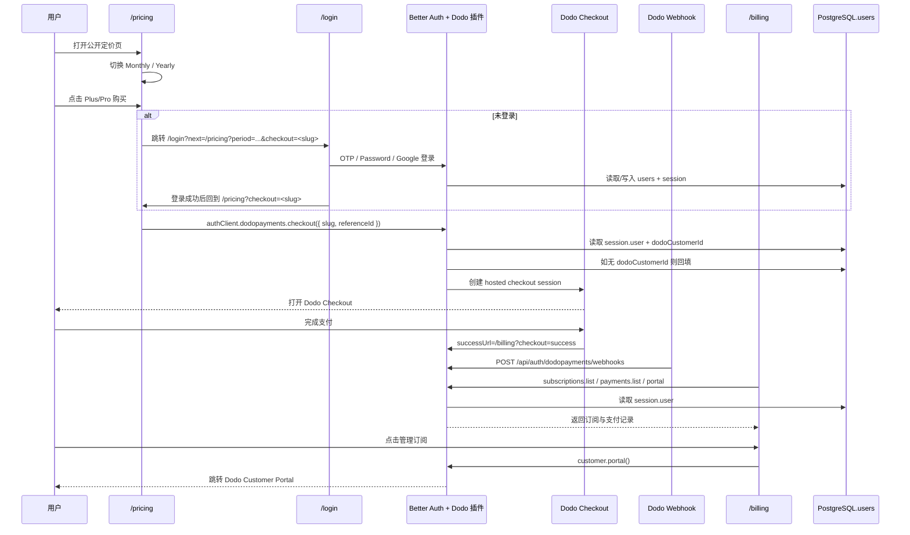

# Phase 7 · DodoPayments + Better Auth 首版支付集成计划

状态：`active`

## 1. 当前现状

### 1.1 代码与路由现状

- 前端仓库已经完成 Better Auth 基础接入，当前真实锚点如下：
  - `src/lib/auth.ts`
    - 使用 `better-auth` + `nextCookies()` + `emailOTP()` + `jwt()`
    - Better Auth 直接复用 PostgreSQL `users` 表，而不是单独维护第二套用户表
  - `src/lib/auth-client.ts`
    - 当前只挂了 `emailOTPClient()` 和 `jwtClient()`
  - `src/app/api/auth/[...all]/route.ts`
    - Better Auth 全部 endpoint 通过 catch-all route 暴露
  - `src/middleware.ts`
    - 仅保护 `/`、`/chat/*`、`/favorites`、`/profile`、`/setup`
- 当前正式页面包含：
  - 公共页：`/login`、`/setup`
  - 登录保护页：`/`、`/chat/[id]`、`/favorites`、`/profile`、`/stats`
- 当前不存在任何支付、套餐、订阅、账单、entitlement、billing UI 或 payment client 代码。

### 1.2 鉴权与登录链路现状

- `src/app/login/page.tsx` 当前登录完成后只会跳：
  - 资料完整：`/`
  - 资料不完整：`/setup`
- 当前登录页不处理 `next` / `callback` / `purchase intent` 查询参数。
- Google 登录虽然在 `src/lib/api.ts` 里支持 `callbackURL`，但 `login/page.tsx` 当前固定传 `/`。
- 这意味着如果用户从未来的 `/pricing` 发起购买，现状无法在登录后返回定价页并继续 checkout。

### 1.3 数据库现状

- 当前 Better Auth 基础表已存在：
  - `users`
  - `session`
  - `account`
  - `verification`
  - `jwks`
- 当前数据库中没有 billing 专用表。
- 当前 `users` 表列如下：
  - `id`
  - `email`
  - `username`
  - `avatar_url`
  - `created_at`
  - `updated_at`
  - `last_login_at`
  - `display_name`
  - `email_verified`
- 当前 **不存在** Dodo customer 绑定字段。

### 1.4 DodoPayments 适配器约束

- `@dodopayments/better-auth@1.5.0` 的插件源码已确认：
  - 不新建独立 subscription / payment / customer 本地表
  - 只给 Better Auth `user` schema 注入一个额外字段：`dodoCustomerId`
  - 通过 `databaseHooks.user.create/update` 自动创建 / 回填 Dodo customer
  - `portal()`、`customer.subscriptions.list()`、`customer.payments.list()` 会要求：
    - 已登录
    - `session.user.emailVerified === true`
- 这意味着 Phase 7 的订阅状态、支付记录和 customer portal 应视为 **Dodo 运行时投影**，而不是本地持久化账单域模型。

## 2. 目标

本期目标固定为：

1. 新增公开定价页 `/pricing`
2. 定价页采用 `Monthly / Yearly` 二段切换，而不是四卡并列
3. 基于 Better Auth + DodoPayments 插件完成真实 checkout 闭环
4. 登录后提供订阅查看 / 订阅管理入口
5. 接入 Dodo webhook，保证 Dodo 侧状态变化能被 Better Auth 插件消费
6. 不引入 mock checkout，不引入 fallback，不手写伪订阅状态

## 3. 本期明确决策

### 3.1 已锁定方案

- 购买入口采用 **单产品 checkout**，不采用 collection 作为首版主入口。
- `/pricing` 页面采用一个周期切换器：
  - `Monthly`
    - `plus-monthly`
    - `pro-monthly`
  - `Yearly`
    - `plus-yearly`
    - `pro-yearly`
- 本期只做：
  - 公开定价页
  - 支付闭环
  - 登录后查看 / 管理订阅
- 本期 **不做** Plus / Pro 的功能权限 gating。

### 3.2 产品映射

| 周期 | 档位 | slug | product_id |
| --- | --- | --- | --- |
| Monthly | Plus | `plus-monthly` | `pdt_0NcDp7r5grpEuNp1MpzAc` |
| Monthly | Pro | `pro-monthly` | `pdt_0NcDpO20F6OKTXZMie9VZ` |
| Yearly | Plus | `plus-yearly` | `pdt_0NcDpGYMY6f8Pwma4W6g0` |
| Yearly | Pro | `pro-yearly` | `pdt_0NcDpUXR7H18wHvMwEBRr` |

### 3.3 非主路径

- `collection id = pdc_0NcDv1jVIzQxSFqtlgHdf` 本期不作为主 CTA。
- 该 collection 保留为后续营销实验或托管套餐页备用能力，不进入 Phase 7 主实现。

## 4. 推荐方案与备选方案

### 4.1 推荐方案 A：公开定价页 + Product Slug Checkout + 独立 Billing 管理页

核心思路：

- 在 Better Auth server/client 两侧挂载 DodoPayments 插件
- 用固定 slug 到 product id 的映射驱动 checkout
- 新增公共 `/pricing`
- 新增登录保护的 `/billing`
- `/billing` 通过 Dodo customer portal + subscriptions list + payments list 做只读状态展示和跳转管理

优点：

- 与 Better Auth / Dodo 官方推荐链路一致
- checkout、portal、webhook 都复用插件，不需要自建 payment service
- 公开定价页与登录后管理页职责清晰
- 不要求本地维护 subscription cache 或 shadow table

缺点：

- 共享数据库需要新增 `users` 绑定字段
- 登录回跳和 pending checkout intent 需要额外处理
- 对 `email_verified` 暴露要求更高

推荐理由：

- 这是当前代码库最小、最稳、最符合现有 Better Auth 形态的路径。

### 4.2 备选方案 B：公开定价页 CTA 统一跳 Dodo Collection

核心思路：

- `/pricing` 只做营销展示
- 所有 CTA 跳到 Dodo collection 页面，由 Dodo 页面完成套餐选择和支付

不推荐理由：

- 用户在我方页面已完成月付 / 年付和档位选择后，还要二次进入 Dodo collection 重选
- 与 Better Auth 插件的 `slug -> productId` checkout 主路径不一致
- 回跳、埋点、购买意图恢复更绕

## 5. 系统位置与影响边界

### 5.1 本次改动位于系统中的位置

- 鉴权与 payment adapter 位于 Next.js server 侧：
  - `src/lib/auth.ts`
  - `src/app/api/auth/[...all]/route.ts`
- 客户端 payment 调用位于 Better Auth client 层：
  - `src/lib/auth-client.ts`
- 公共营销与购买入口位于页面层：
  - 新增 `src/app/pricing/page.tsx`
- 登录后账单管理位于 app 壳内：
  - 新增 `src/app/(app)/billing/page.tsx`

### 5.2 会影响的模块

- Better Auth server 配置
- Better Auth client 配置
- 登录回跳逻辑
- 中间件保护范围
- 公共路由结构
- 账户菜单导航
- 共享 PostgreSQL `users` 表结构

### 5.3 不应被改动的边界

- `/v1/*` 后端业务 API 现有聊天 / 角色 / 音色契约
- 现有 Better Auth 基础登录方式本身
- Discover / Chat / Favorites / Growth 业务主链路
- 本期不引入任何 Plus / Pro 功能拦截逻辑

## 6. 契约级细节

### 7 新增环境变量

前端仓库需要新增并在 `.env.example`、部署 env 中声明：

| 变量名 | 用途 | 必填 |
| --- | --- | --- |
| `DODO_PAYMENTS_API_KEY` | Dodo API Key | 是 |
| `DODO_PAYMENTS_WEBHOOK_SECRET` | `/api/auth/dodopayments/webhooks` 的 webhook secret | 是 |
| `DODO_PAYMENTS_ENVIRONMENT` | `test_mode` 或 `live_mode` | 是 |

说明：

- `BETTER_AUTH_URL` 继续作为 Better Auth base URL
- webhook URL 固定为：
  - 开发：`http://localhost:3001/api/auth/dodopayments/webhooks`
  - 生产：`https://parlasoul.com/api/auth/dodopayments/webhooks`

### 6.2 Better Auth / Dodo 逻辑契约

Better Auth plugin 配置目标：

- server 侧启用：
  - `dodopayments(...)`
  - `checkout(...)`
  - `portal()`
  - `webhooks(...)`
- checkout 配置使用固定 products 数组：
  - `productId`
  - `slug`
  - `successUrl = "/billing?checkout=success"`
  - `authenticatedUsersOnly = true`

client 侧启用：

- `dodopaymentsClient()`

计划内使用的 client 方法：

- `authClient.dodopayments.checkout(...)`
- `authClient.dodopayments.customer.portal()`
- `authClient.dodopayments.customer.subscriptions.list(...)`
- `authClient.dodopayments.customer.payments.list(...)`

### 6.3 路由契约

新增公共路由：

- `GET /pricing`

新增登录保护路由：

- `GET /billing`

新增 Better Auth plugin 自动暴露 endpoint：

- `POST /api/auth/dodopayments/checkout`
- `POST /api/auth/dodopayments/checkout-session`
- `GET /api/auth/dodopayments/customer/portal`
- `GET /api/auth/dodopayments/customer/subscriptions/list`
- `GET /api/auth/dodopayments/customer/payments/list`
- `POST /api/auth/dodopayments/webhooks`

说明：

- 页面与组件层只通过 `authClient` 调用这些 endpoint，不手写裸 `fetch` 到陌生路径。

### 6.4 URL / 查询参数契约

公开定价页使用：

- `period=monthly|yearly`
  - 控制定价页默认展示周期
- `checkout=<slug>`
  - 登录回跳后的待执行购买意图

账单页使用：

- `checkout=success`
  - checkout 完成后的成功提示与数据刷新信号

登录页新增：

- `next=<encoded_url>`
  - 登录后跳转目标

### 6.5 数据库变更契约

本期数据库改动只有一个主字段：

- 共享业务表：`users`
- 新增字段：`dodoCustomerId`
- 类型：`text`
- 可空：`true`
- 语义：保存 Dodo Payments customer id

推荐约束：

- 为 `users."dodoCustomerId"` 建唯一索引
- 不为本期新增 subscription/payment 本地表

选择 `dodoCustomerId` 的理由：

- Dodo Better Auth 插件公开 schema 直接注入的逻辑字段就是 `dodoCustomerId`
- Phase 7 先与插件默认 schema 完全对齐，避免在首版引入字段别名偏差

额外前端 DTO 变更：

- 现有 `User` 增加 `email_verified?: boolean`
- 当前 `users.email_verified` 已存在，前端应把它映射出来，供 `/billing` 做可管理性判断

### 6.6 Billing UI 数据契约

`/billing` 页面至少展示三类数据：

1. 当前订阅列表
   - 来源：`authClient.dodopayments.customer.subscriptions.list`
   - 展示字段：
     - 计划名称
     - 状态
     - 周期
     - 当前计费周期起止时间
     - 下次扣费时间
2. 支付记录
   - 来源：`authClient.dodopayments.customer.payments.list`
   - 展示字段：
     - 支付时间
     - 金额
     - 币种
     - 状态
3. 管理订阅按钮
   - 来源：`authClient.dodopayments.customer.portal`
   - 动作：跳转到 Dodo customer portal

如果 `email_verified !== true`：

- `/billing` 不展示 portal 跳转与订阅列表主操作
- 页面显示中文阻断说明：
  - 当前账户邮箱尚未验证，暂时无法管理订阅

## 7. 核心流程



### 7.1 关键解释

- `/pricing` 是公开营销入口，但 checkout 仍要求登录。
- 登录回跳不是简单回首页，而是必须恢复购买意图。
- 首版不在我方页面采集账单地址，账单信息留给 Dodo 托管 checkout。
- webhook 不负责本地账单表同步，因为本期没有本地账单域模型；其主要职责是保证 Better Auth 插件链路完整。
- `/billing` 是登录后的事实查看面板，数据来源是 Dodo API 运行时读取，不做本地 shadow copy。

### 7.2 最容易漂移的点

1. 登录后回跳
   - 如果仍保留当前 “登录后只跳 `/` / `/setup`” 的逻辑，公开定价页购买会断链。
2. 未验证邮箱用户
   - Dodo portal / subscriptions / payments endpoint 要求 `emailVerified`
   - 当前前端用户 DTO 未暴露该字段，若忽略会出现“页面无反馈但请求 401/403 风格失败”
3. 用户字段名
   - 插件依赖 `dodoCustomerId`
   - 数据库字段必须与最终 Better Auth schema 对齐

## 8. 落地锚点

### 锚点 1：`src/lib/auth.ts`

这是本方案的 server 侧支付主入口，负责：

- 创建 Dodo client
- 把 Dodo plugin 挂进 Better Auth
- 声明固定产品 slug 映射
- 配置 checkout / portal / webhook

### 锚点 2：`src/lib/auth-client.ts`

这是本方案的 client 侧能力出口，负责：

- 在现有 Better Auth client 上挂 `dodopaymentsClient()`
- 让页面层可直接调用 checkout / portal / subscriptions / payments

### 锚点 3：新增 `src/lib/billing/plans.ts`

这是前端计费口径的单一真相源，负责：

- 统一维护 monthly / yearly -> plus / pro -> slug / productId 的映射
- 供 `/pricing` UI、checkout 调用和成功提示复用

## 9. 实施路径

### Step 1：先落共享数据库迁移

修改对象：

- 后端仓库 Alembic（共享数据库 schema 管理入口）

执行目标：

- 在 `users` 表新增 `dodoCustomerId` 字段
- 创建唯一索引

预期结果：

- Better Auth Dodo plugin 可在用户创建 / 更新后回填 customer id

执行要求：

- 先写 Alembic migration
- 立刻执行 Alembic
- 验证生产 / 本地 schema 一致

### Step 2：补齐环境变量与配置基线

修改对象：

- `.env.example`
- `.env.local`
- `.env.production`
- 部署环境变量文档

执行目标：

- 增加 Dodo API key / webhook secret / environment
- 不把真实 secret 写入 plan 文档

预期结果：

- 本地与生产都能构造 Dodo client

### Step 3：在 Better Auth server 侧挂 Dodo plugin

修改对象：

- `src/lib/auth.ts`

执行目标：

- 引入 `DodoPayments`
- 引入 `dodopayments / checkout / portal / webhooks`
- 配置固定 product slug 映射
- 设置 `createCustomerOnSignUp: true`
- 设置 `authenticatedUsersOnly: true`
- successUrl 指向 `/billing?checkout=success`

预期结果：

- Better Auth 自动暴露 Dodo 相关 endpoint
- 新老用户均可回填 `dodoCustomerId`

### Step 4：在 Better Auth client 侧挂 payment plugin

修改对象：

- `src/lib/auth-client.ts`

执行目标：

- 引入 `dodopaymentsClient()`

预期结果：

- 页面层可直接使用 `authClient.dodopayments.*`

### Step 5：建立 billing 计划目录与纯函数工具

修改对象：

- 新增 `src/lib/billing/plans.ts`
- 必要时新增 `src/lib/billing/checkout-intent.ts`

执行目标：

- 抽象 monthly/yearly toggle 数据
- 提供 slug 查找、默认周期、标签文案、价格文案
- 提供 checkout intent 编解码和一次性执行保护

预期结果：

- UI 与 checkout 逻辑不在页面里散落硬编码 product id

### Step 6：新增公开定价页 `/pricing`

修改对象：

- 新增 `src/app/pricing/page.tsx`
- 必要时新增 `src/components/billing/*`

执行目标：

- 展示中文定价文案
- 提供 `Monthly / Yearly` 切换
- 每个周期只展示 `Plus / Pro` 两个档位
- CTA 根据登录态决定：
  - 已登录：直接 checkout
  - 未登录：跳转到带 `next` 的登录页

预期结果：

- 用户可以从公开页发起真实购买

### Step 7：补登录回跳与购买意图恢复

修改对象：

- `src/app/login/page.tsx`
- 必要时 `src/lib/api.ts`

执行目标：

- 读取 `next` 查询参数
- OTP / Password 登录后优先跳到 `next`
- Google 登录的 `callbackURL` 使用 `next`
- 当 `next` 指向 `/pricing?...&checkout=<slug>` 时，返回定价页并自动执行一次 checkout

预期结果：

- 未登录购买不会被迫重新点一次

执行方向：

- `next` 指向公共路由时，不再因为 profile incomplete 被强制送去 `/setup`
- `next` 指向受保护路由时，保留原有 setup 约束

### Step 8：新增登录保护的 `/billing`

修改对象：

- 新增 `src/app/(app)/billing/page.tsx`
- `src/middleware.ts`
- `src/components/Sidebar.tsx`

执行目标：

- 新增账单管理页
- 将 `/billing` 纳入受保护路由
- 侧栏账户菜单新增“订阅管理”

页面能力：

- 读取活跃 / 全部订阅
- 读取支付记录
- 跳转 customer portal
- 根据 `checkout=success` 刷新并展示成功提示

### Step 9：补 `email_verified` 前端映射与阻断提示

修改对象：

- `src/lib/api-service.ts`
- `src/lib/auth-user-mapper.ts`
- `src/lib/auth-context.tsx`
- `/billing` 页面

执行目标：

- 将 `users.email_verified` 映射到前端 `User`
- 对未验证邮箱用户阻断 portal / subscriptions / payments 管理入口

预期结果：

- 不会出现 Dodo 插件因 `emailVerified` 缺失而在 UI 层无意义失败

### Step 10：补错误处理与中文文案

修改对象：

- `src/lib/error-map.ts`
- billing / pricing 相关组件

执行目标：

- 覆盖 checkout 创建失败
- 覆盖 portal 打开失败
- 覆盖订阅 / 支付记录拉取失败
- 覆盖邮箱未验证阻断文案

执行约束：

- 不新增随意错误码
- 优先复用现有通用错误分类与中文文案策略

### Step 11：接入真实 webhook

修改对象：

- `src/lib/auth.ts`
- Dodo Dashboard webhook 配置

执行目标：

- 使用真实 `DODO_PAYMENTS_WEBHOOK_SECRET`
- 指向真实域名 `/api/auth/dodopayments/webhooks`
- 在开发环境可用本地 URL 做联调

预期结果：

- webhook 签名验证与事件处理链路可正常执行

### Step 12：进入检查修复循环

检查项：

- checkout 是否完全走真实 Dodo
- `/pricing -> login -> pricing -> checkout -> /billing` 是否闭环
- `/billing` 是否只消费 Dodo 实时状态
- 数据库字段是否与 Better Auth Dodo schema 对齐
- 未验证邮箱用户是否有明确阻断提示
- 现有聊天 / 角色 / 音色链路是否无回归

退出条件：

- 我认为本期范围内不存在功能缺口、明显错误和计划漂移

## 10. Non-goals

本期明确不包含：

- Plus / Pro 功能权限 gating
- usage metering / 额度消耗
- 内部 credits 系统
- 本地 subscription / payment shadow table
- collection checkout 主入口
- 改造现有聊天、角色、音色、成长体系以适配套餐差异

## 11. 验证与验收标准

### 11.1 必跑命令

前端仓库：

- `pnpm lint`
- `pnpm build`

数据库与共享 schema：

- 执行 Alembic migration
- 验证 `users` 表新增 Dodo customer 绑定字段

### 11.2 关键人工验收

1. 未登录打开 `/pricing`
2. 切换 `Monthly / Yearly`
3. 点击任一档位 CTA
4. 被引导到 `/login?next=...`
5. 登录成功后返回 `/pricing` 并自动打开 Dodo checkout
6. 完成支付后回到 `/billing?checkout=success`
7. `/billing` 能看到订阅与支付记录
8. 点击“管理订阅”能跳到 Dodo customer portal
9. webhook 能收到并通过签名校验

### 11.3 失败场景验收

- Dodo API key 缺失
- webhook secret 错误
- 未登录直接调用 checkout
- product slug 配置错误
- `email_verified = false` 用户访问 `/billing`
- Dodo API 暂时失败

### 11.4 前端端到端验收

实现完成后必须补一轮浏览器端 E2E，覆盖：

- `/pricing` 周期切换
- 登录回跳
- checkout 发起
- `/billing` 数据加载
- portal 跳转按钮

## 12. 外部前置事项

1. Dodo Dashboard 中确认四个产品仍有效
2. 确认当前 API key 与 `DODO_PAYMENTS_ENVIRONMENT` 匹配
3. 在 Dodo Dashboard 创建或更新 webhook：
   - `https://parlasoul.com/api/auth/dodopayments/webhooks`
4. 后端仓库准备共享数据库 Alembic migration

## 13. 测试方法

### 13.1 测试前提

- Dodo 后台已配置 **`test_mode`** 环境
- 代码中 `DODO_PAYMENTS_ENVIRONMENT=test_mode`
- 测试卡号**仅在 test_mode 下有效**，不会产生真实交易

### 13.2 测试卡号

| 地区 | 品牌 | 卡号 | 用途 |
|------|------|------|------|
| US | Visa | `4242424242424242` | 模拟支付成功 |
| US | Mastercard | `5555555555554444` | 模拟支付成功 |
| US | Visa | `4000000000000002` | 模拟通用拒绝 |
| US | Mastercard | `4000000000009995` | 模拟余额不足 |

**通用信息**：所有测试卡有效期填写 `06/32`，CVV 填写 `123`

### 13.3 测试流程

1. 打开 `/pricing`，选择 Monthly / Yearly 和 Plus / Pro 档位
2. 点击购买 CTA，未登录则跳转到 `/login?next=...`
3. 完成登录（OTP / Password / Google），返回 `/pricing` 后自动打开 Dodo Checkout
4. 在 Dodo Checkout 页面填入测试卡号：
   - 卡号：`4242424242424242`
   - 有效期：`06/32`
   - CVV：`123`
5. 完成支付，跳转到 `/billing?checkout=success`
6. 验证 `/billing` 页面能看到订阅列表和支付记录

### 13.4 失败场景测试

| 场景 | 测试卡号 | 预期结果 |
|------|----------|----------|
| 通用拒绝 | `4000000000000002` | 支付失败，页面提示拒绝 |
| 余额不足 | `4000000000009995` | 支付失败，页面提示余额不足 |

### 13.5 本地 Webhook 测试

开发环境 webhook 到 localhost 可能被拦截，官方推荐使用 Dodo CLI：

```bash
# 转发真实测试 webhook 到本地服务器
dodo wh listen

# 发送所有事件类型的模拟 payload
dodo wh trigger
```

### 13.6 测试环境说明

| 环境 | DODO_PAYMENTS_ENVIRONMENT | 测试卡号 | 真扣钱 |
|------|---------------------------|----------|--------|
| test_mode | `test_mode` | ✅ 可用 | ❌ 不会 |
| live_mode | `live_mode` | ❌ 拒绝 | ✅ 会 |

> ⚠️ **注意**：即使在生产域名下，只要 `DODO_PAYMENTS_ENVIRONMENT=test_mode`，测试卡号就有效且不会真扣钱。

## 14. 参考资料

- Better Auth DodoPayments 插件文档
  https://www.better-auth.com/docs/plugins/dodopayments
- DodoPayments Better Auth 适配器文档
  https://docs.dodopayments.com/developer-resources/better-auth-adaptor
- DodoPayments Product Collections
  https://docs.dodopayments.com/features/product-collections
- `@dodopayments/better-auth@1.5.0` npm README 与发布包源码
